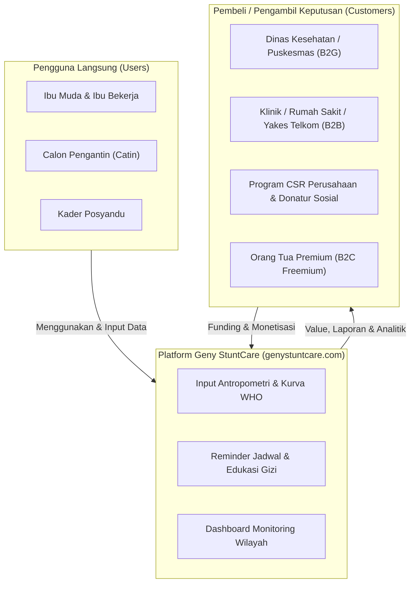

# Profil Startup: Geny StuntCare
## Platform Digital Pemantauan & Pencegahan Stunting Anak Balita

---

## 1. Informasi Dasar Startup

| Item | Informasi Detail |
| :--- | :--- |
| **Nama Startup** | **Geny StuntCare** |
| **Domain Resmi (Web)**| [genystuntcare.com](https://genystuntcare.com) |
| **Sektor Industri** | HealthTech / Social Impact / AI & Maternal-Child Health |
| **Program Inkubasi** | Inkubator Bisnis Startup Batch 24 : Bandung Techno Park (Telkom University) |
| **Tahapan Saat Ini** | Stage 1 (SRL 0 & SRL 1: Problem & Customer Validation) |

---

## 2. Visi & Misi

### Visi
Mewujudkan generasi emas Indonesia bebas stunting melalui demokratisasi akses teknologi deteksi dini, pemantauan status gizi antropometri balita yang presisi, dan pendampingan pola asuh digital yang mudah diakses oleh seluruh keluarga Indonesia.

### Misi
1. **Aksesibilitas Tinggi:** Menyediakan platform pemantauan tumbuh kembang balita berbasis web (`genystuntcare.com`) yang responsif, ringan, dan dapat diakses dari berbagai perangkat ponsel tanpa batasan spesifikasi.
2. **Presisi Deteksi Dini:** Menerapkan algoritma cerdas berbasis standar kurva WHO untuk mendeteksi deviasi pertumbuhan dan risiko stunting sedini mungkin (terutama periode emas 1000 Hari Pertama Kehidupan).
3. **Pemberdayaan Kader & Faskes:** Memfasilitasi kader posyandu dan puskesmas dalam pencatatan digital terpadu yang memangkas beban administrasi manual.
4. **Edukasi & Intervensi Nutrisi Terpersonalisasi:** Menghubungkan orang tua dengan panduan gizi MPASI kaya protein hewani lokal yang terjangkau dan aplikatif.

---

## 3. Segmentasi Stakeholder: Customer vs User

Mengacu pada arahan materi Workshop BTP Stage 1, Geny StuntCare membedakan secara tegas antara **User** (pengguna langsung fitur) dan **Customer** (pihak pengambil keputusan pembayaran / pembeli nilai ekonomis):

---

## 4. Ekosistem Fitur Inti (`genystuntcare.com`)

1. **Smart Growth Tracker:**
   - Pencatatan berkala berat badan (BB), tinggi/panjang badan (TB/PB), dan lingkar kepala (LK).
   - Plotting otomatis terhadap grafik Z-score standar WHO (BB/U, TB/U, BB/TB).
2. **Stunting Risk Early Warning System:**
   - Notifikasi dini jika grafik pertumbuhan balita mengalami tren mendatar (*faltering growth*) selama 2 bulan berturut-turut.
3. **Personalized MPASI & Local Food Guide:**
   - Menu MPASI berbasis bahan pangan lokal terjangkau (telur ayam, hati ayam, ikan kembung, tempe).
4. **Posyandu Digital Hub:**
   - Fitur rekap digital untuk kader posyandu agar pencatatan tidak tercecer di buku kertas.
