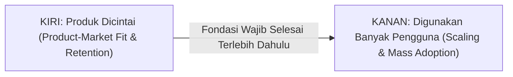
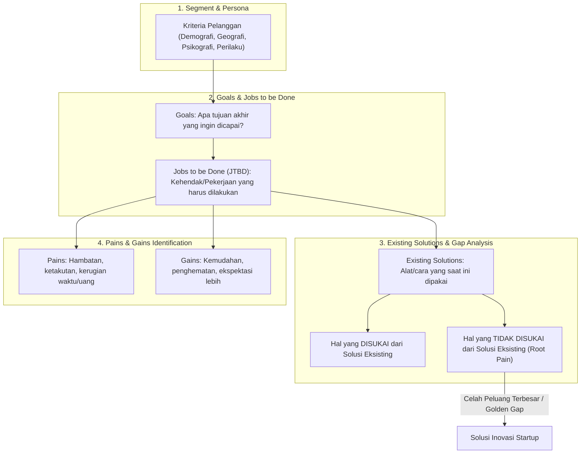

# Notulensi Lengkap & Menyeluruh: Workshop Stage 1 (Sesi 1)
## Topik: "Discover the Problem, Understand the Customer"
### Program Inkubasi Startup Batch 24 — Bandung Techno Park (Telkom University)

---

## 1. Metadata Sesi & Pelaksanaan

| Parameter | Keterangan Detail |
| :--- | :--- |
| **Kegiatan** | Workshop Stage 1 Inkubator Bisnis BTP Batch 24 (Kompetisi) |
| **Hari, Tanggal** | Rabu, 23 September 2026 |
| **Waktu Pelaksanaan** | 09.00 – 11.30 WIB |
| **Topik Utama** | **Discover the Problem, Understand the Customer** |
| **Narasumber** | **Indra Purnama, S.T., M.T.** (Direktur PT. Bara Praja Indonesia, Founder Bara Inovasi Semesta, Eks Executive Director Bandung Digital Valley / Indigo Incubator PT Telkom Indonesia) |
| **Moderator / MC** | **Shoffa Anbar** (Bandung Techno Park) |
| **Platform** | Zoom Cloud Meetings (Meeting ID: `883 0476 3688`) |
| **Tujuan Sesi** | Memberikan pemahaman komprehensif kepada startup binaan mengenai metodologi *Customer Discovery*, pengujian hipotesis masalah, pemetaan *Jobs to be Done* (JTBD), serta analisis pasar agar produk yang dibangun tepat sasaran dan terhindar dari kegagalan komersial. |

---

## 2. Pembukaan & Sambutan Moderator (Mbak Shoffa - BTP)

### Poin-Poin Pembukaan:
1. **Aturan Utama Sesi:**
   - Seluruh peserta (Changemakers) diwajibkan menyalakan kamera (*open camera*) selama sesi 1 dan sesi 2 berlangsung sebagai wujud antusiasme dan komitmen inkubasi.
2. **Semangat Program Inkubasi BTP:**
   - Mengusung tema besar: *"Dari Masalah Hingga Solusi: Bangun Startup yang Berdampak"*.
   - Mengingatkan kembali bahwa fondasi paling krusial sebelum berbicara mengenai produk, teknologi mutakhir, atau valuasi bisnis yang fantastis adalah:
     > *"Apakah kita benar-benar memahami masalah yang ingin kita selesaikan? Dan siapa customer yang menghadapi masalah tersebut secara nyata?"*
   - Startup yang kuat tidak lahir sekadar dari ide yang terdengar keren di atas kertas, melainkan berakar dari **problem yang nyata**, **customer yang tepat**, dan **pemahaman yang mendalam terhadap kebutuhan mereka**.
3. **Profil Mendalam Pemateri — Indra Purnama, S.T., M.T.:**
   - Seorang *Innovation Strategist*, *Product Innovation Leader*, dan *Ecosystem Builder* terkemuka dengan rekam jejak lebih dari **15 tahun dalam pengembangan ekosistem inovasi & startup**, serta **24 tahun berwirausaha mandiri**.
   - Telah mendampingi secara langsung lebih dari **350 startup digital** di berbagai program inkubasi, akselerasi, dan inisiatif inovasi korporat/pemerintah di tingkat nasional dan Asia Pasifik (Malaysia, Singapura, dll).
   - Mantan *Executive Director & Lead Mentor* di **Bandung Digital Valley (BDV)** / Indigo Incubator (PT Telkom Indonesia, Gegerkalong Bandung) — inkubator startup digital pertama di Indonesia.
   - Penulis buku panduan standar startup:
     1. *"Startup Tools"* — Panduan komprehensif bagi founder dalam memilih metodologi, framework, dan pendekatan yang tepat dalam pengembangan bisnis & produk.
     2. *"Digital Incubator Playbook"* — Panduan pengelola inkubator dalam mendampingi portofolio inovasi startup secara terstruktur.
   - Pendiri dan CEO PT Bara Praja Indonesia serta pengembang platform aplikasi manajemen portofolio inovasi.

---

## 3. Sensus Cepat & Pemetaan Ide Startup Peserta Batch 24

Sebagai langkah awal sebelum pemaparan materi, Pak Indra meminta seluruh peserta menuliskan profil ringkas di kolom chat dengan format:
`Nama | Nama Startup | Produk yang Dibuat | Deskripsi Singkat Produk | Siapa Customernya`

### Tinjauan Beberapa Startup Peserta:
1. **Costify:** Platform SaaS Cost Management & Back Office untuk optimasi pengeluaran operasional bisnis.
2. **Creative Education Platform:** Platform kurikulum digital interaktif untuk institusi pendidikan.
3. **Karbonir:** Pengolahan limbah pertanian menjadi briket ramah lingkungan untuk UMKM kuliner.
4. **Kell Skin:** Pemanfaatan kulit buah dan sayur menjadi produk *personal care*.
5. **Klinis / HealthTech:** Aplikasi referensi dan perhitungan klinis untuk praktik mandiri dokter.
6. **Platform Bahan Baku Horeca:** Distribusi bahan baku pangan untuk hotel, restoran, dan kafe dengan penyesuaian harga *real-time* berbasis serapan surplus panen (*over-panen*).
7. **Smartfarming Infrastructure:** Peralatan cerdas dan infrastruktur IoT untuk efisiensi pertanian presisi.
8. **Brand Fashion Muslim:** Busana muslimah spesifik segmen tertentu.
9. **Patisserie / Custom Birthday Cake:** Pembuatan kue ulang tahun kustom berbasis pesanan khusus.

> **Catatan Evaluasi Awal Pak Indra:**
> Banyak startup mampu menyebutkan nama produk dan fiturnya dengan sangat lancar, namun masih sering ragu, terlalu luas, atau bahkan belum mencantumkan **siapa customer spesifik** yang bersedia membayar produk tersebut.

---

## 4. Paradigma Dasar: Mengapa Customer Discovery adalah Soal Hidup-Mati Startup

Pak Indra menegaskan alasan mendasar mengapa sesi *Customer Discovery* diletakkan pada awal program inkubasi BTP:

1. **Jerih Payah yang Berujung Sia-Sia:**
   - Membangun produk memerlukan pengorbanan waktu berbulan-bulan, tenaga pikiran, dan biaya operasional yang tidak sedikit.
   - Tragedi terbesar bagi founder adalah ketika produk yang dibangun dengan susah payah ternyata **tidak disambut baik oleh pasar**, sepi peminat, tidak ada yang mau membeli, dan akhirnya mati perlahan.
2. **Dua Kriteria Kegagalan Produk Startup:**
   - **Kriteria 1 (Finansial):** Produk gagal menghasilkan keuntungan finansial (*revenue/profit*) yang menopang keberlanjutan bisnis.
   - **Kriteria 2 (Dampak/Manfaat):** Produk bahkan tidak memberikan manfaat nyata (*zero impact*) bagi penggunanya karena tidak menyelesaikan kebutuhan esensial mereka.

---

## 5. Evolusi Teknologi: Produk Canggih Bukan Jaminan Sukses

Pak Indra membandingkan perbedaan mencolok iklim bisnis teknologi masa lalu dengan masa kini:

```
[DULU / Era Awal Teknologi]
Hambatan Utama: PENGUASAAN TEKNOLOGI
• Membuat software/hardware sangat sulit dan langka.
• Membutuhkan investasi pabrik besar atau coding rumit tingkat tinggi.
• "Selama produk Anda canggih, Insya Allah hampir pasti sukses."

                VERSUS

[SEKARANG / Era Modern]
Hambatan Utama: KESESUAIAN PRODUK TERHADAP PASAR (FIT)
• Akses teknologi sangat terbuka (No-Code, Low-Code, AI Tools, 3D Printing).
• Siapa saja bisa membuat software atau produk fisik dengan cepat tanpa pabrik.
• Kecanggihan BUKAN LAGI faktor penentu utama keberhasilan.
• BANYAK PRODUK CANGGIH GAGAL SECARA KOMERSIAL.
```

---

## 6. Bedah Studi Kasus 1: Kegagalan Komersial Segway vs Sepeda Lipat Brompton

Pak Indra memaparkan studi kasus klasik yang sangat legendaris di dunia inovasi:

### A. Kisah Segway
* **Inovasi Teknologi:** Kendaraan personal dua roda dengan teknologi keseimbangan mandiri (*self-balancing* gyroscopic) dan kendali digital presisi. Secara teknologi, Segway adalah mahakarya luar biasa pada zamannya.
* **Visi Ambisius Awal:** Segway diproyeksikan menggantikan cara manusia bermobilitas harian (*commuting*) dari rumah ke tempat kerja secara masif di perkotaan dunia.
* **Kenyataan Lapangan:** Segway gagal total secara komersial di pasar massal (*mass market*). Saat ini Segway hanya bertahan di pasar ceruk (*niche*) yang sangat terbatas: patroli petugas satpam di bandara, petugas keamanan taman hiburan (Dufan/Disney), atau tur wisata tertutup.

### B. Mengapa Segway Gagal Dibandingkan Sepeda Lipat Brompton?
* **Pola Perjalanan Komuter Riil (Kacamata Pelanggan):**
  - Pengguna sepeda lipat Brompton di kota besar (misal: London) mengendarai sepeda dari rumah ke halte bus / stasiun kereta terdekat.
  - Saat tiba di halte, sepeda Brompton dilipat secara sangat ringkas dan ringan, dibawa masuk ke dalam kabin bus/kereta, lalu dibuka kembali di stasiun tujuan untuk dikayuh menuju kantor.
  - Tiba di ruang kantor, sepeda kembali dilipat rapi dan disimpan di bawah meja kerja tanpa risiko dicuri.
* **Blindspot Segway yang Mengabaikan Konteks Pengguna:**
  1. *Multimodal Incompatibility:* Pengguna tidak bisa membawa Segway masuk ke dalam bus kota atau kereta rel listrik karena bentuknya yang besar, berat, dan tidak bisa dilipat.
  2. *Masalah Parkir & Keamanan:* Di kantor, Segway terlalu besar untuk dibawa masuk ke dalam bilik kerja, namun terlalu rentan dicuri bila ditinggalkan di area parkir umum tanpa pengamanan khusus.
  3. *Ambiguitas Regulasi Jalan:* Pengguna bingung apakah harus melaju di trotoar pejalan kaki (yang membahayakan pejalan kaki) atau melaju di jalan raya (yang membahayakan diri sendiri terhantam mobil/motor).
* **Pelajaran Moral:**
  > *"Segway gagal bukan karena teknologinya jelek, melainkan karena para pembuatnya GAGAL PAHAM TERHADAP KEBUTUHAN DAN KONTEKS GAYA HIDUP PELANGGANNYA."*

---

## 7. Bedah Studi Kasus 2: Tragedi Dot-Com Bubble (Tahun 2000-an Awal)

* **Euforia Awal Internet:**
  - Investor menggelontorkan ratusan juta dolar kepada startup-startup perintis hanya karena mereka "yang pertama" di internet (*first-mover advantage*).
  - Contoh: **Pets.com** menghabiskan lebih dari **$300 Juta USD** untuk membangun e-commerce perlengkapan hewan peliharaan; **eToys.com** membakar **$247 Juta USD** untuk toko mainan online; serta platform **Go.com** untuk travel.
* **Kenyataan:**
  - Begitu website canggih diluncurkan, ternyata sangat sedikit pelanggan yang mau membeli. Biaya akuisisi dan logistik jauh melampaui margin keuntungan. Perusahaan-perusahaan ini bangkrut seketika (*bubble pecah*).
* **Pelajaran Moral:**
  > *"Investasi raksasa, fitur super canggih, dan menjadi yang pertama di pasar tidak menjamin bisnis berhasil bila produk yang diciptakan tidak cocok dengan kebutuhan riil pasar."*

---

## 8. Dua Kutub Keberhasilan Startup: Dicintai Dulu (Love) vs Skala Besar (Scale)

Pak Indra menjelaskan hubungan dinamis antara dua pilar kesuksesan produk:



### Mengapa Harus Selesaikan Sisi Kiri (Dicintai) Terlebih Dahulu?
1. **Definisi Produk Dicintai:**
   - Produk digunakan secara **berulang kali (*repeat usage/retention*)**, bukan hanya sekali coba karena rasa penasaran atau promosi gratis.
   - Pengguna enggan kembali ke cara lama dan tidak berpaling ke produk kompetitor.
   - *Contoh UMKM:* Jika warung makan beralih dari arang/LPG ke briket buatan startup kita, mereka terus-menerus memesan ulang briket kita setiap minggu dan menolak membeli briket merek lain.
2. **Bahaya Menggabungkan atau Membalik Urutan:**
   - Mengupayakan retensi (membuat produk dicintai) dan mengupayakan skala (merekrut ribuan pengguna lewat iklan masif) memerlukan strategi dan metrik yang berbeda total.
   - Jika startup memaksakan skala (*scale up*) sebelum produknya dicintai, maka yang terjadi adalah fenomena **Ember Bocor (*Leaky Bucket*)**: biaya pemasaran jutaan rupiah habis untuk mendatangkan 1.000 pengguna baru, namun 990 pengguna langsung berhenti menggunakan aplikasi setelah hari pertama karena produk tidak memuaskan.

---

## 9. Mindset Baru Founder: Bukan Produk Canggih, Tapi Produk yang TEPAT

Tujuan utama founder startup bukan membangun produk yang keren secara teknologi atau berdesain mewah, melainkan **membangun produk yang TEPAT**.

### Definisi Produk yang Tepat:
* **Memecahkan Permasalahan (*Solving a Problem*):** Menghilangkan rasa sakit, kerugian finansial, atau hambatan operasional yang dialami customer.
* **Memenuhi Keinginan (*Fulfilling a Desire*):** Memuaskan kebutuhan emosional, gengsi, estetika, atau aspirasi gaya hidup.

| Kategori | Karakteristik Utama | Contoh Kasus Peserta |
| :--- | :--- | :--- |
| **Solving Problem** | Fokus pada rasa sakit (*pain*), inefisiensi, risiko kerugian waktu/uang/kesehatan. | • Costify (kebocoran biaya operasional)<br>• Karbonir (biaya bahan bakar mahal)<br>• **Geny StuntCare** (risiko stunting permanen balita) |
| **Fulfilling Desire** | Fokus pada preferensi rasa, keindahan, ekspresi diri, status sosial, gaya hidup. | • Brand Muslim Fashion (ingin tampil modis & syar'i)<br>• Custom Birthday Cake Patisserie (ingin perayaan ulang tahun unik & berkesan) |

---

## 10. Segmentasi Pelanggan yang Tajam: Bahaya Generalisasi

Salah satu kesalahan paling fatal dari startup pemula adalah mendefinisikan target pasar secara terlalu luas dan mengambang (misal: *"Semua ibu-ibu di Indonesia"* atau *"Semua UMKM"*).

### Studi Kasus: "Siapa Target Pelanggan Brand Muslim Fashion?"
- Jumlah populasi muslim di Indonesia mencapai ~230 juta jiwa, dengan muslimah sekitar 90–100 juta jiwa.
- Apakah 90 juta muslimah memiliki kebutuhan busana yang sama? **Tentu tidak!**
  - Ada muslimah berpenghasilan tinggi (*high SES*) yang mengutamakan bahan sutra premium dan eksklusivitas.
  - Ada muslimah muda mahasiswi yang mencari busana kasual kasir dengan harga terjangkau.
  - Ada wanita karier perkotaan yang butuh busana kerja formal.
  - Ada ibu rumah tangga pedesaan dengan preferensi gamis praktis.

### Studi Kasus: Laptop Ideal Berdasarkan Kategori Pelanggan
Kebutuhan produk yang ideal sangat ditentukan oleh siapa yang menggunakannya:

```
[Kategori 1: Gamer]
• Kebutuhan Utama: Kartu grafis tinggi (GPU), refresh rate layar besar, keyboard mekanik empuk, pendingin maksimal.
• Kompromi: Bobot tebal dan berat (bulky), baterai cepat habis -> Tidak masalah bagi gamer.

[Kategori 2: Profesional / Manajer]
• Kebutuhan Utama: Keseimbangan antara performa komputasi multi-tasking, ketahanan baterai, dan portabilitas untuk mobilitas kantor.

[Kategori 3: Top Eksekutif / Direksi]
• Kebutuhan Utama: Desain sangat tipis (ultra-slim), sangat ringan dibawa rapat ke mana-mana, baterai awet seharian.
• Aktivitas: Membaca email, meninjau dashboard laporan PDF/Excel, presentasi ringan. Tidak memerlukan GPU gaming berat.
```

---

## 11. Hakikat Inovasi & Hubungannya dengan Hipotesis

### A. Tiga Kriteria Mutlak Sesuatu Disebut "Inovasi":
1. **Terdapat Kebaruan (*Novelty*):** Produk atau model bisnis tidak sama persis dengan apa yang sudah ada di pasar saat ini.
2. **Sudah Terimplementasi (*Implemented*):** Inovasi bukan sekadar ide di awang-awang atau rancangan di atas kertas; ia harus sudah dieksekusi menjadi produk/layanan nyata.
3. **Menciptakan Nilai (*Value Creation*):** Produk tersebut mampu menghadirkan manfaat nyata bagi pengguna dan keuntungan bagi penciptanya. Jika suatu karya baru berhasil dibuat namun tidak ada yang merasakan manfaatnya, karya tersebut **bukan inovasi**.

### B. Semua Asumsi Awal Adalah Hipotesis!
- Karena inovasi mengandung unsur kebaruan, maka segala sesuatu yang ada di dalam kepala founder pada awal membangun startup berstatus sebagai **HIPOTESIS**.
- **Definisi Hipotesis:** Sesuatu yang kita yakini benar, padahal **belum tentu benar** di dunia nyata.
- *Contoh Hipotesis Umum:*
  - *"Petani pasti butuh aplikasi AI untuk meningkatkan panen."* (Belum tentu! Banyak petani merasa hasil panennya sudah cukup membelikan motor anak tanpa teknologi baru).
  - *"Ibu-ibu balita pasti mau membeli produk kita seharga Rp 50.000."* (Belum tentu! Mereka mungkin lebih memilih membelanjakan uangnya untuk pulsa atau kebutuhan lain).
- **Tugas Utama Inkubasi:** Menguji hipotesis-hipotesis tersebut melalui eksperimen lapangan hingga terbukti menjadi **FAKTA TERVALIDASI** atau gugur menjadi bahan evaluasi (*pivot*).

---

## 12. Bedah Komparasi Tools: BMC vs Empathy Map vs User Persona

Pak Indra membedah fungsi masing-masing kanvas standar agar founder tidak salah dalam menggunakannya:

| Kanvas / Tools | Fokus Utama | Karakteristik Bentuk | Keterbatasan Umum |
| :--- | :--- | :--- | :--- |
| **Business Model Canvas (BMC)** | Memetakan hipotesis **arsitektur bisnis & ekonomi** secara keseluruhan (9 blok). | Format baku (Alexander Osterwalder). | Kurang mendalam dalam membedah aspek emosional dan psikologis pelanggan. |
| **Empathy Map** | Memetakan hipotesis **persepsi segmen pelanggan**: *Who, What they need to do, See, Say, Do, Hear, Think & Feel, Pains, Gains*. | Format relatif baku. | Fokus pada kelompok (*cohort/segment*), namun sering **mengabaikan keberadaan Solusi Eksisting** di pasar. |
| **User Persona** | Menggambarkan profil representatif **individu ideal** calon pengguna (*semi-fictional character*). | Format fleksibel sesuai industri. | Sering kali hanya berhenti pada biodata fiktif tanpa membedah kebiasaan pemecahan masalah riil. |

### Studi Kasus: User Persona Produk Grooming "Kahf" (Wardah Group)
* **Karakter Semi-Fiksional:** Diberi nama realistis, misal: *Muhammad Rafa*.
* **Mengapa "Muhammad Rafa"?**
  - Brand Kahf menyasar pria muslim muda Indonesia modern.
  - Nama "Muhammad Rafa" mencerminkan demografi pria muslim kelahiran akhir 1990-an / 2000-an (berbeda dengan nama generasi senior seperti Nur Nurdin atau Yusuf).
* **Atribut Persona:** Usia 22 tahun, *junior employee* atau mahasiswa tingkat akhir, aktif berolahraga, tinggal di kota dengan iklim tropis yang panas sehingga mudah berkeringat, membutuhkan deodoran dan pembersih wajah yang terjamin halal dan maskulin.

---

## 13. Framework Hipotesis Lengkap Inovasi (Kerangka Eksklusif Indra Purnama)

Setelah mendampingi ratusan startup selama 15 tahun, Pak Indra merumuskan kerangka kerja hipotesis yang paling lengkap namun praktis, yang menyempurnakan kelemahan Empathy Map dan Persona tradisional:



### Rincian 7 Elemen Kerangka Hipotesis:

#### 1. Segment Pelanggan (Customer Segment)
Didefinisikan secara presisi menggunakan 4 parameter utama:
- **Geografis:** Lokasi spesifik (Kota Bandung, Surabaya, Kabupaten Malang) atau kriteria wilayah (daerah pesisir, pegunungan tropis, pedesaan terpencil).
- **Demografis:** Usia, jenis kelamin, tingkat pengeluaran/SES, pendidikan, pekerjaan, status keluarga.
- **Psikografis:** Gaya hidup sehat, nilai spiritual, orientasi karier, tingkat kecemasan, motivasi hidup.
- **Perilaku Konsumsi (*Behavioral*):** Kebiasaan riset sebelum membeli, loyalitas merek, ketergantungan pada diskon/promo, frekuensi belanja digital.

#### 2. Goals (Tujuan Akhir Pelanggan)
- Apa kondisi ideal jangka panjang yang ingin dicapai oleh pelanggan tersebut?
- *Contoh Orang Tua:* "Memastikan anak tumbuh sehat, pintar, tidak stunting, dan mampu menempuh pendidikan tinggi."

#### 3. Jobs to be Done (JTBD / Kehendak)
- Padanan paling tepat dalam bahasa Indonesia untuk JTBD adalah **KEHENDAK / TUGAS KERJA**.
- JTBD bukan masalah! JTBD adalah aktivitas yang harus dilakukan seseorang demi mencapai goals-nya.
- **Empat Kategori JTBD:**
  1. *Fungsional (Peran):* Tugas teknis dengan output spesifik (merawat balita, menimbang berat badan, memasak makanan bergizi, merawat mobil).
  2. *Emosional (Perasaan):* Keinginan batin untuk merasa aman, merasa percaya diri, merasa bangga, atau merasa tenang.
  3. *Sosial (Masyarakat):* Keinginan untuk diakui lingkungan, dihargai di komunitas pengajian/posyandu, atau menjaga reputasi keluarga.
  4. *Kebutuhan Dasar (Biologis):* Kebutuhan makan, minum, pakaian, dan perlindungan fisik.

#### 4. Pains (Permasalahan & Rasa Sakit)
- Hal-hal tidak menyenangkan yang menghambat atau merugikan pelanggan ketika menjalankan JTBD:
  - **Sia-sia:** Pemborosan waktu mengantre lama, uang terbuang percuma.
  - **Ketakutan:** Takut anak terkena gizi buruk, takut divonis stunting, takut salah memberi obat.
  - **Emosi Negatif:** Frustrasi karena aplikasi sering error, bingung membaca kurva KMS buku fisik.
  - **Kesalahan Pengguna:** Salah menakar porsi MPASI, gagal menawar ongkos ojek di masa lalu.
  - **Hambatan:** Jarak faskes yang jauh, tidak ada kendaraan.

#### 5. Gains (Keinginan & Keuntungan yang Diharapkan)
- Manfaat positif yang diharapkan pelanggan ketika menuntaskan JTBD:
  - **Penghematan:** Biaya konsultasi lebih murah, porsi bahan makanan hemat.
  - **Kemudahan:** Deteksi status gizi otomatis cukup dari foto/input data di HP.
  - **Kualitas Output:** Balita naik berat badan sesuai kurva hijau WHO.
  - **Beyond Expectation:** Mendapatkan tips parenting harian dan komunitas pendukung sesama ibu muda.

#### 6. Existing Solutions (Solusi Eksisting yang Berjalan Saat Ini)
- **Kenyataan Penting:** Kita tidak hidup di peradaban baru yang hampa! Sebelum startup kita lahir, customer sudah menyelesaikan masalah mereka menggunakan solusi tertentu (buku KIA fisik, timbangan dacin posyandu, grup WhatsApp kader, Excel, aplikasi kompetitor, atau cara manual).

#### 7. Analisis Suka & Tidak Suka terhadap Solusi Eksisting (The Golden Gap)
- Peluang terbesar startup untuk sukses **bukan** menciptakan kebutuhan baru, melainkan:
  > *"Menyelesaikan hal-hal yang TIDAK DISUKAI pelanggan dari solusi yang sudah ada saat ini."*
- *Contoh Deodoran Halal:* Sebelum produk baru muncul, deodoran halal sudah ada, namun kelemahannya wanginya tidak tahan lama dan meninggalkan noda di baju. Jika startup mampu mengatasi kelemahan tersebut, peluang produknya diterima pasar melonjak sangat drastis!

---

## 14. Tiga Kaidah Emas Validasi Masalah di Lapangan

### Kaidah 1: Pain Baru Muncul Jika Ada JTBD!
* Seseorang tidak akan pernah merasakan *pain* (masalah) jika ia tidak memiliki *Jobs to be Done* (kehendak/kewajiban melakukan sesuatu).
* Oleh karena itu, jangan pernah melompat menanyakan masalah sebelum memvalidasi apakah customer tersebut benar-benar memiliki tugas/kehendak tersebut.

### Kaidah 2: Uji Keaslian JTBD (The Manual Behavior Test)
* Bagaimana membuktikan apakah suatu JTBD benar-benar penting bagi customer?
* **Rumus Uji:**
  > *"Jika belum ada aplikasi atau teknologi modern yang membantu, apakah customer tetap berusaha melakukannya secara MANUAL sebisanya?"*
* Jika customer berkata bahwa ia butuh melakukan X, namun saat ditanya: *"Selama ini bagaimana Anda melakukannya?"* dan ia menjawab: *"Oh, saya tidak melakukan apa-apa karena tidak ada aplikasinya,"* maka dipastikan **JTBD TERSEBUT TIDAK PENTING BAGINYA!**
* Customer yang benar-benar memiliki masalah mendesak akan tetap mencari jalan keluar secara manual (mencatat di kertas robek, menyusun buku catatan manual, dll.).

### Kaidah 3: Masalah dari Kacamata Customer vs Masalah Dunia Global (*Common World Problems*)
* Jangan terjebak mendefinisikan masalah makro dunia sebagai masalah pelanggan:
  - Masalah pemanasan global, sampah menumpuk, kemiskinan nasional, atau angka stunting nasional 21% adalah **masalah makro peradaban**.
  - Masalah yang dipecahkan startup harus berupa **masalah spesifik yang dirasakan langsung oleh individu calon pembeli**.
* **Studi Kasus Petani:**
  - Lulusan pertanian menganggap teknik bertani tradisional petani salah dan merusak lingkungan.
  - Namun ketika ditanya langsung, sang petani menjawab: *"Lho, Mas, cara saya ini tidak bermasalah kok. Dari dulu saya bertani begini setiap panen masih bisa beli motor baru dan menguliahkan anak saya."*
  - Artinya, menurut kacamata petani tersebut, **dia tidak memiliki masalah!** Menjual produk teknologi ke orang yang merasa hidupnya baik-baik saja adalah resep pasti menuju kegagalan.

### Studi Kasus Interaktif: "Bagi Mahasiswa, Hujan Lebat Itu Pain atau Gain?"
Pak Indra melemparkan pertanyaan pancingan kepada seluruh peserta zoom:
* Sebagian peserta menjawab: *"Pain, Pak! Karena baju basah, jalanan becek, dan tidak bisa berangkat ke kampus."*
* Sebagian peserta lain menjawab: *"Gain, Pak! Karena bisa dijadikan alasan sah untuk telat atau tidur."*
* **Kesimpulan Filosofis Pak Indra:**
  > *"Jawaban yang benar adalah: **TERGANTUNG JOBS TO BE DONE MAHASISWA SAAT ITU!***
  > * Jika JTBD mahasiswa saat itu adalah: **Harus presentasi ujian skripsi tepat pukul 09.00 di kampus**, maka hujan lebat adalah **PAIN BESAR**.
  > * Namun jika JTBD mahasiswa saat itu adalah: **Habis begadang semalaman dan ingin tidur nyenyak di kamar kos**, maka hujan lebat adalah **GAIN BESAR** karena membuat suasana sejuk dan tidur pulas.*
  > *Inilah bukti mutlak mengapa kita wajib mengetahui JTBD customer terlebih dahulu sebelum menyimpulkan sesuatu sebagai Pain atau Gain!"*

---

## 15. Implikasi Khusus untuk Startup Geny StuntCare (`genystuntcare.com`)

Berdasarkan seluruh transfer ilmu dari Pak Indra Purnama, berikut lembar kerja implementasi langsung untuk Startup **Geny StuntCare**:

```
[IMPLEMENTASI MATERI PADA GENY STUNTCARE]

1. Customer Segments yang Tajam:
   • User: Ibu muda (20-30 tahun, melek smartphone, anak pertama/kedua) dan Kader Posyandu.
   • Customer: Puskesmas / Dinas Kesehatan / Yakes Telkom (membutuhkan data surveilans agregat akurat).

2. JTBD Ibu Muda:
   • Fungsional: Memastikan status berat dan tinggi badan anak naik setiap bulan sesuai usia.
   • Emosional: Menghilangkan kecemasan/ketakutan bahwa anaknya mengalami stunting.
   • Sosial: Merasa diakui sebagai ibu yang bertanggung jawab dan cerdas di mata keluarga besar.

3. Existing Solutions & Pain Analysis:
   • Solusi Lama: Datang ke posyandu bulanan dan mencatat di buku KIA fisik.
   • Hal yang Disukai dari Solusi Lama: Bertemu sesama ibu, gratis, ada PMT (Pemberian Makanan Tambahan).
   • Hal yang TIDAK DISUKAI dari Solusi Lama (Peluang Geny StuntCare):
     - Waktu tunggu antrean lama (1-2 jam) mengganggu jadwal kerja/mengurus rumah.
     - Buku KIA sering hilang atau sobek di rumah.
     - Penjelasan kader terlalu singkat karena antrean padat, ibu tidak paham grafik KMS.
     - Jarak posyandu di pedesaan/kabupaten cukup jauh tanpa angkutan umum reguler.

4. Formulasi Value Proposition Geny StuntCare:
   "Membantu ibu muda memantau kurva tumbuh kembang balita secara mandiri dan real-time dari ponsel, dengan deteksi dini risiko stunting serta panduan MPASI lokal tanpa harus khawatir kehilangan rekam jejak pertumbuhan fisik."
```
