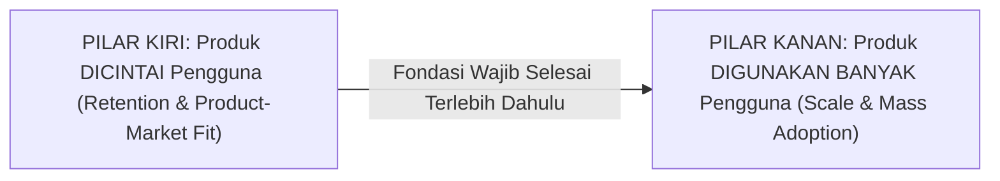
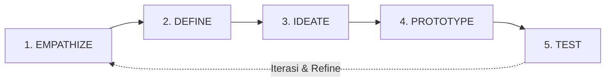

# Notulensi Lengkap & Menyeluruh: Workshop Stage 1 (Sesi 1)
## Topik: "Customer Discovery & Market Size"
### Program Inkubasi Startup Batch 24 : Bandung Techno Park (Telkom University)

---

## 1. Metadata Sesi & Pelaksanaan

| Parameter | Keterangan Detail |
| :--- | :--- |
| **Kegiatan** | Workshop Stage 1 Inkubator Bisnis BTP Batch 24 (Kompetisi) |
| **Hari, Tanggal** | Rabu, 23 September 2026 |
| **Waktu Pelaksanaan** | 09.00 - 11.30 WIB |
| **Topik Resmi Materi** | **Customer Discovery & Market Size** |
| **Sub-Tema Kegiatan** | *Discover the Problem, Understand the Customer* ("Dari Masalah Hingga Solusi: Bangun Startup yang Berdampak") |
| **Narasumber** | **Indra Purnama, S.T., M.T.** (Innovator in Chief : VINOV, Direktur PT Bara Praja Indonesia, Eks Executive Director Bandung Digital Valley / Indigo Incubator PT Telkom Indonesia) |
| **Kontak Narasumber** | `indra@indra.me` |
| **Moderator / MC** | **Shoffa Anbar** (Bandung Techno Park) |
| **Platform** | Zoom Cloud Meetings (Meeting ID: `883 0476 3688`) |
| **Peserta Hadir** | 100+ Peserta (47 Tim Startup Inkubasi BTP Batch 24, Founder, Co-Founder, dan Anggota Tim Inovasi) |
| **Notulis** | **Gerrard Sebastian** (Anggota Tim Geny StuntCare) |
| **Tujuan Sesi** | Memberikan penguasaan tuntas kepada startup binaan mengenai metodologi *Customer Discovery*, pengujian hipotesis di lapangan, pemetaan *Jobs to be Done* (JTBD), teknik wawancara eksploratif mendalam, penyusunan *Persona Canvas*, serta kalkulasi ukuran pasar (*Market Size*: TAM, SAM, SOM) secara *Top-Down* maupun *Bottom-Up*. |

---

## 2. Profil Komprehensif Pemateri: Indra Purnama, S.T., M.T.

Pak Indra Purnama adalah seorang *Full-Stack Innovation Expert* dan *Strong Believer in Startup & Incubator* dengan rekam jejak lebih dari **23 tahun berwirausaha mandiri (sejak 2003)** dan **15 tahun mendedikasikan diri dalam manajemen inkubasi startup (sejak 2012)**.

```
+---------------------------------------------------------------------------------------------------+
|                            PORTFOLIO & TRACK RECORD INDRA PURNAMA                                 |
+---------------------------------------------------------------------------------------------------+
| 1. Wirausaha (2003 - Sekarang)          : BARA (PT Bara Praja Indonesia), Angel.ID, VINOV         |
| 2. Manajemen Inkubasi (2012 - Sekarang) : Bandung Digital Valley (BDV/Indigo), BEKUP,             |
|                                           STPIPB+ (Science Techno Park IPB), BRIN                 |
| 3. Komunitas Startup & Ekosistem        : MIKTI, AIBI (Asosiasi Inkubator Bisnis Indonesia)      |
| 4. Inovasi Korporat (2014 - Sekarang)   : PLN, Telkomsel, Telkom Indonesia, Kalbe,                |
|                                           BPJS Ketenagakerjaan                                    |
| 5. Tenaga Ahli Senior Pemerintah        : Ristekdikti, Kemenko Perekonomian RI, Bekraf,           |
|                                           KemenkopUKM, LPDP                                       |
| 6. Jangkauan Asia Pasifik               : CodeArmy, Lean Startup Machine, Khazanah Nasional       |
+---------------------------------------------------------------------------------------------------+
```

### Publikasi Buku & Pengembangan Platform:
1. **Buku *"Startup Tools."*** (Diterbitkan oleh MIKTI bersama Gina Dellyana, Indra Purnama, M. Andy Zaky, Nina Anna): Berisi 53 tools aplikatif yang disesuaikan dengan setiap tahapan bisnis, memandu founder dalam merancang strategi pengembangan usaha yang berkelanjutan.
2. **Buku *"Digital Incubator Playbook"*** (Diterbitkan oleh MIKTI bersama Arief Widhiyasa, Dr. Dina Dellyana, Indra Purnama, M. Andy Zaky, Nina Anna): Buku panduan standar nasional bagi pengelola inkubator bisnis di Indonesia dalam mendampingi portofolio startup dari tahap ideasi hingga pendanaan.
3. **Platform Manajemen Inovasi (Inventor x Korporat x Startup):** Mengembangkan sistem platform inkubasi dan akselerasi digital (VINOV / Bara Praja) untuk memantau performa, modul misi mingguan, *worksheet*, serta evaluasi matriks inovasi secara terstruktur.

---

## 3. Pembukaan & Sambutan Moderator (Mbak Shoffa : BTP)

1. **Komitmen Changemakers:** Seluruh peserta inkubasi BTP Batch 24 diwajibkan menyalakan kamera (*open camera*) selama rangkaian workshop berlangsung sebagai wujud keseriusan dan kedisiplinan pembinaan.
2. **Tema Inkubasi Batch 24:** *"Dari Masalah Hingga Solusi: Bangun Startup yang Berdampak"*. Fondasi utama startup yang tangguh tidak dibangun dari keangkuhan teknologi, melainkan dari pemahaman mendalam terhadap masalah riil yang dihadapi manusia di dunia nyata.

---

## 4. Sensus Cepat & Pemetaan Ide Startup Peserta Batch 24

Sebelum masuk ke teori, Pak Indra meminta seluruh peserta menuliskan ringkasan profil di kolom obrolan dengan format:  
`Nama | Nama Startup | Produk yang Dibuat | Deskripsi Singkat Produk | Siapa Customernya`

### Tinjauan Ragam Startup Peserta:
* **Costify:** Platform SaaS Cost Management & Back Office untuk efisiensi pengeluaran operasional bisnis.
* **Creative Education Platform:** Platform kurikulum digital interaktif untuk institusi sekolah.
* **Karbonir:** Pengolahan limbah biomassa pertanian menjadi briket ramah lingkungan untuk UMKM kuliner.
* **Kell Skin:** Pemanfaatan limbah kulit buah dan sayur menjadi produk perawatan diri (*personal care*).
* **Klinis (HealthTech):** Aplikasi kalkulator dosis dan panduan klinis untuk praktik mandiri dokter.
* **Platform Rantai Pasok Horeca:** Distribusi bahan pangan untuk hotel, restoran, dan kafe berbasis serapan over-panen petani.
* **Smartfarming IoT:** Perangkat monitoring tanah dan cuaca presisi untuk perkebunan.
* **Brand Fashion Muslimah:** Busana muslim fungsional untuk segmen wanita aktif.
* **Custom Birthday Cake Patisserie:** Penyediaan kue tart kustom berbasis pesanan personal.

> **Catatan Evaluasi Pak Indra:**  
> Sebagian besar founder sangat fasih menceritakan fitur produk dan kecanggihan aplikasinya, namun masih sangat kabur, ragu-ragu, atau mendefinisikan calon pelanggannya secara terlalu luas ("semua orang", "semua ibu", "seluruh UMKM"). Inilah penyakit klasik startup yang harus disembuhkan di Stage 1!

---

## 5. Paradigma Inti: "We Don't Want to Build Product That Nobody Wants"

Prinsip paling fundamental dalam Customer Discovery terangkum dalam satu kalimat tegas:  
> **"We don't want to build product that nobody wants."**  
> *(Kita tidak ingin menghabiskan waktu, tenaga, dan tabungan untuk membangun produk yang pada akhirnya tidak diinginkan oleh siapa pun).*

### Mengapa Sesi Ini Vital di Awal Inkubasi?
1. **Jerih Payah yang Berujung Sia-Sia:** Membangun aplikasi atau pabrikasi produk fisik menuntut waktu berbulan-bulan dan biaya yang besar. Tragedi terbesar founder adalah saat produk diluncurkan, ternyata tidak ada pasar yang menyambutnya.
2. **Dua Kriteria Kegagalan Produk Startup:**
   - **Kriteria Finansial:** Produk gagal menghasilkan pendapatan (*revenue*) dan profit yang mampu menutup biaya operasional.
   - **Kriteria Dampak (*Impact*):** Produk bahkan tidak memberikan manfaat nyata bagi kehidupan pengguna karena memecahkan masalah yang sebenarnya tidak dianggap penting.

---

## 6. Evolusi Paradigma: Kecanggihan Produk Bukan Jaminan Sukses

Pak Indra membandingkan perbedaan iklim inovasi masa lampau dengan era modern:

```
[ERA DULU : Kendala Ada pada Penguasaan Teknologi]
• Membangun software/hardware sangat sulit, langka, dan butuh modal kapital raksasa.
• Jika Anda berhasil membuat produk yang canggih secara teknologi, hampir pasti bisnis laku.

                                  VS

[ERA SEKARANG : Kendala Ada pada Kesesuaian Pasar (Fit)]
• Teknologi sangat terdemokratisasi (No-code, Low-code, Cloud Server, AI Tools, 3D Printing).
• Siapa pun bisa merilis aplikasi dalam hitungan hari.
• BANYAK PRODUK SUPER CANGGIH GAGAL SECARA KOMERSIAL KARENA TIDAK DIBUTUHKAN PASAR.
```

### Bedah Kasus 1: Mengapa Segway Gagal Dibandingkan Sepeda Lipat Brompton?
* **Segway:** Mahakarya teknologi *self-balancing gyroscopic* yang sangat canggih. Visi awalnya adalah merevolusi mobilitas manusia perkotaan dunia. Namun secara komersial, Segway gagal total di pasar massal (*mass market*) dan hanya bertahan di pasar ceruk (*niche*): patroli satpam bandara atau wahana rekreasi taman hiburan.
* **Akar Masalah (Kacamata Pengguna Komuter):**
  - Pengguna sepeda lipat Brompton di kota metropolitan menaiki sepeda dari rumah ke stasiun, melipat sepedanya dalam hitungan detik, membawanya ke dalam gerbong kereta, membukanya lagi di stasiun tujuan, lalu menyimpannya rapi di kolong meja kantor tanpa takut dicuri.
  - Segway gagal mengakomodasi konteks mobilitas ini: bobotnya terlalu berat untuk diangkat ke kereta, tidak bisa dilipat, membingungkan regulasi trotoar vs jalan raya, serta terlalu besar ditaruh di bilik kantor namun rawan dicuri jika diparkir di luar.

---

## 7. Tragedi Dot-Com Bubble: $2.7 Miliar Hangus Akibat Faktor Ide

Pada 10 Maret 2000, indeks saham teknologi NASDAQ Composite mencapai puncaknya di level 5.132,52 sebelum akhirnya runtuh secara spektakuler. Sebanyak **$2,7 Miliar USD hangus** hanya dari 10 perusahaan dot-com yang gagal akibat euforia ide tanpa validasi pasar yang nyata:

```
                       TOTAL KERUGIAN 10 STARTUP DOT-COM ($2.7 BILLION)
                                   
                     [Webvan: $800M]            [Go.com: $790M]
                               \                    /
                                [Pets.com: $300M]
                               /                 \
                     [Kozmo.com: $280M]       [e-Toys.com: $247M]
                               \                 /
                                [Boo.com: $100M]
                               /                 \
                     [MVP.com: $65M]          [GovWorks: $60M]
                               \                 /
                                [Flooz: $50M]
                                      |
                                [Kibu.com: $22M]
```

### Rincian 10 Startup Dot-Com yang Kolaps:
1. **Webvan ($800 Juta USD):** Layanan pesan antar belanjaan dapur (*grocery online*) yang membangun gudang otomatis raksasa sebelum memastikan adopsi konsumen.
2. **Go.com ($790 Juta USD):** Portal internet mesin pencari raksasa milik Disney yang gagal merebut pangsa pasar.
3. **Pets.com ($300 Juta USD):** Penjualan makanan dan perlengkapan hewan peliharaan online. Biaya logistik makanan anjing kalengan yang berat jauh melampaui margin keuntungan.
4. **Kozmo.com ($280 Juta USD):** Layanan kurir instan 1 jam gratis tanpa minimum order (bahkan untuk satu kaleng soda atau DVD sewaan).
5. **e-Toys.com ($247 Juta USD):** E-commerce mainan anak yang gagal mengelola rantai pasok dan operasional saat pesanan melonjak.
6. **Boo.com ($100 Juta USD):** Fashion online mewah yang website-nya terlalu berat dan lambat untuk koneksi internet dial-up pada tahun 2000.
7. **MVP.com ($65 Juta USD):** E-commerce peralatan olahraga yang didukung atlet terkenal namun sepi pembeli.
8. **GovWorks ($60 Juta USD):** Platform pembayaran digital urusan birokrasi pemerintahan kota yang terjebak friksi regulasi dan konflik internal.
9. **Flooz ($50 Juta USD):** Mata uang digital online prasejarah yang kolaps akibat serbuan sindikat pencurian kartu kredit dan penipuan (*fraud*).
10. **Kibu.com ($22 Juta USD):** Portal komunitas remaja putri yang menghabiskan modal promosi tanpa model monetisasi yang jelas.

> **Pelajaran Moral:** Memiliki suntikan dana jutaan dolar, fitur web canggih, dan menjadi pelopor pertama (*first mover*) sama sekali tidak menjamin kelangsungan hidup jika produk tidak menjawab kebutuhan mendesak pelanggan.

---

## 8. Dua Pilar Keberhasilan Produk: Dicintai Dulu (Love) vs Skala Besar (Scale)



### Bahaya Membalik Urutan (Fenomena Ember Bocor):
* **Pilar Kiri (Dicintai):** Pengguna memakai produk secara berulang (*repeat usage*), merekomendasikan ke teman (*organic referral*), dan merasa sangat kehilangan bila produk ditutup.
* **Pilar Kanan (Skala):** Menjangkau ribuan hingga jutaan pengguna melalui saluran pemasaran masif dan modal kerja.
* Jika startup memaksakan skala sebelum produknya dicintai, maka biaya iklan ratusan juta akan lenyap sia-sia seperti menuangkan air ke dalam **ember yang bocor**: 1.000 pengguna baru mengunduh aplikasi hari ini, namun 990 pengguna langsung menghapusnya esok hari karena merasa kecewa atau tidak butuh.

---

## 9. Mindset Baru Founder: Stop Building The Cool Product, Start Building The Right One

Pak Indra mengibaratkan pilihan arah produk seperti lampu lalu lintas:

```
[LAMPU MERAH : BERHENTI!]
🔴 STOP BUILDING THE COOL PRODUCT (Technically Awesome)
   Jangan terobsesi membuat produk hanya karena terlihat keren secara teknologi,
   menggunakan AI rumit, atau berdesain futuristik bila tidak ada yang membutuhkan.

[LAMPU HIJAU : MULAI SEKARANG!]
🟢 START BUILDING THE RIGHT ONE (Solving Real Problem & Fulfilling Desire of User)
   Bangunlah produk yang TEPAT: produk yang memecahkan masalah riil dan
   memuaskan kehendak serta aspirasi terdalam penggunanya.
```

### Dua Klaster Nilai Produk:
1. **Solving Real Problem:** Menghilangkan rasa sakit (*pain*), inefisiensi biaya, risiko bahaya, atau kerugian waktu (contoh: Costify, Karbonir, Geny StuntCare).
2. **Fulfilling Desire of User:** Memuaskan gaya hidup, gengsi, estetika, status sosial, atau hiburan (contoh: Muslim Fashion, Patisserie Cake, Game).

---

## 10. Segmentasi Pelanggan yang Tajam: Bahaya Generalisasi

Segmen pelanggan yang berbeda akan menginginkan karakteristik produk yang berbeda pula. Menargetkan "semua orang" sama saja dengan tidak menargetkan siapa pun!

### A. Studi Kasus Laptop Berdasarkan Segmen Pengguna:
* **Segmen Gamers:** Membutuhkan kartu grafis GPU bertenaga tinggi, layar dengan refresh rate tinggi, sistem pendingin kipas ganda. Bodi tebal, bobot berat, dan baterai cepat habis **bukan masalah** bagi mereka.
* **Segmen Profesional / Manajer:** Membutuhkan keseimbangan antara daya komputasi multi-tasking, portabilitas, daya tahan baterai, dan bodi yang kokoh untuk mobilitas kantor.
* **Segmen Eksekutif / Direksi:** Membutuhkan laptop ultra-tipis (*ultra-slim*), sangat ringan, desain elegan/mewah (emas/silver), dan baterai awet seharian untuk membaca email, melihat dashboard laporan, dan menghadiri rapat direksi. Mereka tidak memerlukan GPU gaming kelas berat.

### B. Studi Kasus Target Busana Muslimah:
Populasi muslimah Indonesia berjumlah sekitar 90 - 100 juta jiwa. Namun, kebutuhan busana mereka sangat beragam:
- Muslimah berpenghasilan tinggi (*high SES*) mencari bahan sutra premium dan eksklusivitas rancangan desainer.
- Mahasiswi muda mencari pakaian kasual trendi yang ramah di kantong.
- Wanita karier mencari pakaian formal kerja yang syar'i namun tidak gerah.

---

## 11. Design Thinking: Metode Human-Centered Design

Design Thinking adalah metode inovasi berpusat pada manusia (*Human-Centered Design*) yang terdiri dari 5 fase berulang:



Pada workshop Sesi 1, pembahasan difokuskan secara mendalam pada fase **EMPATHIZE** sebagai gerbang utama memahami manusia sebelum merumuskan definisi masalah (**DEFINE**).

---

## 12. Tiga Pilar & 8 Teknik Metode Empathize

Untuk membangun empati yang autentik terhadap calon pengguna, innovator harus memadukan 3 pilar pendekatan:
1. **Observasi:** Mengamati perilaku nyata pengguna di habitat alami mereka tanpa mengintervensi.
2. **Interaksi:** Berdialog langsung, mewawancarai, dan mendengarkan keluh kesah mereka.
3. **Terjun Langsung (*Immersion*):** Merasakan sendiri penderitaan atau kerepotan yang dialami pengguna dengan memposisikan diri kita dalam situasi mereka.

```
+---------------------------------------------------------------------------------------------------+
|                                 8 TEKNIK PRAKTIS METODE EMPATHIZE                                 |
+---------------------------------------------------------------------------------------------------+
| 1. Research      : Menelaah laporan riset pasar, data sekunder makro, jurnal ilmiah, dan tren.    |
| 2. Interviews    : Wawancara mendalam tatap muka secara terstruktur dan terbuka.                  |
| 3. Surveys       : Kuesioner terukur untuk menguji kecenderungan pada sampel populasi luas.       |
| 4. Shadowing     : Mengikuti dan mendampingi aktivitas harian calon pengguna dari dekat.          |
| 5. Documentary   : Mendokumentasikan foto, video proses kerja, dan lingkungan fisik pengguna.     |
| 6. Journals      : Meminta pengguna mengisi catatan harian pengalaman (*diary study*).             |
| 7. Body Language : Mengamati gestur fisik, perubahan nada suara, dan ekspresi mikro keraguan.     |
| 8. Body Storming : Memeragakan skenario fisik dan situasi nyata untuk merasakan dinamika interaksi|
+---------------------------------------------------------------------------------------------------+
```

---

## 13. Exploratory (In-Depth) Interview vs Survey

Banyak startup terburu-buru menyebar Google Form (survei) di awal. Pak Indra menegaskan bahwa pada tahap *Customer Discovery*, **Wawancara Eksploratif (Interview)** jauh lebih penting dibandingkan survei!

```
+---------------------------------------------------------------------------------------------------+
|                       KOMPARASI: EXPLORATORY INTERVIEW VS EVALUATIVE SURVEY                       |
+---------------------------+-----------------------------------+-----------------------------------+
| Parameter                 | Interview: GENERATIVE             | Survey: EVALUATIVE                |
+---------------------------+-----------------------------------+-----------------------------------+
| Tujuan Utama              | Menemukan wawasan baru & pola tak | Mengukur & mengonfirmasi pola     |
|                           | terduga (*discover unknown*)      | yang sudah diketahui (*measure*)  |
| Bentuk Interaksi          | Bercerita leluasa (*Tell Story*)  | Menjawab pertanyaan (*Answering*) |
| Format Pertanyaan         | Open Ended & Serial Question      | Leading Question / Pilihan Ganda  |
| Alur Pertanyaan           | Fleksibel, memicu cerita lebih    | Alur kaku, baku, urutan tetap     |
|                           | dalam (*Trigger to tell more*)    | (*Fixed flow of questions*)       |
| Data yang Ditangkap       | Menyeluruh: respon verbal, emosi, | Terbatas pada jawaban teks/angka  |
|                           | kerutan dahi, jeda bicara         | yang diserahkan responden saja    |
+---------------------------+-----------------------------------+-----------------------------------+
```

### Prinsip Wawancara Eksploratif:
* Dilakukan **satu lawan satu (*one-on-one*)** agar responden merasa aman dan tidak terpengaruh jawaban orang lain.
* Menggunakan **pertanyaan terbuka** (bukan pertanyaan yang dijawab "ya" atau "tidak").
* Menggunakan **pertanyaan serial bertingkat** (menggali "*mengapa hal itu terjadi?*", "*lalu apa yang Anda rasakan?*").
* Menanyakan **tindakan, kondisi, pikiran, dan kejadian nyata di masa lalu** (fakta konkret, bukan opini spekulatif).
* **DILARANG KERAS** mempresentasikan solusi atau mempromosikan ide produk saat wawancara.
* Posisikan diri sebagai **pembelajar yang haus ilmu (*learner*)**, bukan sebagai konsultan atau ahli (*expert*).

---

## 14. Do's and Don'ts dalam Wawancara Pelanggan

| DO (Sangat Dianjurkan) | DON'T (Dilarang Keras) |
| :--- | :--- |
| • **Ask Specific Something in the Past:** Tanyakan kejadian nyata yang dialami di masa lalu ("Kapan terakhir kali Anda mengalami masalah tersebut?", "Apa yang Anda lakukan saat itu?"). | • **Ask to Imagine Theoretical Future Condition:** Jangan meminta mereka berandai-andai di masa depan ("Seandainya nanti ada aplikasi X, apakah Anda mau pakai?"). Responden cenderung berbohong demi bersikap sopan! |
| • **Ask for Problem:** Fokus menggali kerepotan, hambatan, kerugian biaya, dan rasa sakit yang dialami. | • **Test some Solution:** Jangan menguji atau menanyakan pendapat mengenai rancangan solusi atau prototipe Anda. |
| • **Be a Learner, Be Curious:** Miliki rasa ingin tahu yang tulus terhadap kehidupan dan kebiasaan narasumber. | • **Be an Expert / Interrogator:** Jangan bersikap menggurui, menginterogasi, atau bertindak seperti polisi. |
| • **Ask, Listen, Record:** Ajukan pertanyaan singkat, dengarkan secara aktif, rekam suara/catat tanpa memotong. | • **Argumentative, Blame, etc:** Jangan mendebat jawaban narasumber, jangan menyalahkan kebiasaan lama mereka. |
| • **Remove Judgment, Bias & Assumption:** Singkirkan bias pribadi dan jangan menggiring narasumber agar sejalan dengan asumsi kita. | • **Pitching Ide Bisnis:** Jangan mengubah sesi wawancara menjadi sesi jualan! |

---

## 15. Script Panduan Wawancara Eksploratif Lapangan (6 Pertanyaan Emas)

Pak Indra membekali startup dengan naskah wawancara standar 6 pertanyaan yang sangat efektif digunakan di lapangan:

1. *"Boleh ceritakan sedikit mengenai latar belakang Bapak/Ibu? (pendidikan, pekerjaan sebelumnya, atau motivasi dalam menjalankan peran/usaha ini)?"*  
   *(Tujuan: Mencairkan suasana dan memetakan profil demografi serta psikografi narasumber).*
2. *"Sebagai [peran: pemilik usaha / ibu balita / kader], apakah Bapak/Ibu secara rutin melakukan [aktivitas JTBD target]? Mengapa hal tersebut perlu dilakukan? Bagaimana caranya? Apa saja yang diperiksa/dilakukan?"*  
   *(Tujuan: Mengonfirmasi apakah Jobs to be Done benar-benar ada dan rutin dijalankan).*
3. *"Apa saja tantangan, kesulitan, atau kendala terbesar yang Bapak/Ibu hadapi saat melakukan hal tersebut? Bagaimana biasanya Bapak/Ibu mengatasinya?"*  
   *(Tujuan: Menangkap Customer Pain dan melihat seberapa besar dampak kerepotan tersebut).*
4. *"Alat bantu, metode, aplikasi, atau proses apa saja yang saat ini Bapak/Ibu terapkan untuk mengatasi hal tersebut? (misal: buku catatan manual, spreadsheet, software tertentu, grup WhatsApp, jasa orang lain)?"*  
   *(Tujuan: Memetakan Existing Solution yang saat ini digunakan di pasar).*
5. *"Dari alat bantu / metode yang digunakan saat ini, apa saja hal yang Bapak/Ibu SUKA atau merasa terbantu?"*  
   *(Tujuan: Mengetahui fitur atau kualitas esensial yang tidak boleh dihilangkan).*
6. *"Lalu, apa saja hal yang Bapak/Ibu PALING TIDAK SUKA atau merasa kecewa dari alat bantu / metode saat ini?"*  
   *(Tujuan: Menemukan celah peluang emas / Root Pain yang akan menjadi dasar proposisi nilai startup kita).*

---

## 16. Kerangka Hipotesis Pelanggan (Menghubungkan Masalah ke Solusi Baru)

Untuk mengubah hasil penelusuran empati menjadi ide solusi yang tervalidasi, Pak Indra merumuskan kerangka alur hipotesis berikut:

```
+---------------------------------------------------------------------------------------------------+
|                        KERANGKA HIPOTESIS PELANGGAN MENUJU SOLUSI BARU                            |
+---------------------------------------------------------------------------------------------------+
|                                                                                                   |
|  [Customer Segment / Persona] --------> [Goals (Tujuan Akhir)]                                    |
|              |                                                                                    |
|              v                                                                                    |
|  [Jobs to be Done (Kehendak)] --------> [Existing Solution (Solusi yang Dipakai Saat Ini)]        |
|              |                                        |                                           |
|              +-------------------+                    +--------------------+                      |
|              |                   |                    |                    |                      |
|              v                   v                    v                    v                      |
|       [Pain (Masalah)]    [Gain (Keinginan)]    [Dislike (Tidak Suka)] [Like (Suka)]              |
|              |                   |                    |                    |                      |
|              +-------------------+--------------------+                    |                      |
|                                  |                                         |                      |
|                                  v                                         |                      |
|                        [DESIGN CHALLENGE] <--------------------------------+                      |
|                                  |                                                                |
|                                  v                                                                |
|                      [POTENTIAL NEW SOLUTION]                                                     |
+---------------------------------------------------------------------------------------------------+
```

---

## 17. Pemetaan Mendalam 4 Jenis Jobs to be Done (JTBD)

**Jobs to be Done (JTBD)** adalah kehendak, aspirasi, atau tugas kerja yang harus diselesaikan oleh pelanggan demi mencapai *Goals* mereka. JTBD bukan masalah; JTBD adalah aktivitas!

```
+---------------------------------------------------------------------------------------------------+
|                                   4 KATEGORI JOBS TO BE DONE (JTBD)                               |
+---------------------------------------------------------------------------------------------------+
| 1. Fungsional      : Aktivitas teknis spesifik yang menghasilkan output terukur.                  |
|                      Misal: Menimbang berat badan balita, membuat laporan penjualan, mencuci baju.|
| 2. Emosional       : Keinginan batin untuk merasakan kondisi psikologis tertentu.                 |
|                      Misal: Ingin merasa tenang, merasa aman, terhindar dari rasa panik.          |
| 3. Sosial          : Kebutuhan sebagai makhluk sosial yang berinteraksi di lingkungan.            |
|                      Misal: Ingin diakui sebagai orang tua teladan, menjaga reputasi bisnis.      |
| 4. Kebutuhan Dasar : Pemenuhan kebutuhan biologis dan hakiki manusia.                             |
|                      Misal: Pemenuhan asupan nutrisi pangan, tempat tinggal layak, akses kesehatan|
+---------------------------------------------------------------------------------------------------+
```

### Kaidah Uji Perilaku Manual (The Manual Behavior Test):
Bagaimana membuktikan apakah suatu JTBD itu nyata atau hanya omong kosong?  
> *"Jika belum ada aplikasi atau teknologi modern yang membantu, apakah calon pelanggan tersebut TETAP BERUSAHA MELAKUKANNYA SECARA MANUAL?"*  
> Jika calon pelanggan menjawab: *"Oh, saya tidak melakukan apa-apa karena belum ada aplikasinya,"* maka dipastikan tugas tersebut **TIDAK PENTING BAGI MEREKA**. Pelanggan yang memiliki kebutuhan mendesak akan tetap mencari jalan keluar sebisanya (mencatat di kertas bekas, membuat grup WhatsApp darurat, menyusun buku kas manual).

---

## 18. Analisis 6 Dimensi Customer Pain (Intensitas & Frekuensi)

**Customer Pain** adalah hal-hal yang **TIDAK DIINGINKAN** oleh pelanggan ketika menyelesaikan JTBD mereka. Terdapat 6 dimensi yang harus dipetakan:
1. **Sia-Sia:** Waktu terbuang percuma akibat antrean panjang, uang terbuang sia-sia, energi terkuras.
2. **Ketakutan:** Risiko kerugian finansial, beban pikiran, rasa cemas anak sakit atau mengalami gangguan pertumbuhan permanen.
3. **Emosional:** Hal yang memicu rasa kesal, jengkel, malu, tidak nyaman, atau bingung.
4. **Yang Tidak Disukai dari Solusi Eksisting:** Ketiadaan fitur penting, sistem lambat/macet (*malfungsi*), data hilang.
5. **Kesalahan Pengguna (*User Errors*):** Kesalahan umum yang sering dilakukan manusia, misal: salah transfer uang, salah hapus data, salah menakar porsi obat/makanan.
6. **Hambatan (*Obstacles*):** Faktor yang menghambat pengguna mencoba solusi baru, seperti harga awal yang terlalu mahal, kurva belajar aplikasi yang rumit, atau birokrasi berbelit.

> **Metrik Analisis:** Ukur setiap pain berdasarkan **Intensitas** (seberapa parah tingkat kepedihan yang dirasakan) dan **Frekuensi** (seberapa sering masalah tersebut berulang). Fokuslah pada masalah dengan intensitas tinggi dan frekuensi sering!

---

## 19. Analisis 6 Dimensi Customer Gain (Intensitas & Frekuensi)

**Customer Gain** adalah hal-hal yang **DIINGINKAN** oleh pelanggan ketika menyelesaikan JTBD mereka:
1. **Penghematan:** Pengurangan biaya operasional, efisiensi waktu pemrosesan, penghematan tenaga fisik.
2. **Kemudahan:** Kemudahan operasional yang praktis, proses otomatis tanpa ribet, antarmuka sederhana.
3. **Pencapaian:** Hasil positif yang membanggakan, ketenangan batin, status sosial yang meningkat.
4. **Yang Disukai dari Solusi Eksisting:** Kualitas atau fungsi dari metode lama yang sudah disenangi (misal: gratis, sudah akrab digunakan staf).
5. **Output Solusi:** Kualitas hasil yang dicari dan standar metrik yang dipakai untuk mengukur keberhasilan.
6. **Daya Tarik (*Trigger to Adopt*):** Insentif atau fitur pembeda yang mendorong pengguna beralih mencoba solusi baru.

---

## 20. Sudut Pandang Masalah: Common World Problems vs Customer's Problem

Jangan pernah mencampuradukkan masalah makro dunia dengan masalah riil pelanggan:

```
[COMMON WORLD PROBLEMS]                   VS               [CUSTOMER'S PROBLEM]
• Perubahan iklim global.                                  • Kios warung kebanjiran saat hujan lebat.
• Angka stunting nasional 21.5%.                           • Ibu cemas berat badan bayinya tidak naik 2 bulan.
• Kemiskinan ekstrem di pedesaan.                          • Petani kekurangan uang tunai untuk membeli pupuk.
```

### Studi Kasus: "Bagi Mahasiswa, Hujan Deras Itu Pain atau Gain?"
Pak Indra melemparkan teka-teki kepada peserta: *"Apakah hujan lebat di pagi hari adalah sebuah Pain atau Gain bagi anak kos?"*
* **Bila JTBD-nya adalah harus presentasi skripsi pukul 08.00 pagi di kampus:** Hujan deras adalah **PAIN BESAR** (baju basah, sepatu kotor, macet di jalan, terancam tidak lulus).
* **Bila JTBD-nya adalah ingin istirahat dan tidur nyenyak setelah begadang semalaman:** Hujan deras adalah **GAIN BESAR** (udara sejuk, suasana tenang, tidur sangat pulas).
* **Kesimpulan:** Suatu kondisi tidak bisa dinilai sebagai Pain atau Gain sebelum kita mengetahui apa **Jobs to be Done (JTBD)** spesifik yang sedang dijalani orang tersebut!

---

## 21. Studi Kasus Segmen Kuliner: Mengapa JTBD Menentukan Solusi?

```
+---------------------------------------------------------------------------------------------------+
|                            KOMPARASI SEGMEN: PENGUSAHA KULINER                                    |
+------------------------------------+--------------------------------------------------------------+
| Pengusaha Kuliner Tradisional      | Pengusaha Kuliner Modern                                     |
+------------------------------------+--------------------------------------------------------------+
| • Pola Pikir: Merasa tanpa sistem  | • Pola Pikir: Sadar bahwa ekspansi cabang butuh standarisasi.|
|   atau teknologi pun usahanya      | • JTBD 1: Memantau dan menganalisis penjualan seluruh cabang.|
|   sudah menghasilkan cukup uang.   | • JTBD 2: Menstandarisasi SOP operasional dan mutu resep.    |
| • JTBD Utama: Menekan biaya modal  | • Goals: Memperluas bisnis menjadi puluhan cabang dengan     |
|   dan bahan baku semurah mungkin.  |   sistem monitoring yang rapi dan terukur.                   |
| • Respon Aplikasi: Menolak SaaS    | • Respon Aplikasi: Bersedia membayar software cloud POS      |
|   manajemen karena dianggap beban. |   dan back-office demi kemudahan pengawasan jarak jauh.      |
+------------------------------------+--------------------------------------------------------------+
```

---

## 22. Studi Kasus BUMN PLN Mobile: Identifikasi Masalah Kendaraan Listrik (EV)

Pak Indra menampilkan studi kasus nyata inovasi korporat PLN dalam merancang layanan ekosistem kendaraan listrik (*Electric Vehicle* / EV):

```
+---------------------------------------------------------------------------------------------------+
|                     STUDI KASUS IDENTIFIKASI PERMASALAHAN: PLN MOBILE & EKOSISTEM EV              |
+---------------------+-----------------------------------------------------------------------------+
| Target Customer     | Pemilik Kendaraan Listrik (EV) dan Calon Pembeli Mobil/Motor Listrik.       |
| Their Goal          | Mobilitas tanpa batas, efisien, dan ramah lingkungan.                       |
| Jobs to be Done     | Melakukan pengisian daya baterai kendaraan (*charging*).                    |
| Existing Solution   | SPKLU publik PLN, Stasiun Pengisian Swasta, Pengisian Daya Mandiri di Rumah.|
+---------------------+-----------------------------------------------------------------------------+
| Problems (Pain)     | 1. Sebaran SPKLU masih sangat terbatas dan belum merata di rute harian.     |
|                     | 2. Range Anxiety: Kekhawatiran mendalam baterai habis di tengah jalan.      |
|                     | 3. Antrean panjang dan keterbatasan daya colokan SPKLU di lokasi ramai.     |
+---------------------+-----------------------------------------------------------------------------+
| Gains yang Dicari   | 1. Kemudahan mengisi daya di mana saja tanpa harus melenceng jauh dari rute.|
|                     | 2. Pengisian daya tanpa perlu mengantre lama.                               |
|                     | 3. Fitur reservasi dan penjadwalan pengisian daya secara fleksibel di HP.   |
+---------------------+-----------------------------------------------------------------------------+
| OPPORTUNITY         | "Bagaimana kita bisa menyediakan fasilitas pengisian daya EV di semua       |
| STATEMENT           |  lokasi strategis dengan cepat, terjangkau, dan tanpa antrean?"             |
+---------------------+-----------------------------------------------------------------------------+
```

---

## 23. Bedah Tools: Persona Canvas 8 Blok

Untuk mendokumentasikan profil pengguna ideal (*semi-fictional character*) yang mewakili *early adopter*, Pak Indra memperkenalkan **Persona Canvas** dengan 8 blok analisis:

```
+---------------------------------------------------------------------------------------------------+
|                                  STRUKTUR PERSONA CANVAS (8 BLOK)                                 |
+----------------------------------+----------------------------------------------------------------+
| 1.a. Nama, Foto & Short Bio      | 1.b. Behavioral & Demographic Information                      |
+----------------------------------+--------------------------------+-------------------------------+
| 2. Job to be Done (JTBD)         | 3. Goal (Tujuan Akhir)         | 6. Current Solution           |
+----------------------------------+--------------------------------+-------------------------------+
| 4. Customer Pain                 | 5. Customer Gain               | 7. Dislike (Kelemahan Solusi) |
|                                  |                                +-------------------------------+
|                                  |                                | 8. Like (Kelebihan Solusi)    |
+----------------------------------+--------------------------------+-------------------------------+
```

### Studi Kasus Nyata Persona Canvas: "Rizky Ramadhan (UMKM Kuliner)"
* **1.a. Profil Biodata:** Rizky Ramadhan, 33 Tahun, Pendidikan Sarjana, Pemilik UMKM Kuliner Modern.
* **1.b. Informasi Demografis & Perilaku:** Rizky saat ini memiliki 3 cabang kedai kuliner di kota berbeda dan berencana memperluas jaringan hingga puluhan cabang. Ia aktif mengawasi operasional harian, tetapi masih mengandalkan rekapan manual dan spreadsheet sederhana.
* **2. Jobs to be Done:** Menganalisis data penjualan dan kinerja menu dari seluruh cabang.
* **3. Goal:** Mengembangkan bisnis menjadi puluhan cabang dengan tata kelola operasional yang rapi, transparan, dan terukur.
* **4. Customer Pain:**
  - Sangat sulit memantau omzet penjualan harian antar cabang secara *real-time*.
  - Rekap laporan keuangan sering tidak konsisten dan terlambat masuk.
  - Banyak transaksi kasir di lapangan masih dicatat di kertas bon manual.
  - Sulit memastikan menu makanan mana yang paling menguntungkan (*high margin*).
  - Kontrol stok bahan baku dan arus kas (*cash flow*) rawan terjadi kebocoran.
* **5. Customer Gain:**
  - Kemampuan memantau operasional seluruh cabang cukup melalui layar smartphone.
  - Rekapitulasi laporan bisnis tersaji otomatis tanpa perlu waktu lembur menyusun Excel.
  - Lebih percaya diri dalam melangkah membuka cabang baru.
  - Citra bisnis terlihat lebih profesional di mata investor atau mitra waralaba.
  - Memiliki data analitik yang akurat untuk mengambil keputusan bisnis secara cepat.
* **6. Current Solution:** Mesin kasir sederhana, spreadsheet Excel manual, buku catatan kas fisik, serta grup WhatsApp staf cabang untuk setor laporan penjualan malam hari.
* **7. Dislike (Hal yang Dibenci dari Solusi Eksisting):**
  - Data antar cabang terpisah-pisah dan tidak terintegrasi.
  - Laporan rekapitulasi sering terlambat berhari-hari dan rawan kesalahan hitung manusia (*human error*).
  - Pemilik tidak bisa memantau bisnis saat sedang bepergian ke luar kota.
  - Tidak ada visualisasi grafik analitik yang membantu strategi penjualan.
  - Cara kerja manual sangat tidak *scalable* untuk ekspansi lebih dari 5 cabang.
* **8. Like (Hal yang Disukai dari Solusi Eksisting):**
  - Sangat mudah digunakan tanpa perlu melatih karyawan secara rumit.
  - Biaya operasional relatif gratis / murah.
  - Cepat digunakan untuk pencatatan harian kasir.
  - Staf lapangan sudah sangat terbiasa dengan WhatsApp dan kertas.
  - Tidak memerlukan pengadaan perangkat keras (*hardware*) komputer yang mahal.

---

## 24. Fundamental Market Size (Ukuran Pasar)

Inovasi yang hebat harus didukung oleh potensi pasar yang layak secara ekonomi. Jika ukuran pasarnya terlalu kerdil, bisnis yang dikelola oleh tim terbaik sekalipun tidak akan mampu bertumbuh secara sehat.

```
                  PIRAMIDA KONSENTRIS MARKET SIZE (TAM - SAM - SOM)
                  
                  +---------------------------------------------+
                  |  TAM : Total Available Market               |
                  |  (Total potensi pasar secara keseluruhan)   |
                  |                                             |
                  |     +---------------------------------+     |
                  |     |  SAM : Serviceable Available    |     |
                  |     |  (Pasar dalam jangkauan kita)   |     |
                  |     |                                 |     |
                  |     |     +---------------------+     |     |
                  |     |     |  SOM : Serviceable  |     |     |
                  |     |     |  Obtainable Market  |     |     |
                  |     |     |  (Pangsa pasar yang |     |     |
                  |     |     |   dapat kita raih)  |     |     |
                  |     |     +---------------------+     |     |
                  |     +---------------------------------+     |
                  +---------------------------------------------+
```

### Definisi 3 Tingkatan Market Size:
1. **TAM (Total Available Market):** Total permintaan pasar terhadap tipe produk atau layanan secara keseluruhan di seluruh industri atau geografi nasional tanpa memandang batasan kapasitas tim kita saat ini.
2. **SAM (Serviceable Available Market):** Bagian dari TAM yang secara spesifik dituju oleh produk kita dan berada dalam jangkauan geografis, regulasi, serta model operasional kita.
3. **SOM (Serviceable Obtainable Market):** Bagian dari SAM yang secara realistis dapat kita kuasai pangsa pasarnya (*market share*) dalam jangka pendek (1 - 3 tahun ke depan) berdasarkan kapasitas penjualan, modal, dan penetrasi tim.

---

## 25. Metode Perhitungan Top-Down (Dari Data Makro Nasional)

Pendekatan *Top-Down* menghitung ukuran pasar dengan membedah data makro industri, kemudian mengerucutkannya secara bertingkat berdasarkan kriteria segmen dan estimasi pangsa pasar yang realistis.

### Simulasi Perhitungan Top-Down (Contoh: SaaS EdTech Sekolah Premium):

```
+---------------------------------------------------------------------------------------------------+
|                              LANGKAH PERHITUNGAN MARKET SIZE TOP-DOWN                             |
+---+--------------------------------------+--------------------------------------------------------+
| 1 | Kriteria Target Customer             | Sekolah tingkat menengah-atas dengan SPP > Rp 1 Jt/bln |
| 2 | Estimasi Jumlah Target Customer      | 1.200 Sekolah di seluruh Indonesia                     |
| 3 | Definisi Wilayah Pelayanan           | Wilayah Provinsi Jawa Barat                            |
| 4 | Estimasi Jumlah Target dalam Wilayah | 150 Sekolah di Jawa Barat                              |
| 5 | Target Pangsa Pasar (Market Share)   | 20% dari target wilayah                                |
| 6 | Estimasi Jumlah Pelanggan Tercapai   | 30 Sekolah (20% x 150 Sekolah)                         |
| 7 | Nilai ARPU (Average Revenue per User)| • Rp 5.000.000 per bulan                               |
|   | / Nilai Transaksi per Tahun          | • Rp 60.000.000 per tahun                              |
+---+--------------------------------------+--------------------------------------------------------+
```

### Hasil Kalkulasi Finansial:
* **TAM (Total Available Market):**  
  $$\text{TAM} = 1.200\text{ Sekolah} \times \text{Rp } 60.000.000 = \mathbf{\text{Rp } 72\text{ Miliar / tahun}}$$
* **SAM (Serviceable Available Market):**  
  $$\text{SAM} = 150\text{ Sekolah} \times \text{Rp } 60.000.000 = \mathbf{\text{Rp } 9\text{ Miliar / tahun}}$$
* **SOM (Serviceable Obtainable Market):**  
  $$\text{SOM} = 30\text{ Sekolah} \times \text{Rp } 60.000.000 = \mathbf{\text{Rp } 1,8\text{ Miliar / tahun}}$$

---

## 26. Strategi Lanjutan Top-Down: Sumber Data Makro, KBLI, & Kategori Baru

1. **Sumber Perolehan Data Makro Sekunder:**
   - Laporan riset pasar konsultan global/nasional kredibel (Gartner, IDC, Frost & Sullivan, Statista, Bain, BPS, dsb.).
   - Laporan Tahunan (*Annual Report*) dari perusahaan terbuka (Tbk) yang terdaftar di bursa efek, yang biasanya menyajikan data riset pasar industri terkini dalam bab Analisis Manajemen.
2. **Standardisasi Industri (KBLI):**
   - Founder wajib mengetahui kode sub-industri resmi dari bisnisnya mengacu pada **KBLI (Klasifikasi Baku Lapangan Usaha di Indonesia)** agar proses komparasi data statistik dengan lembaga pemerintah dapat dilakukan secara presisi.
3. **Mengestimasi Produk Kategori Baru (*New Market Creation*):**
   - Jika startup menciptakan kategori produk baru yang belum pernah ada pasarnya, potensi pasar dihitung dari besaran pasar produk lama yang akan disubstitusi atau digantikan.
   - *Contoh Sejarah:* Pada awal kemunculan Personal Computer (PC) di era 1980-an, perkiraan ukuran pasar PC dihitung oleh analis berdasarkan besarnya pasar penjualan **mesin ketik (*typewriter*)** yang saat itu mendominasi perkantoran dunia!

---

## 27. Metode Perhitungan Bottom-Up (Unit Economics Tervalidasi)

Berbeda dengan Top-Down yang mengasumsikan persentase dari langit (*macro share*), metode **Bottom-Up** menghitung ukuran pasar berdasarkan rencana aksi nyata dan data transaksi mikro yang telah tervalidasi di lapangan. Metode ini sangat disukai oleh investor karena jauh lebih realistis dan dapat dipertanggungjawabkan!

### Studi Kasus Nyata Bottom-Up: "Perusahaan A (Produksi Kerajinan Tangan)"
1. **Fakta Lapangan Saat Ini:**
   - Produk kerajinan Perusahaan A saat ini telah dititipkan di **1 toko oleh-oleh** di pusat kota.
   - Rata-rata pengunjung toko tersebut adalah 100 orang per hari.
   - Di toko tersebut, produk kerajinan laku terjual rata-rata **5 buah per bulan**.
   - Harga jual produk adalah **Rp 1.000.000 per buah**.
   - Realisasi omzet saat ini = 5 buah x Rp 1.000.000 = **Rp 5.000.000 per bulan per toko**.
2. **Rencana Aksi Ekspansi yang Tervalidasi:**
   - Perusahaan A telah mengantongi kesepakatan kemitraan untuk mendistribusikan produknya ke **20 toko oleh-oleh serupa lainnya** di kota yang sama.
   - Dengan asumsi volume kunjungan pembeli dan tingkat konversi yang setara di seluruh toko mitra:
     $$\text{Omzet Bulanan} = 20\text{ Toko} \times 5\text{ Produk} \times \text{Rp } 1.000.000 = \mathbf{\text{Rp } 100.000.000\text{ / bulan}}$$
     $$\text{Omzet Tahunan (SOM)} = \text{Rp } 100.000.000 \times 12\text{ bulan} = \mathbf{\text{Rp } 1,2\text{ Miliar / tahun}}$$
3. **Kesimpulan Angka SOM:** Nilai **Rp 1,2 Miliar per tahun** ini adalah angka SOM riil yang dihitung dari bawah ke atas (*bottom-up*) berdasarkan data penjualan nyata, bukan sekadar angan-angan persentase makro.

---

## 28. Rencana Implementasi Khusus untuk Startup Geny StuntCare (`genystuntcare.com`)

Sebagai implementasi langsung dari materi Sesi 1, tim **Geny StuntCare** merumuskan lembar kerja validasi masalah, instrumen wawancara, dan pemodelan ukuran pasar:

### A. Persona Canvas: "Bunda Rina (Ibu Balita 18 Bulan)"
* **1.a. Profil:** Rina Kartika, 26 Tahun, Ibu Rumah Tangga / Pekerja Paruh Waktu, Pendidikan D3, tinggal di Kabupaten Malang. Memiliki satu anak perempuan usia 18 bulan.
* **1.b. Karakteristik & Perilaku:** Menggunakan smartphone kelas menengah (Android), aktif di grup WhatsApp arisan RT dan Instagram parenting, namun sering cemas saat membaca kabar mengenai bahaya stunting di media sosial.
* **2. Jobs to be Done (JTBD):**
  - Memantau kenaikan berat dan panjang badan anak setiap bulan.
  - Memastikan anak mengonsumsi makanan pendamping ASI (MPASI) yang cukup gizi.
  - Mengeliminasi ketakutan bahwa tumbuh kembang anaknya tertinggal dibanding anak seusianya.
* **3. Goals:** Anak tumbuh sehat, lincah, berat badan naik stabil, dan bebas dari ancaman stunting permanen.
* **4. Customer Pain:**
  - Waktu antrean di posyandu bulanan sangat lama (1 - 2 jam), anak sering rewel dan menangis.
  - Kader posyandu tidak sempat menjelaskan arti garis grafik KMS di buku KIA fisik karena antrean sangat ramai.
  - Buku KIA fisik rawan terselip, basah, atau robek saat disimpan di rumah.
  - Bingung menyusun variasi menu MPASI berbasis protein hewani murah di pasar tradisional.
* **5. Customer Gain:**
  - Bisa mencatat dan melihat langsung grafik pertumbuhan balita dari smartphone kapan saja.
  - Notifikasi otomatis jika berat badan anak mengalami tren stagnan (*growth faltering*).
  - Rekomendasi resep MPASI berbasis pangan lokal murah (telur ayam, hati ayam, ikan kembung, tempe).
* **6. Current Solution:** Datang ke posyandu setiap bulan dan mencatat di buku KIA fisik.
* **7. Dislike:** Penjelasan kader terlalu terburu-buru, buku mudah rusak, tidak ada pengingat harian di ponsel.
* **8. Like:** Gratis, mendapatkan Pemberian Makanan Tambahan (PMT) biskuit/bubur, dan bisa silaturahmi dengan sesama ibu balita.

---

### B. Naskah Wawancara Eksploratif Lapangan Geny StuntCare (6 Pertanyaan Emas)
Naskah ini akan digunakan oleh surveyor Geny StuntCare pada riset validasi lapangan di 8 wilayah sasaran (Malang, Banyuwangi, Sidoarjo, Magetan, Surabaya, Jember):

1. *"Boleh ceritakan pengalaman Bunda dalam merawat dan memperhatikan tumbuh kembang si kecil selama setahun terakhir?"*
2. *"Apakah Bunda rutin memantau kenaikan berat badan dan tinggi badan si kecil? Biasanya dilakukan di mana dan bagaimana prosesnya?"*
3. *"Apa kesulitan atau kerepotan terbesar yang Bunda rasakan saat membawa si kecil menimbang atau saat memeriksa status gizinya?"*
4. *"Selama ini, bagaimana cara Bunda menyimpan riwayat catatan penimbangan tersebut? Alat bantu apa yang Bunda pakai di rumah?"*
5. *"Dari cara pemantauan yang Bunda lakukan saat ini di posyandu/klinik, apa yang paling Bunda sukai atau merasa terbantu?"*
6. *"Apa hal yang paling Bunda rasa kurang memuaskan, membingungkan, atau bikin repot dari cara pemantauan saat ini?"*

---

### C. Estimasi Ukuran Pasar (Market Size) Geny StuntCare

Menggabungkan model B2G (Puskesmas / Dinas Kesehatan) dan B2C Freemium (Orang Tua):

```
+---------------------------------------------------------------------------------------------------+
|                             ESTIMASI MARKET SIZE GENY STUNTCARE                                   |
+---------------------------------------------------------------------------------------------------+
| 1. MODEL TOP-DOWN B2G (Institusi Faskes / Puskesmas Pembina Posyandu)                             |
|    • TAM Nasional  : 10.374 Puskesmas di seluruh Indonesia                                       |
|                      x Nilai Lisensi Dashboard Wilayah Rp 12 Juta / tahun = Rp 124,4 Miliar/tahun |
|    • SAM Regional  : 971 Puskesmas di Provinsi Jawa Timur                                         |
|                      x Rp 12 Juta / tahun = Rp 11,65 Miliar / tahun                               |
|    • SOM Target    : 50 Puskesmas di 8 Kabupaten/Kota Sasaran Lapangan (Malang, Sidoarjo, dll)     |
|                      x Rp 12 Juta / tahun = Rp 600 Juta / tahun                                   |
|                                                                                                   |
| 2. MODEL BOTTOM-UP B2C FREEMIUM (Orang Tua Balita Pengguna Fitur Premium Edukasi Gizi)            |
|    • Basis Pengujian Lapangan : 8 Wilayah Sasaran Riset Validasi                                  |
|    • Target Populasi Awal     : 10.000 Ibu Balita terdaftar di platform genystuntcare.com         |
|    • Tingkat Konversi Premium : 3% beralih ke Fitur Konsultasi Gizi & Menu MPASI Personal        |
|    • Jumlah Pengguna Berbayar : 300 Pelanggan Aktif                                               |
|    • Nilai Langganan          : Rp 25.000 per bulan (Rp 300.000 per tahun)                        |
|    • SOM Bottom-Up B2C Awal   : 300 x Rp 300.000 = Rp 90.000.000 / tahun                          |
+---------------------------------------------------------------------------------------------------+
```

---

## 29. Penutup & Informasi Sesi Lanjutan

* Sesi ditutup oleh Moderator **Mbak Shoffa** tepat pukul 11.30 WIB dengan apresiasi tinggi kepada seluruh peserta aktif dan pemaparan komprehensif dari narasumber.
* Narasumber menyertakan kontak resmi untuk konsultasi kurikulum inovasi startup:  
  **Indra Purnama** | Email: `indra@indra.me`
* Kegiatan dilanjutkan pada Sesi 2 (Pukul 16.00 WIB) dengan topik *"Design Thinking Startup"* bersama Direktur Bandung Techno Park, **Dr. Iwan Iwut Tritoasmoro, S.T., M.T.**

---
<p align="center">
  <em>Notulensi masterclass resmi ini disusun secara menyeluruh dan terverifikasi untuk arsip repositori Projects21 : Program Inkubasi Bisnis Startup Batch 24 Bandung Techno Park (Telkom University).</em>
</p>
