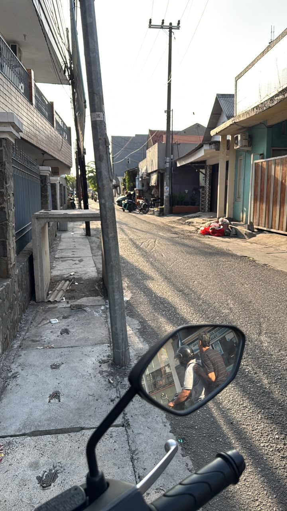
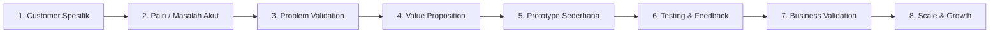
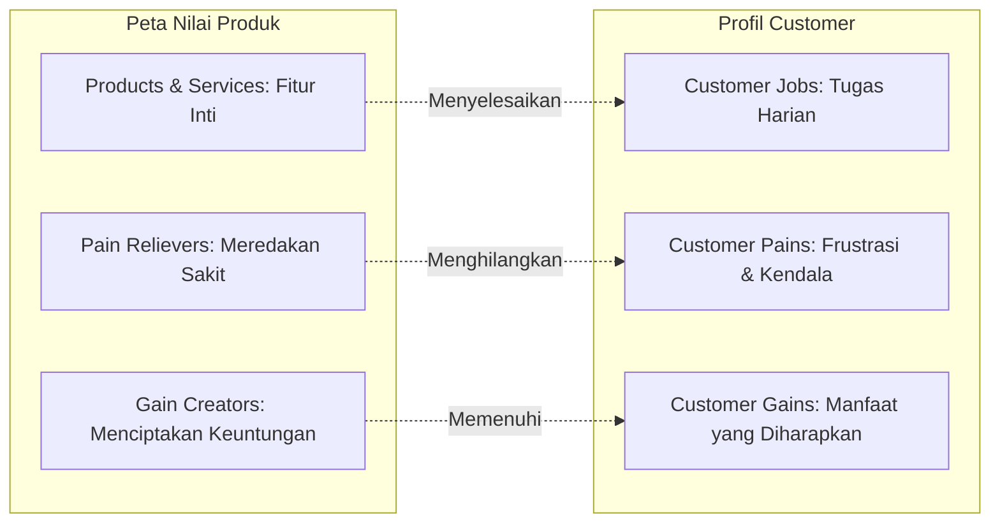
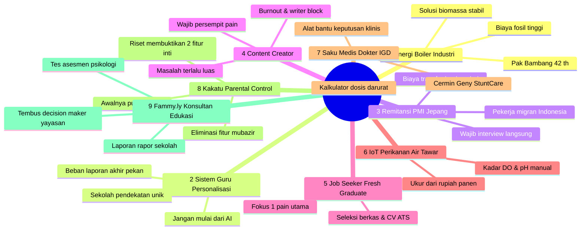
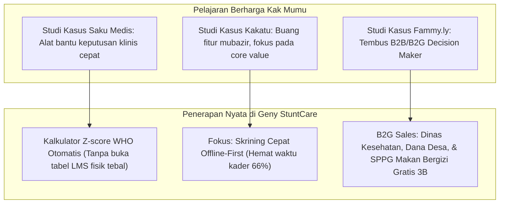

# 📑 Notulensi Lengkap & Komprehensif Workshop Stage 1 (Sesi 3)
## *Problem Validation and Value Proposition Canvas*
### Program Inkubasi Startup Batch 24 : Bandung Techno Park (Telkom University)

---

  

---

## 📌 Metadata & Profil Sesi

* **Program**: Inkubasi Bisnis Startup Batch 24 Bandung Techno Park (BTP) : Telkom University
* **Tahap Inkubasi**: Stage 1 — *Problem & Customer Validation*
* **Tema Sesi 3**: **Problem Validation and Value Proposition Canvas**  
  *(Sub-Tema: Dari Masalah Hingga Solusi — Bangun Startup yang Berdampak)*
* **Narasumber**: **Muhammad Nur Awaludin** (Co-Founder & CEO of Fammy.ly / FAMI, Founder Kakatu, akrab disapa **Kak Mumu**)
* **Hari, Tanggal**: **Sabtu, 26 September 2026**
* **Waktu**: **09.00 – 11.30 WIB**
* **Media**: Daring via Zoom Meeting
* **Tautan Presensi**: [Google Form Presensi Kehadiran BTP](https://forms.gle/6rpV3CnAXCbo3axDA)
* **Dokumentasi Terkait**: [Modul Terstruktur 10 Berkas](file:///Users/sinitygs/Projects21/04-notulensi-workshop/workshop-01/sesi-03-problem-validation-dan-vpc/README.md) | [Informasi & Poster Resmi](file:///Users/sinitygs/Projects21/04-notulensi-workshop/workshop-01/info_dan_poster_sesi_3.md)

---

## 💡 Ringkasan Eksekutif & Filosofi Pokok

Workshop Sesi 3 menghadirkan praktisi kawakan ekosistem startup Indonesia, **Muhammad Nur Awaludin (Kak Mumu)**, yang membagikan pengalaman jatuh bangun membangun produk digital (dari Kakatu hingga Fammy.ly). 

Pesan inti yang ditekankan sepanjang sesi adalah:

> *"Kesalahan terbesar dari hampir 90% founder tahap awal adalah jatuh cinta pada solusi teknologinya sendiri (solution-in-search-of-a-problem), bukan pada penderitaan nyata calon pengguna. Startup yang tangguh tidak dibangun dari kecanggihan baris kode, melainkan dari kedalaman empati mendengarkan masalah customer."*

### Alur Baku Pengembangan Startup Berdampak:

$$\textbf{Kenali Customer} \longrightarrow \textbf{Dengarkan Customer} \longrightarrow \textbf{Gali Masalah} \longrightarrow \textbf{Temukan Akar Masalah} \longrightarrow \textbf{Validasi Asumsi} \longrightarrow \textbf{Rancang Solusi} \longrightarrow \textbf{Uji Prototipe} \longrightarrow \textbf{Perbaiki Iteratif}$$

---

## 🎯 Bagian 1: Mendefinisikan Customer Persona Secara Spesifik

### 1.1 Bahaya Menentukan Pasar Terlalu Luas
Banyak founder pemula mendefinisikan target pasar dengan kalimat:
- *"Target kami adalah seluruh ibu hamil dan balita di Indonesia."*
- *"Target kami adalah semua sekolah swasta."*

Definisi yang terlalu luas membuat tim kehilangan fokus riset. Masalah yang divalidasi menjadi bias, tidak seragam, dan menghasilkan fitur yang serba tanggung (*mediocre*).

### 1.2 6 Elemen Wajib Customer Persona
Untuk membangun persona yang hidup (*living persona*), founder wajib mengisi 6 parameter:
1. **Nama Representatif**: Memberi identitas nyata agar tim memiliki empati yang sama saat berdiskusi.
2. **Usia**: Menentukan gaya komunikasi, preferensi visual UI, dan kanal adopsi digital.
3. **Pekerjaan & Tanggung Jawab**: Peran harian, rutinitas kerja, dan beban administratif.
4. **Tujuan (*Goals*)**: Apa capaian yang membuatnya merasa sukses atau dihargai atasannya.
5. **Pains / Masalah Utama**: Apa hambatan terbesar yang membuatnya frustrasi, rugi waktu, atau rugi uang.
6. **Perilaku (*Behaviors*)**: Kebiasaan nyata saat ini dalam menyelesaikan masalah (alat apa yang dipakai, di mana mereka mengadu).

### 1.3 Contoh Studi Kasus: Pak Bambang (Manager Operation)
- **Nama & Usia**: Pak Bambang, 42 tahun.
- **Jabatan**: *Manager Operation* Pabrik Tekstil Manufaktur.
- **Pains**: Biaya energi operasional pabrik membengkak akibat konsumsi bahan bakar fosil pada mesin *boiler*, ditambah tekanan regulasi emisi karbon pemerintah yang mengancam denda operasional.
- **Goals**: Menekan biaya energi bulanan minimal 15–20% dengan bahan bakar alternatif yang stabil tanpa merusak mesin boiler.
- **Insight Kak Mumu**: Dengan persona sejelas ini, penawaran solusi tidak lagi membicarakan hal abstrak, melainkan kalkulasi penghematan rupiah per ton uap boiler.

---

## 💊 Bagian 2: Problem Validation — Konsep "Vitamin vs Painkiller"

### 2.1 Membedakan Vitamin vs Painkiller
Founder harus menguji dengan jujur apakah produk yang dibangun adalah *Vitamin* atau *Painkiller*:

| Dimensi Perbandingan | Solusi Kategori Vitamin | Solusi Kategori Painkiller |
| :--- | :--- | :--- |
| **Karakter Masalah** | Masalah ringan, bersifat pelengkap (*nice-to-have*). | Masalah akut, menyakitkan, dan mendesak (*must-have*). |
| **Dampak Jika Tidak Ada** | Kehidupan dan bisnis customer tetap berjalan normal. | Menimbulkan kerugian finansial, sanksi hukum, atau jam lembur parah. |
| **Willingness to Pay** | Sangat sulit memungut biaya; pengguna enggan bayar. | **Customer rela mengalokasikan anggaran** demi menghentikan rasa sakit. |
| **Retensi Pengguna** | Mudah ditinggalkan setelah rasa penasaran awal hilang. | Tingkat retensi dan ketergantungan operasional sangat tinggi. |

### 2.2 Diagnostik Jika Validasi Masalah Menemui Kegagalan
Jika saat turun ke lapangan calon customer tidak menganggap masalah tersebut penting, jangan langsung panik dan jangan membabi buta membuang produk (*pivot*). Lakukan uji diagnostik 4 faktor:
1. **Apakah Masalahnya Dibuat-buat (*Invented Problem*)?** Masalah hanya ada di imajinasi founder, tetapi di dunia nyata tidak dirasakan siapa pun.
2. **Apakah Masalahnya Terlalu Kecil?** Masalah memang ada, tetapi dampaknya sangat sepele sehingga customer merasa tidak perlu repot memasang aplikasi baru.
3. **Apakah Kurang Menyakitkan (*Not Painful Enough*)?** Masalah ada, tetapi customer sudah terbiasa hidup berdampingan dengan masalah tersebut (*status quo*).
4. **Apakah Berbicara dengan Target yang Salah (*Wrong Target Market*)?** Masalahnya nyata, tetapi Anda mewawancarai orang yang tidak punya kepentingan atau wewenang.

---

## 🎨 Bagian 3: Value Proposition Canvas (VPC)

*Value Proposition* adalah artikulasi janji nilai yang menghubungkan **Profil Customer** dengan **Peta Nilai Produk**:

### 3 Pertanyaan Uji Value Proposition:
1. **Apakah customer benar-benar butuh solusi ini?**
2. **Apakah solusi ini terbukti meringankan beban mereka secara terukur?**
3. **Apakah nilai tersebut dapat dipahami dalam 10 detik pertama tanpa penjelasan teknis yang berbelit-belit?**

---

## 🎙️ Bagian 4: Customer Discovery & Protokol Wawancara One-on-One

### 4.1 Tiga Pendekatan Customer Discovery
1. **Observasi Lapangan (*Fly on the Wall*)**: Mengamati tanpa menginterupsi untuk melihat perilaku asli.
2. **Focus Group Discussion (FGD)**: Mengumpulkan beberapa pengguna untuk memicu diskusi komparatif.
3. **Interview One-on-One**: Pendekatan paling mendalam untuk menggali akar masalah psikologis dan operasional.

### 4.2 Aturan 80/20 dalam Interview
> *"Dalam interview yang baik, calon customer berbicara 80% dari total waktu, sementara interviewer hanya berbicara 20% untuk memandu pertanyaan."*

- **Hindari Leading Questions**: Jangan bertanya *"Apakah Anda suka aplikasi ini?"*. Tanyakan: *"Bagaimana langkah Anda menyelesaikan pekerjaan ini kemarin? Apa kendala paling menyebalkan yang Anda temui?"*
- **Fokus pada Masa Lalu**: Orang bisa berbohong mengenai apa yang akan mereka lakukan di masa depan, tetapi mereka tidak bisa berbohong mengenai apa yang sudah mereka alami dalam 30 hari terakhir.
- **Tahan Diri untuk Jualan**: Jangan terburu-buru membuka demo aplikasi sebelum seluruh peta masalah mereka terurai tuntas.

### 4.3 Kuesioner Online sebagai *Second Opinion*
Kuesioner (Google Form) digunakan untuk **mengukur seberapa luas masalah tersebut tersebar**, bukan untuk **menemukan masalah baru**:
- Durasi pengisian maksimal 5–7 menit.
- Cantumkan estimasi waktu di halaman depan.
- Berikan opsi terbuka (*"Lainnya..."*) di setiap pertanyaan pilihan ganda.

---

## 🧪 Bagian 5: Validasi Prototipe & Metrik Uji

### 5.1 Skala Sampel Pengujian Prototipe
- **Segmen B2C (Konsumen Perorangan)**:  
  Target awal: **sekitar 30 orang**.  
  Target ideal: **sekitar 50 orang** untuk pola umpan balik yang kokoh.
- **Segmen B2B / B2G (Institusi / Pemerintah)**:  
  Cukup **3 sampai 5 institusi/klien**, karena rantai keputusan kelembagaan jauh lebih kompleks dan berbobot.

### 5.2 Satu Pertanyaan Emas & *Probing* Kualitatif
Setelah responden mencoba alur prototipe, tanyakan:
> *"Dari skala 1 sampai 10, seberapa membantu prototipe ini dalam menyelesaikan masalah Anda?"*

Kuncinya ada pada pertanyaan lanjutannya:
- Jika dijawab 7: *"Apa yang membuat Anda memberi nilai 7, dan apa yang kurang agar nilainya bisa menjadi 10?"*
- Catat seluruh tombol yang membingungkan, teks yang tidak terbaca, atau alur yang terhambat.

---

## 🏢 Bagian 6: Validasi Bisnis, Pengambil Keputusan B2B/B2G & Pivot

### 6.1 Tiga Serangkai Kelayakan Bisnis
1. **Desire**: Apakah pasar benar-benar menginginkan produk ini?
2. **Feasibility**: Apakah tim mampu secara teknis dan operasional untuk mengeksekusinya?
3. **Viability / Buyability**: Apakah ada model bisnis yang masuk akal dan ada pihak yang bersedia membayar?

### 6.2 Memisahkan End-User vs Economic Buyer di B2B/B2G
Pengguna produk hampir selalu berbeda dari pihak yang memegang anggaran:
- **Di Sekolah**: Pengguna = Guru & Siswa; Pengambil Keputusan / Pembayar = Kepala Sekolah & Ketua Yayasan.
- **Di Posyandu / Kesehatan**: Pengguna = Kader & Ibu Balita; Pengambil Keputusan / Pembayar = Kepala Puskesmas, Dinas Kesehatan, Kepala Desa (Dana Desa), atau Pengelola SPPG MBG 3B.

### 6.3 Repositioning vs Pivot
- **Repositioning**: Dilakukan saat **masalahnya valid**, namun target segmen pengguna, model harga, atau kemasan UI/UX perlu digeser.
- **Pivot**: Dilakukan saat **masalah utamanya terbukti tidak ada** atau tidak ada yang mau membayar solusinya.

---

## 📖 Bagian 7: Deconstruct 9 Studi Kasus Nyata Workshop

1. **Industri & Energi**: Penghematan biaya bahan bakar boiler pabrik melalui pasokan biomassa terjamin.
2. **Sistem Guru**: Mengurangi beban administrasi guru dalam menyusun laporan evaluasi individual murid.
3. **Remitansi Pekerja Migran Jepang**: Memangkas biaya dan kerumitan birokrasi transfer uang nafkah keluarga.
4. **Content Creator**: Mengatasi *burnout* dengan mempersempit masalah ke satu titik frustrasi paling akut.
5. **Job Seeker**: Menyelesaikan masalah spesifik seleksi berkas sistem ATS bagi *fresh graduate*.
6. **Budidaya Ikan**: Sistem IoT pemantau air yang dinilai dari berapa rupiah kerugian kematian ikan yang dapat diselamatkan.
7. **Saku Medis**: **Kalkulator medis darurat untuk dokter muda/koas di IGD**. Studi kasus ini sangat identik dengan *Geny StuntCare*: kader posyandu membutuhkan kalkulator cerdas Z-score WHO yang instan di tengah kepadatan antrean.
8. **Kakatu**: Pelajaran penting membuang puluhan fitur mubazir dan fokus pada **2 fitur esensial**: membatasi aplikasi dan mengatur *screen time*.
9. **Fammy.ly**: Keberhasilan Kak Mumu mentransformasikan platform parenting menjadi konsultan ekosistem sekolah dengan menyasar *decision maker* Kepala Sekolah/Yayasan.

---

## ❓ Bagian 8: 12 Tanya Jawab (Q&A) Lengkap

1. **Menentukan Persona Majemuk**: Buat persona terpisah untuk setiap segmen; jangan dicampuradukkan.
2. **Kapan Membahas AI/Teknologi**: Jangan mulai dari AI; mulailah dari penderitaan customer, biarkan kebutuhan mereka yang memanggil teknologinya.
3. **Keterbatasan Riset Sekunder**: Riset sekunder hanya peta awal; validasi wajib berbicara langsung ke pengguna di lapangan.
4. **Validasi Tanpa Menulis Kode**: Gunakan prototipe interaktif (Figma) yang dapat diklik untuk melihat reaksi pengguna.
5. **Jumlah Pengguna Uji**: Patokan praktis: 30–50 *end consumers* (B2C) atau 3–5 institusi (B2B/B2G).
6. **Mengevaluasi Skor Feedback**: Nilai rating 1–10 hanyalah pembuka; yang terpenting adalah menggali alasan mengapa belum mencapai nilai 10.
7. **Bolehkah Hanya Mengandalkan Form?**: Tidak boleh. Form adalah *second opinion*; wawancara langsung wajib untuk menangkap emosi.
8. **Format Form yang Baik**: Singkat (5–7 menit), cantumkan estimasi waktu, dan sediakan opsi pilihan terbuka.
9. **Menyikapi Masalah Tidak Valid**: Analisis 4 faktor diagnostik sebelum memutuskan langkah selanjutnya.
10. **Kriteria Repositioning**: Lakukan saat masalah terbukti nyata tetapi kemasan produk atau segmen pembeli perlu digeser.
11. **Kriteria Pivot**: Lakukan saat masalah terbukti fiktif atau tidak ada kesediaan membayar sama sekali.
12. **Membangun Keterbukaan Interview**: Terapkan prinsip mendengarkan 80%, hindari nada menguji, dan tanyakan pengalaman nyata di masa lalu.

---

## 📋 Bagian 9: 10 Action Items Implementasi Startup

| No. | Action Item | Target Luaran |
| :---: | :--- | :--- |
| **1** | Mempersempit Customer Persona | Memilih 1 persona paling tajam untuk Posyandu. |
| **2** | Mengidentifikasi Pain Utama | Menetapkan 1 rasa sakit paling akut kader: antrean & salah hitung z-score. |
| **3** | Melakukan Customer Discovery | Mengamati meja 1–5 penimbangan posyandu di Sidoarjo. |
| **4** | Menyusun Panduan Wawancara Bebas Bias | Pertanyaan berbasis pengalaman masa lalu tanpa istilah stunting di awal. |
| **5** | Membangun Prototipe MVP Sederhana | Aplikasi kalkulator skrining offline-first tanpa fitur mubazir. |
| **6** | Menguji Prototipe ke Responden | Menguji ke minimal 30–50 kader posyandu dan ibu balita. |
| **7** | Mengukur Rating & Alasan Feedback | Memperoleh skor 1–10 dan mencatat daftar perbaikan antarmuka. |
| **8** | Memvalidasi Decision Maker B2G | Mendekati Kepala Puskesmas, Pemda, dan mitra SPPG MBG 3B. |
| **9** | Mengelompokkan Pola Masukan | Menyusun prioritas pengembangan engineering berbasis umpan balik riil. |
| **10** | Menetapkan Keputusan Iterasi Produk | Mengambil keputusan strategis berbasis data lapangan empiris. |

---

## 🚀 Bagian 10: Relevansi Langsung & Panduan Strategis bagi Geny StuntCare

Pelajaran dari materi Kak Mumu memberikan arahan yang sangat presisi bagi perjalanan startup **Geny StuntCare** di Inkubasi BTP Batch 24:

1. **Refleksi Studi Kasus Saku Medis**:  
   Kader posyandu di lapangan berada dalam kondisi tertekan mirip dokter muda di IGD: antrean balita menangis, pencatatan register manual tebal, dan keterbatasan waktu. Fitur utama Geny StuntCare harus menjadi **alat bantu keputusan klinis instan** yang langsung mengeluarkan status Z-score WHO tanpa perlu membolak-balik tabel LMS fisik.
2. **Refleksi Studi Kasus Kakatu (Anti-Feature Creep)**:  
   Laporan audit membuktikan aplikasi edukasi stunting generik di Indonesia memiliki retensi rendah dan tidak menurunkan angka stunting. Geny StuntCare tidak boleh membebani aplikasi dengan artikel panjang yang tidak dibaca kader; fokuskan 100% pada **kecepatan pencatatan, kalkulasi otomatis, dan rujukan presisi**.
3. **Refleksi Studi Kasus Fammy.ly (B2G Decision Maker)**:  
   Kader dan ibu balita adalah *end-user*, tetapi pembayar sesungguhnya adalah **institusi pemerintah**: Dinas Kesehatan (pengadaan alat Posyandu ILP), Pemerintah Desa (alokasi 10% Dana Desa untuk stunting), serta Badan Gizi Nasional / mitra SPPG program Makan Bergizi Gratis (MBG 3B) yang membutuhkan validasi data penerima.

---
*Dokumentasi ini disahkan sebagai notulensi resmi Workshop Stage 1 (Sesi 3) Repositori Projects21.*
