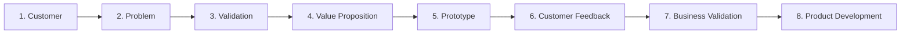

# 📁 Sesi 03: Problem Validation & Value Proposition Canvas

> **Dokumentasi Terstruktur Workshop Stage 1 (Sesi 3) : Inkubasi Startup BTP Batch 24**  
> Narasumber: **Muhammad Nur Awaludin** (Co-Founder & CEO of Fammy.ly / FAMI, Kak Mumu)  
> Tanggal: **Sabtu, 26 September 2026** | **09.00 – 11.30 WIB**  
> Penyelenggara: **Bandung Techno Park (Telkom University)**

---

## 📌 Ringkasan Sesi

Workshop ini membahas proses sistematis dalam memahami customer, memvalidasi problem secara objektif, merancang *Value Proposition Canvas* (VPC), menguji prototipe solusi, menjalankan *customer discovery*, dan mengevaluasi kelayakan bisnis (*business validation*).

> **Prinsip Utama**: *"Pahami customer dan masalah terlebih dahulu sebelum membangun solusi atau teknologi. Kenali customer → Dengarkan customer → Gali masalah → Temukan akar masalah → Validasi asumsi → Rancang solusi → Uji → Perbaiki."*

---

## 📚 Daftar Berkas Materi Terstruktur

Modul ini telah dipecah ke dalam 10 topik pembahasan terpisah untuk memudahkan eksplorasi dan implementasi tim:

| Berkas | Topik Bahasan | Fokus Utama |
| :--- | :--- | :--- |
| **[notulensi_sesi_03.md](notulensi_sesi_03.md)** | Ringkasan Eksekutif Sesi | Profil sesi, tujuan, kesimpulan, dan prinsip dasar validasi startup. |
| **[customer_persona.md](customer_persona.md)** | Pemetaan Customer Persona | Menentukan target spesifik, elemen persona, contoh Pak Bambang & Guru. |
| **[problem_validation.md](problem_validation.md)** | Validasi Masalah Nyata | Urutan Customer ➔ Masalah ➔ Solusi, konsep *Vitamin vs Painkiller*. |
| **[value_proposition.md](value_proposition.md)** | Value Proposition Canvas | 3 pertanyaan penting, keselarasan pain dengan value proposition. |
| **[customer_discovery.md](customer_discovery.md)** | Customer Discovery & Interview | 3 cara discovery, etika interview 1-on-1 (jangan mendominasi), survey form. |
| **[prototype_validation.md](prototype_validation.md)** | Validasi Prototipe Solusi | Target pengujian (30–50 end consumers, 3–5 B2B), rating feedback 1–10. |
| **[business_validation.md](business_validation.md)** | Validasi Bisnis & Keputusan | Desire, Feasibility, Viability; B2B decision makers; Repositioning vs Pivot. |
| **[studi_kasus.md](studi_kasus.md)** | 9 Studi Kasus Nyata | Industri boiler, guru personal, remitansi Jepang, Saku Medis, Kakatu, FAMI. |
| **[tanya_jawab.md](tanya_jawab.md)** | 12 Tanya Jawab (Q&A) | Tanya jawab lengkap peserta dengan Kak Mumu seputar validasi startup. |
| **[action_items.md](action_items.md)** | 10 Action Items Implementasi | Langkah konkret tindak lanjut tim dan siklus *Discovery ➔ Feedback*. |

---

## 🖼️ Media & Tautan Terkait

- 🖼️ **Poster Resmi Kegiatan:** [info_dan_poster_sesi_3.md](../info_dan_poster_sesi_3.md)
- 📄 **Dokumen Notulensi Masterclass Lengkap:** [notulensi_lengkap_sesi_3_muhammad_nur_awaludin.md](../notulensi_lengkap_sesi_3_muhammad_nur_awaludin.md)
- 📘 **Indeks Utama Folder 04:** [04-notulensi-workshop/README.md](../../README.md)
