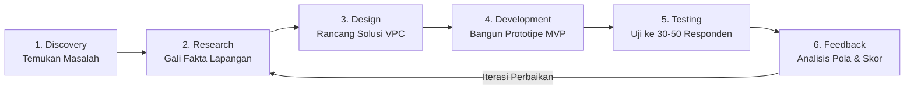

# Action Items Implementasi Startup

10 Rencana Tindak Lanjut (*Action Items*) konkret yang ditugaskan kepada tim startup pasca-mengikuti Workshop Stage 1 (Sesi 3):

| No. | Action Item Konkret | Tujuan & Target Capaian | PIC & Batas Waktu |
| :---: | :--- | :--- | :--- |
| **1** | **Mempersempit Customer Persona** | Memilih satu profil segmen paling spesifik dan menghindari target pasar yang terlalu luas. | Tim Produk |
| **2** | **Mengidentifikasi Pain Utama (*The Single Biggest Pain*)** | Menghindari *problem statement* yang terlalu banyak cabang; fokus pada satu rasa sakit paling akut. | Tim Riset |
| **3** | **Melakukan Customer Discovery Lapangan** | Turun langsung mengamati dan berbicara kepada calon pengguna di lingkungan aslinya. | Tim Lapangan |
| **4** | **Menyusun Panduan Interview Bebas Bias** | Menghilangkan pertanyaan mengarahkan (*leading questions*) dan fokus pada kejadian nyata 30 hari terakhir. | Tim Riset & UX |
| **5** | **Membangun Prototipe Sederhana (*Clickable Mockup*)** | Menyediakan prototipe interaktif cepat sebelum melakukan pengembangan rekayasa perangkat lunak besar. | Tim Desain & Tech |
| **6** | **Menguji Prototipe ke Target Responden** | Menguji ke minimal **30–50 end consumers (B2C)** atau **3–5 institusi (B2B/B2G)**. | Tim Produk & Lapangan |
| **7** | **Mengukur Minat & Willingness-to-Adopt** | Memperoleh rating 1–10 dan mencatat seluruh alasan kualitatif di balik penilaian tersebut. | Tim Validasi |
| **8** | **Menguji Kelayakan Model Bisnis (*Viability*)** | Memetakan siapa pembayar sesungguhnya (*economic buyer*) dan skema pendanaan yang masuk akal. | Tim Bisnis / CEO |
| **9** | **Menganalisis Hasil Bukti Validasi** | Mengelompokkan feedback menjadi pola konsisten untuk menentukan iterasi fitur produk. | Seluruh Tim |
| **10** | **Menetapkan Keputusan: Iterasi, Repositioning, atau Pivot** | Mengambil keputusan strategis berbasis bukti lapangan empiris, bukan ego founder. | Founder & Mentor BTP |

---

## Siklus Berkelanjutan Pengembangan Produk (*The Product Development Loop*)

> **Mantra Penutup Kak Mumu**:  
> *"Kecepatan sebuah startup tidak diukur dari seberapa cepat mereka menulis ribuan baris kode, melainkan seberapa cepat mereka belajar dari umpan balik pengguna nyata dan memperbaikinya."*
