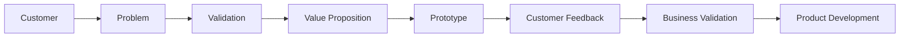

# Notulensi Workshop: Membangun dan Memvalidasi Value Proposition Startup

## Program Workshop

| Informasi | Keterangan |
|---|---|
| **Program** | Inkubasi Bisnis Startup Batch 24 Bandung Techno Park (Telkom University) |
| **Tema Umum** | *Dari Masalah Hingga Solusi — Bangun Startup yang Berdampak* |
| **Sesi** | Workshop Stage 1 (Sesi 3) – Customer, Problem Validation, dan Value Proposition Canvas |
| **Narasumber** | **Muhammad Nur Awaludin** (Co-Founder & CEO of Fammy.ly / FAMI, akrab dipanggil Kak Mumu) |
| **Hari, Tanggal** | **Sabtu, 26 September 2026** |
| **Waktu** | **09.00 – 11.30 WIB** |
| **Platform** | Pertemuan daring Zoom Meeting |

---

## Tujuan Sesi

Workshop membahas cara membangun produk yang sesuai kebutuhan customer melalui proses terstruktur:

1. Menentukan customer secara spesifik (*narrow target market*).
2. Menyusun customer persona yang hidup dan realistis.
3. Memahami dan memvalidasi problem secara objektif di lapangan.
4. Melakukan customer discovery dan interview tatap muka (*one-on-one*).
5. Menguji hipotesis nilai solusi menggunakan prototipe fungsional.
6. Memastikan solusi memiliki kelayakan bisnis (*viability* & *buyability*).
7. Menentukan apakah solusi perlu dilanjutkan, diperbaiki, repositioning, atau pivot.

---

## Inti Filosofi Workshop

> *"Pahami customer dan masalah terlebih dahulu sebelum membangun solusi atau teknologi."*

Banyak founder startup gagal karena jatuh cinta pada ide teknologi sendiri (misalnya langsung ingin membuat AI, blockchain, atau aplikasi kompleks) tanpa membuktikan apakah ada orang yang menderita karena masalah tersebut dan bersedia membayar solusinya.

---

## Alur Utama Pengembangan Produk

---

## Kesimpulan

Startup yang kuat tidak dimulai dari teknologi, melainkan dari pemahaman mendalam terhadap customer dan penderitaan (*pain*) nyata yang benar-benar mereka alami.

Urutan baku yang ditekankan oleh Kak Mumu:

$$\text{Kenali Customer} \longrightarrow \text{Dengarkan Customer} \longrightarrow \text{Gali Masalah} \longrightarrow \text{Temukan Akar Masalah} \longrightarrow \text{Validasi Asumsi} \longrightarrow \text{Rancang Solusi} \longrightarrow \text{Uji Prototipe} \longrightarrow \text{Perbaiki Iteratif}$$
