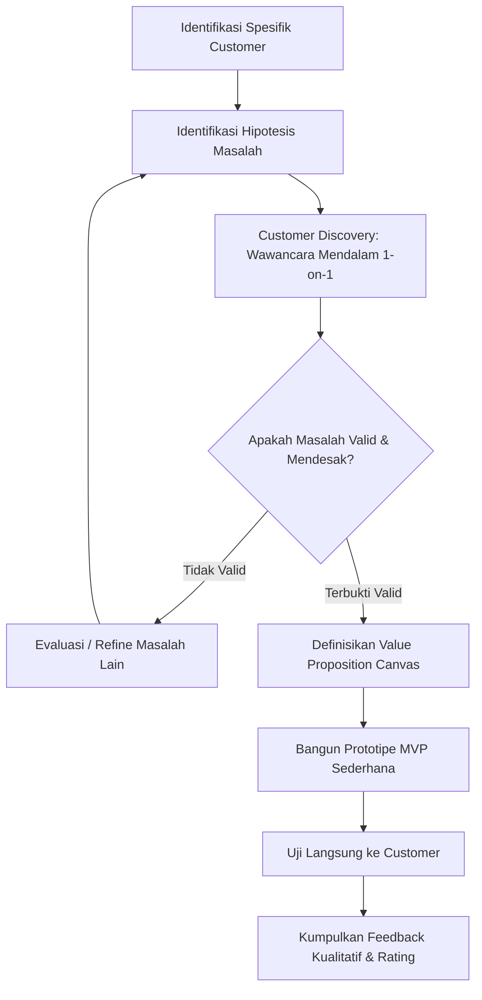

# Problem Validation

## Prinsip Dasar

Jangan pernah langsung menawarkan solusi atau mendemonstrasikan prototipe fitur di awal. Urutan berpikir yang benar adalah:

$$\textbf{Customer} \longrightarrow \textbf{Masalah (Pain)} \longrightarrow \textbf{Tujuan (Goal)} \longrightarrow \textbf{Solusi}$$

Masalah yang layak dijadikan fondasi startup harus **benar-benar dirasakan customer secara mendalam** dan **cukup penting/mendesak untuk diselesaikan (*urgent & important*)**.

---

## Konsep: Vitamin vs Painkiller

Dalam memvalidasi problem, founder harus membedakan dengan jujur apakah solusinya merupakan *Vitamin* atau *Painkiller*:

```
          ┌───────────────────────────────────────────────┐
          │                   SOLUSI                      │
          └───────┬───────────────────────────────┬───────┘
                  │                               │
                  ▼                               ▼
      ┌───────────────────────┐       ┌───────────────────────┐
      │        VITAMIN        │       │       PAINKILLER      │
      ├───────────────────────┤       ├───────────────────────┤
      │ • Manfaat tambahan    │       │ • Menyembuhkan luka   │
      │ • "Nice to have"      │       │ • "Must have"         │
      │ • Sulit memungut uang │       │ • Customer rela bayar │
      │ • Cepat ditinggalkan  │       │ • Retensi tinggi      │
      └───────────────────────┘       └───────────────────────┘
```

- **Vitamin (*Nice-to-Have*)**: Solusi yang memberikan kenyamanan atau manfaat tambahan, tetapi jika customer tidak menggunakannya hari ini, aktivitas hidup atau bisnis mereka tetap berjalan normal.
- **Painkiller (*Must-Have*)**: Solusi yang menyembuhkan penderitaan akut (menghentikan kerugian uang, memangkas sanksi hukum, atau menghilangkan jam lembur berat).

> **Hukum Validasi**: Semakin menyakitkan masalah bagi customer, semakin jelas dan kuat alasan customer untuk segera mengadopsi atau membayar produk Anda.

---

## Alur Proses Validasi Masalah



---

## Apa yang Harus Dilakukan Jika Problem Tidak Valid?

Jika dalam riset lapangan calon pengguna tidak menganggap masalah tersebut penting:
1. **Jangan Langsung Melakukan Pivot Membabi Buta**: Bedah terlebih dahulu di mana letak kegagalan hipotesis.
2. **Uji 4 Kemungkinan**:
   - Apakah masalahnya memang **tidak ada** (*invented problem*)?
   - Apakah masalahnya ada, tetapi **terlalu kecil** sehingga mereka tidak peduli mencari solusi?
   - Apakah masalahnya **tidak cukup menyakitkan (*not painful enough*)** sehingga mereka enggan keluar uang/usaha?
   - Ataukah masalahnya valid, tetapi Anda berbicara dengan **segmen market yang salah**?
3. **Repositioning vs Pivot**:
   - Jika masalahnya riil tetapi target pasarnya salah, lakukan **Repositioning** (ganti target pengguna).
   - Jika masalah utamanya terbukti fiktif dan tidak ada yang peduli, lakukan **Pivot** (ganti arah fundamental produk).
