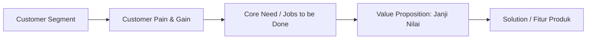

# Value Proposition

## Fokus Utama Value Proposition

*Value Proposition* bukanlah daftar fitur canggih atau teknologi mutakhir yang dimiliki aplikasi. *Value Proposition* adalah **janji nilai yang menjawab secara presisi kebutuhan dan masalah customer yang telah terbukti valid di lapangan**.

Sebelum menulis kode atau merancang arsitektur sistem, founder wajib menjawab **3 pertanyaan kritis**:
1. **Apakah customer benar-benar membutuhkan solusi ini?** (Bukan sekadar kita yang ingin membuatnya).
2. **Apakah solusi ini benar-benar membantu meringankan beban atau mencapai tujuan mereka?**
3. **Apakah nilai (*value*) yang diberikan dapat dipahami secara instan dan jelas oleh customer dalam waktu kurang dari 10 detik?**

---

## Kerangka Kerja Value Proposition

---

## 4 Prinsip Desain Proposisi Nilai

1. **Jangan Mulai dari Teknologi**: Hindari kalimat seperti *"Startup kami berbasis Artificial Intelligence dan Blockchain"*. Teknologi adalah cara (*enabler*), bukan proposisi nilai. Proposisi nilai adalah: *"Membantu kader memangkas waktu pencatatan posyandu dari 7 menit menjadi 2 menit tanpa galat"*.
2. **Jangan Membangun Produk Terlalu Besar di Awal**: Batasi solusi pada 1 atau 2 fitur utama yang langsung meredakan rasa sakit terbesar (*pain relief*).
3. **Pastikan Selaras dengan Pain Terbesar**: Jika rasa sakit terbesar kader posyandu adalah beban kalkulasi manual dan antrean panjang ibu-ibu, maka fitur utama yang harus ada adalah kalkulator Z-score otomatis dalam hitungan detik.
4. **Gunakan Umpan Balik Nyata untuk Iterasi**: Lakukan perbaikan berkelanjutan berdasarkan apa yang dikeluhkan pengguna saat mencoba prototipe awal.

> **Siklus Emas Pengembangan**:  
> $$\text{Pahami} \longrightarrow \text{Validasi} \longrightarrow \text{Rancang} \longrightarrow \text{Uji} \longrightarrow \text{Perbaiki} \longrightarrow \text{Kembangkan}$$
