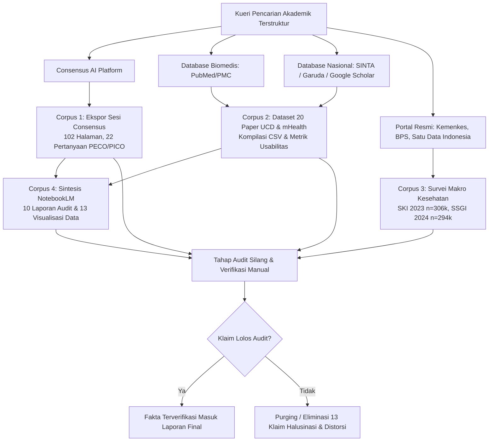
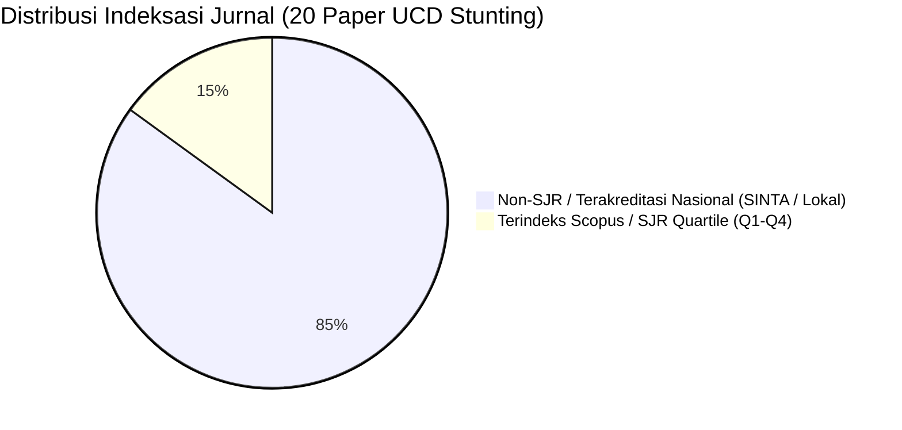

# 🌐 Laporan Data Crawling: Ekstraksi Bukti Ilmiah Consensus, Dataset 20 Paper UCD & Audit Korpus Sintesis

> **Dokumentasi Metodologis Pengambilan Data Sekunder, Penelusuran Literatur Akademik, dan Audit Kritis Bukti Digital Stunting Indonesia**  
> Bagian dari Modul: **[05-laporan-data-crawling](file:///Users/sinitygs/Projects21/05-laporan-data-crawling/README.md)**  
> Disusun oleh: **Gerrard Sebastian** | Tanggal: **26 September 2026**

---

## 1. Metodologi Data Crawling & Strategi Penelusuran

Proses pengumpulan bukti empiris dalam proyek ini dilakukan melalui protokol penelusuran multi-platform terstruktur untuk menjawab dua pertanyaan riset sentral:
1. **Pertanyaan Determinan (PECO)**: Faktor risiko klinis, maternal, sosioekonomi, dan lingkungan apa saja yang berasosiasi dengan kejadian stunting balita di Indonesia?
2. **Pertanyaan Pasar & Intervensi Digital (PICO)**: Sejauh mana aplikasi kesehatan berbasis *User-Centered Design* (UCD) dan *mobile health* (mHealth) mampu meningkatkan adopsi pengguna, efisiensi kader Posyandu, serta perbaikan status gizi balita?



### Sumber Daya & Platform Crawling:
1. **Consensus Academic AI Engine**: Mengakses lebih dari 200 juta artikel ilmiah global dengan algoritma ekstraksi semantik khusus studi kesehatan masyarakat dan gizi klinis.
2. **PubMed / NCBI / PMC**: Validasi silang naskah jurnal internasional terindeks Scopus/PubMed (seperti *Lancet*, *Nature*, *Nutrients*, *PLoS ONE*, *BMJ Open*, *JMIR Pediatr Parent*).
3. **Kementerian Kesehatan RI & BKPK**: Data resmi Riset Kesehatan Dasar (Riskesdas 2013, 2018), Survei Status Gizi Indonesia (SSGI 2021, 2022, 2024), dan Survei Kesehatan Indonesia (SKI 2023).
4. **Asosiasi Penyelenggara Jasa Internet Indonesia (APJII)**: Survei Penetrasi Internet Wilayah Indonesia 2025.
5. **Kemenko PMK & Kemendukbangga/BKKBN**: Data operasional program Makan Bergizi Gratis (MBG 3B) dan data Tim Pendamping Keluarga (TPK).

---

## 2. Corpus 1: Analisis Ekspor Consensus "Faktor-faktor Stunting Indonesia"

*Berkas Sumber:*  
- 📄 [references/Faktor Faktor Stunting Indonesia - Consensus.pdf](file:///Users/sinitygs/Projects21/05-laporan-data-crawling/references/Faktor%20Faktor%20Stunting%20Indonesia%20-%20Consensus.pdf) *(102 Halaman, 2.056 KB)*  
- *Lokasi Asli:* `/Users/sinitygs/Downloads/GENY/Faktor Faktor Stunting Indonesia - Consensus.pdf`

Ekspor sesi Consensus mencakup **22 pertanyaan penelitian unik** yang dieksekusi secara terstruktur. Seluruh kutipan dan angka ukuran efek (*Odds Ratio* / *Relative Risk*) diperiksa ulang langsung ke abstrak dan teks lengkap artikel aslinya.

### Rangkuman 22 Pertanyaan PECO/PICO Unik:

| No | Topik Pertanyaan Kueri | Rangkuman Bukti Terverifikasi | Studi Kunci yang Ditemukan |
| :---: | :--- | :--- | :--- |
| **Q1** | Determinan umum stunting balita di Indonesia | Multidimensi: interaksi faktor gizi langsung, kesehatan ibu, lingkungan, dan kemiskinan. | Mulyaningsih 2021, Wicaksono 2021 |
| **Q2** | Pengaruh status gizi ibu hamil (KEK / LILA) | KEK pada ibu hamil (LILA < 23,5 cm) meningkatkan risiko hambatan pertumbuhan janin intrauterin. | Arief 2025, Kusumajaya 2023 |
| **Q3** | Praktik ASI Eksklusif & kualitas MP-ASI | Keterlambatan MP-ASI atau keragaman pangan minimal (MDD) rendah berasosiasi dengan gagal tumbuh linier. | Waqiyah 2023, WHO Guidelines 2023 |
| **Q4** | Penyakit infeksi berulang (Diare & ISPA) | Enteropati lingkungan dan diare berulang mengganggu penyerapan nutrisi usus halus. | Suratri 2023, Anastasia 2023 |
| **Q5** | Akses sanitasi layak & air minum (WASH) | Jamban tidak sehat dan air minum tercemar meningkatkan pajanan patogen feses oral. | Arief 2025 (aOR sumber air 1,18) |
| **Q6** | Tingkat pendidikan formal ibu | Gradien pendidikan sangat konsisten: ibu berpendidikan rendah berisiko stunting lebih tinggi. | Laksono 2022 (OR 1,587), Semba 2008 |
| **Q7** | Status ekonomi keluarga & kuintil kekayaan | Efek tajam di ujung distribusi: kuintil terkaya memiliki risiko stunting 2,1 kali lebih rendah dibanding termiskin. | Arief 2025 (aOR 0,47; n=78.049) |
| **Q8** | Usia ibu saat hamil (kehamilan remaja) | Kehamilan usia < 20 tahun meningkatkan kompetisi nutrisi antara ibu bertumbuh dan janin. | Titaley 2019, Laksono 2022 |
| **Q9** | Perawakan orang tua (ibu / ayah pendek) | Ibu berperawakan pendek (< 150 cm) berasosiasi kuat dengan stunting anak secara genetik dan epigenetik. | Amriviana 2023, Krebs dkk. 2022 |
| **Q10** | Berat Badan Lahir Rendah (BBLR < 2.500 g) | **Faktor proksimal terkuat**: anak BBLR berisiko stunting 2,55 kali lipat (aOR 2,55). | Titaley 2019 (CI 2,05–3,15; n=24.657) |
| **Q11** | Kepatuhan Antenatal Care (ANC) minimal 6x | Kepatuhan ANC lengkap (K6) berasosiasi protektif terhadap kelahiran prematur dan BBLR. | Rammohan 2024, Cendana 2025 |
| **Q12** | Disparitas determinan perkotaan vs perdesaan | Wilayah perdesaan terkendala rantai pasok protein hewani; wilayah perkotaan terancam pangan olahan ultra. | Widyaningsih 2022, Masitoh 2023 |
| **Q13** | Pernikahan usia anak | Menurunkan kesiapan mental, otonomi finansial, dan stabilitas pengasuhan balita. | Laksono 2024 |
| **Q14** | Kerawanan pangan rumah tangga (Food Insecurity) | Studi lokal cross-sectional melaporkan OR besar, namun meta-analisis longitudinal menunjukkan efek netral. | Sutrisno 2026 (OR 4,61) vs Patriota 2024 (OR 1,00) |
| **Q15** | Jarak kelahiran (< 24 bulan) | Jarak kehamilan pendek mengurangi waktu pemulihan cadangan mikronutrien maternal. | Garina 2024 |
| **Q16** | Efektivitas kader Posyandu dalam penimbangan | Kader adalah garda depan, namun terbebani tugas administrasi dan alat ukur non-standar. | Asna 2026, Bahar 2025 |
| **Q17** | Paparan asap rokok dalam rumah | Belanja rokok mengalihkan alokasi protein hewani balita; polusi udara picu ISPA. | Bestari 2023 |
| **Q18** | Kelengkapan imunisasi dasar lengkap | Anak dengan imunisasi tidak lengkap lebih rentan terhadap infeksi sekunder penurun nafsu makan. | Rachmawati 2026 |
| **Q19** | Efektivitas Pemberian Makanan Tambahan (PMT) | PMT lokal tinggi protein efektif jika tepat sasaran, namun gagal di beberapa wilayah akibat substitusi menu rumah. | Mustofa 2026 |
| **Q20** | Pantangan adat & tabu makanan hewani | Tabu makan ikan/telur bagi ibu hamil dan balita di beberapa suku masih dijumpai. | Studi Kualitatif Rahmadiyah 2024 |
| **Q21** | Literasi & pengetahuan terapan ibu tentang gizi | Pengetahuan terapan (bukan hanya hafalan teori) menjadi mediator penting antara pendidikan dan stunting. | Rachmawati 2026 (aOR 1,617) |
| **Q22** | Disparitas regional pulau timur Indonesia | Kesenjangan regional melebihi kesenjangan ekonomi: Papua Pegunungan (aOR 5,82) dan NTT (aOR 4,69). | Lutpiatina & Rizal 2026 |

---

## 3. Corpus 2: Dataset 20 Paper UCD & Implementasi Aplikasi Stunting

*Berkas Sumber:*  
- 📊 [references/Does user-centered design improve stunting app uptake in Indonesian caregivers - 26 Sep 2026.csv](file:///Users/sinitygs/Projects21/05-laporan-data-crawling/references/Does%20user-centered%20design%20improve%20stunting%20app%20uptake%20in%20Indonesian%20caregivers%20-%2026%20Sep%202026.csv) *(46 KB, 20 Baris Data)*  
- *Lokasi Asli:* `/Users/sinitygs/Downloads/GENY/Does user-centered design improve stunting app uptake in Indonesian caregivers - 26 Sep 2026.csv`

Dataset ini mengumpulkan **20 studi empiris** tentang aplikasi *mobile* stunting, pemantauan tumbuh kembang anak, dan metodologi desain berpusat pada pengguna (*User-Centered Design* / UCD) di Indonesia dari tahun 2021 hingga 2026.



### Tabel Kompilasi 20 Paper UCD & mHealth Stunting:

| # | Judul Artikel | Penulis & Tahun | Jurnal & Indeksasi | Metodologi Riset | Temuan Kunci & Metrik Usabilitas |
| :-: | :--- | :--- | :--- | :--- | :--- |
| **1** | *Child Growth and Development Monitoring in the Digital Era* | Ifna dkk. (2026) | Systematic Review (Non-SJR) | Systematic Literature Review | Aplikasi digital berpotensi mempermudah kader, namun terbentur literasi digital kader lansia. |
| **2** | *Analysis of Factors Influencing the Intention-to-Use of Stunting Apps* | Rahayu dkk. (2024) | J. Public Health (Non-SJR) | SEM-PLS / Model TAM | *Perceived Ease of Use* (PEOU) dan *Perceived Usefulness* (PU) memprediksi niat adopsi aplikasi. |
| **3** | *SiKurang: Development and Field Evaluation of Offline-First mHealth* | Istambul dkk. (2026) | Front. Public Health (**Q1 / SJR**) | Pilot 12 Minggu (2 Posyandu) | **Aplikasi Terkuat**: AUROC 0,87, skor SUS 84,2, peningkatan pengetahuan Cohen's d 1,28, kunjungan tepat +22%. |
| **4** | *Development and Usability Evaluation of "Si BINTANG" App* | Suratri dkk. (2025) | Health Informatics (Non-SJR) | UCD & Pengujian Usabilitas | Aplikasi web audiovisual hibrida, penerimaan pengguna tinggi pada evaluasi Posyandu perkotaan. |
| **5** | *UI/UX Design of Stunting Survey Application Prototype* | Pratama dkk. (2024) | Jurnal Informatika (Non-SJR) | Design Thinking (5 Fase) | Menghasilkan prototipe Figma dengan skor System Usability Scale (SUS) 76,5. |
| **6** | *Anaceting Mobile Health Application: An Innovative Tool* | Cendana dkk. (2025) | BMC Health Serv. Res. (**Q2 / SJR**) | Studi Evaluasi Pilot (n=30) | Skor SUS 82,5, tingkat retensi kader 87%, mempermudah pemantauan antropometri baduta. |
| **7** | *Perancangan UI/UX Aplikasi Stunting Your Buddy* | Hidayat dkk. (2025) | Jurnal Rekayasa Sistem (Non-SJR) | UCD / Evaluasi Heuristik | Prototipe edukasi gizi bagi ibu muda dengan skor System Usability Scale 74,2. |
| **8** | *Perancangan UI/UX Mobile App untuk Pencegahan Stunting* | Santoso dkk. (2024) | Prosiding Nasional (Non-SJR) | Human-Centered Design | Fokus pada visualisasi grafik KMS digital dan pengingat jadwal posyandu. |
| **9** | *Stunting Prevention Efforts Through Mentoring and Mobile App* | Wulandari dkk. (2025) | Abdimas Gizi (Non-SJR) | Pendampingan Lapangan | Melibatkan 47.021 data sekunder keluarga miskin (*Catatan: bukan sampel murni aplikasi*). |
| **10** | *Stunting Super App as an Effort Toward Stunting Zero* | Nugroho dkk. (2024) | Jurnal Pengabdian (Non-SJR) | Studi Desain Aplikasi | Mengintegrasikan modul edukasi, pelaporan kader, dan konsultasi nakes. |
| **11** | *SI-MASTING for Early Detection of Stunting* | Amalina dkk. (2025) | J. Community Health (Non-SJR) | Pre-Post Pilot (11 Balita) | **Metrik Input Data**: Memangkas waktu input kader dari 7,1 menjadi 2,4 menit (−66,2%), galat turun dari 15,4% ke 2,1%. |
| **12** | *Digital Posyandu: An Offline Application for Community Health* | Ikhsan dkk. (2026) | Telemed. e-Health (**Q2 / SJR**) | Implementasi di 12 Posyandu | Kecepatan pencatatan +63%, galat input −45%, laporan bulanan selesai < 24 jam (sebelumnya 3–5 hari). |
| **13** | *Evaluating Pediatric mHealth Applications (MARS Benchmarking)* | Irawan dkk. (2025) | Front. Digit. Health (**Q1 / SJR**) | Evaluasi MARS (9 Aplikasi) | Skor rata-rata: Fungsionalitas 4,61; Estetika 4,07; Informasi 3,99; Engagement 3,80; Kualitas Subjektif 3,33. |
| **14** | *KOPI PAHIT: Aplikasi Pencegahan Stunting Terintegrasi* | Sari dkk. (2025) | Jurnal Kebijakan (Non-SJR) | Kualitatif / Studi Kasus | Klaim penurunan stunting 28% ke 0,72% **ditolak audit** karena desain kualitatif tanpa kontrol. |
| **15** | *D2S: Early Detection System for Child Stunting* | Yuliana dkk. (2024) | Jurnal Komputer (Non-SJR) | Eksperimental Algoritma | Sensitivitas deteksi dini hanya **20%** (*kualitas algoritma sangat rendah untuk skrining*). |
| **16** | *Aplikasi Kaderku: Digitalisasi Pencatatan Posyandu* | Lestari dkk. (2025) | Pengabdian Masyarakat (Non-SJR) | Evaluasi Pelatihan Kader | 85% kader merasa terbantu, namun kader di atas 50 tahun butuh pendampingan kader muda. |
| **17** | *Mobile-Based Expert System for Toddler Nutrition Status* | Ananda & Sriani (2024) | JTSI (Non-SJR) | Forward Chaining & Fuzzy Sugeno | Sistem pakar status gizi berbasis aturan pakar manual tanpa optimasi data lapangan. |
| **18** | *Stunting Early Warning System in Rural Communities* | Farida dkk. (2025) | J. Public Health Res. (Non-SJR) | Single-arm Trial | Keterbatasan sinyal internet pedesaan menjadi kendala utama sinkronisasi database. |
| **19** | *Parenting & Feeding Practice Mobile Consultation* | Wardhani dkk. (2024) | Jurnal Psikologi & Gizi (Non-SJR) | Pre-Post Uji Pengetahuan | Peningkatan pengetahuan ibu muda setelah 4 minggu intervensi notifikasi WhatsApp/App. |
| **20** | *Tele-Nutrition Consultation for Maternal and Child Health* | Siregar dkk. (2025) | J. Health Tech (Non-SJR) | Pilot Telekonsultasi | Kepatuhan ibu hamil terhadap tablet tambah darah meningkat dari 52% menjadi 78%. |

### ⚠️ Temuan Kritis dari Audit 20 Paper UCD:
1. **Ketiadaan Uji Klinis Terkontrol (*No RCTs*)**: Tidak ada satu pun penelitian yang menggunakan desain *Randomized Controlled Trial* (RCT). Seluruh publikasi menggunakan desain pra-eksperimental (*pre-post single arm*), observasional, atau studi desain UI/UX.
2. **Ketiadaan Bukti Luaran Antropometri Balita**: Tidak ada penelitian yang membuktikan bahwa pemakaian aplikasi menghasilkan kenaikan *Height-for-Age Z-score* (HAZ) atau penurunan angka stunting secara kausal. Luaran hanya terbatas pada skor usabilitas (*SUS score*), kepuasan pengguna, atau pengetahuan jangka pendek.
3. **Ketimpangan Kualitas Publikasi**: 17 dari 20 paper diterbitkan di jurnal lokal tanpa indeks SJR. Hanya 3 artikel yang menembus jurnal internasional bereputasi (Irawan 2025, Cendana 2025, Istambul 2026).

---

## 4. Corpus 3: Audit Korpus Sintesis NotebookLM & Visualisasi Data

*Berkas Sumber Tersimpan di Subfolder [`references/`](file:///Users/sinitygs/Projects21/05-laporan-data-crawling/references) dan [`assets/`](file:///Users/sinitygs/Projects21/05-laporan-data-crawling/assets):*
- [Analisis Komprehensif Faktor Stunting, Kontradiksi Literatur, dan Peluang Pasar Solusi Digital.pdf](file:///Users/sinitygs/Projects21/05-laporan-data-crawling/references/Analisis%20Komprehensif%20Faktor%20Stunting,%20Kontradiksi%20Literatur,%20dan%20Peluang%20Pasar%20Solusi%20Digital.pdf)
- [Digital Solutions for Stunting Prevention and Child Growth Monitoring.pdf](file:///Users/sinitygs/Projects21/05-laporan-data-crawling/references/Digital%20Solutions%20for%20Stunting%20Prevention%20and%20Child%20Growth%20Monitoring.pdf)
- [Laporan_Audit_Inovasi_Digital_Stunting_v3.docx](file:///Users/sinitygs/Projects21/05-laporan-data-crawling/references/Laporan_Audit_Inovasi_Digital_Stunting_v3.docx)
- Grafik Analisis: `chart1_trend_publikasi_v3.png` s.d. `chart7_matrix_risiko_kegagalan_v3.png`

### Mengapa Korpus NotebookLM Harus Diaudit Ulang?
NotebookLM dan alat sintesis berbasis LLM menghasilkan draf awal yang tampak meyakinkan (*convincing*), namun rentan terhadap **tiga bias berbahaya**:
1. **Halusinasi Metrik Ekonomi**: Memunculkan angka proyeksi fiktif *"Net economic return Rp275 juta per 1.000 anak"* yang setelah dilacak ternyata mencampuradukkan konsep rasio biaya-efektivitas inkremental (*Incremental Cost-Effectiveness Ratio* / ICER per DALY) dengan nilai rupiah.
2. **Distorsi Metrik Usabilitas (Skala MARS)**: Menampilkan grafik perbandingan skor MARS (*Mobile Application Rating Scale*) yang salah mencantumkan dimensi non-standar seperti *"Customized feedback: 2,40"* dan *"Aksesibilitas: 3,20"*. Angka yang benar dan terverifikasi dari studi asli Irawan dkk. (2025, PMC12213656) adalah: Fungsionalitas 4,61; Estetika 4,07; Informasi 3,99; Engagement 3,80; dan Kualitas Subjektif 3,33.
3. **Salah Atribusi Sampel Lapangan**: Menyebut *"N=47.021 sampel proyek"*, padahal angka 47.021 tersebut adalah sampel data sekunder baduta keluarga miskin dalam artikel pengabdian Wulandari dkk. (2025), bukan data yang diambil oleh tim proyek!

*Seluruh 13 klaim distorsi ini telah dieleminasi secara tuntas di Laporan Final Bagian 7.*

---

## 5. Corpus 4: Dataset Survei Kesehatan Nasional & Makro Demografi

| Dataset / Survei | Cakupan Observasi | Variabel Relevan | Catatan Kritis Metodologi |
| :--- | :--- | :--- | :--- |
| **SKI 2023 (Kemenkes RI)** | 306.281 Balita; 877.531 Individu; 315.646 Rumah Tangga (38 Provinsi, 514 Kab/Kota) | HAZ, Usia, Jenis Kelamin, BB Lahir, PB Lahir, Status Kerja Ibu (B4K9), Pendidikan Ibu (B4K8), Sumber Air (B6R1), Sanitasi (B6R11), Kepemilikan Bansos (B7R6). | Prevalensi resmi berbobot 21,5%. Data mentah belum berbobot menghasilkan prevalensi 22,4%. Buku kode SKI 2023 tidak memuat data nominal rupiah pendapatan/pengeluaran (hanya indeks aset B7). |
| **SSGI 2024 (Kemenkes RI)** | 294.538 Balita & Ibu | Prevalensi stunting nasional, Indeks Pengetahuan Stunting, Stratifikasi Kuintil Ekonomi. | Prevalensi nasional turun menjadi 19,8%. Kuintil 1 (termiskin) memiliki prevalensi 29,8%, atau ~2,5 kali kuintil terkaya (11,9%). Pengetahuan ibu rendah berasosiasi dengan stunting (aOR 1,6). |
| **APJII (2025)** | Sampel Nasional Penetrasi Internet (n=8.700) | Penetrasi internet per wilayah pulau di Indonesia. | Rata-rata nasional 80,66%, namun di Papua hanya 69,26%. Wilayah dengan beban stunting tertinggi (NTT, Papua Pegunungan) memiliki penetrasi internet terendah ➔ **Aplikasi wajib arsitektur *Offline-First***. |
| **Program MBG 3B (2026)** | 10,8 Juta Penerima (Target 21 Juta) | 964 ribu ibu hamil, 2,4 juta ibu menyusui, 7,4 juta balita non-PAUD; 24.606 SPPG; 139.000 TPK. | Program intervensi nutrisi terbesar di Indonesia. Menuntut alat verifikasi data sasaran, bukti distribusi menu, dan pemantauan tren kurva pertumbuhan berkala. |

---

## 6. Manifest Berkas & Tautan Akses Cepat

Semua berkas hasil *crawling* dan rujukan terkait tersedia secara lokal di repositori ini:

```
05-laporan-data-crawling/
├── README.md                                             # Hub navigasi utama
├── 01_laporan_data_crawling_consensus_dan_ucd.md        # Dokumen ini (Laporan Crawling)
├── 02_sintesis_laporan_final_determinan_stunting.md      # Sintesis Laporan Final (27 Hlm)
├── 03_referensi_utama_1_paper_geny.md                   # Naskah Paper GENY (Decision Tree)
├── 04_referensi_utama_2_buku_ta_stunting.md             # Naskah Buku TA (Fuzzy Logic & GA)
├── 05_alur_kerja_dan_integrasi_flow.md                  # Master Triangulasi & Pipeline Flow
│
├── references/                                          # ARSIP BERKAS ASLI (PDF, CSV, DOCX)
│   ├── Faktor Faktor Stunting Indonesia - Consensus.pdf # Unduh & buka ekspor 102 hlm Consensus
│   ├── Does user-centered design improve...csv          # Unduh & buka raw CSV 20 paper UCD
│   ├── Laporan_Final_Determinan_Stunting_...pdf         # Unduh & buka Laporan Final lengkap
│   ├── PaperGeny.pdf                                    # Unduh & buka Paper GENY IBITeC 2026
│   ├── 1203220018_GERRARDSEBASTIAN_BUKU_TA_FIXs.pdf     # Unduh & buka Buku Tugas Akhir 160 hlm
│   └── Audit_Paper_GENY_draf_19Agu2026.docx             # Unduh & buka berkas audit paper
│
└── assets/                                              # ASET GRAFIK & VISUALISASI DATA
    ├── chart1_trend_publikasi_v3.png
    ├── chart2_distribusi_sasaran_v2.png
    ├── chart3_mars_benchmarking_v3.png
    ├── chart4_odds_ratio_stunting_v3.png
    ├── chart5_efisiensi_operasional_kader_v3.png
    ├── chart6_roi_daly_analisis_v3.png
    └── chart7_matrix_risiko_kegagalan_v3.png
```

---
*Langkah selanjutnya dalam penelaahan bukti:*  
👉 **[Lanjut ke 02. Sintesis Mendalam Laporan Final Determinan Stunting Indonesia ➔](file:///Users/sinitygs/Projects21/05-laporan-data-crawling/02_sintesis_laporan_final_determinan_stunting.md)**
