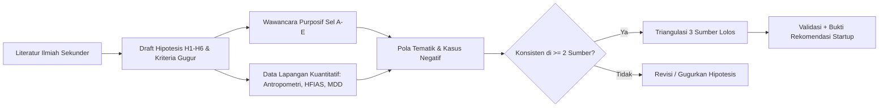
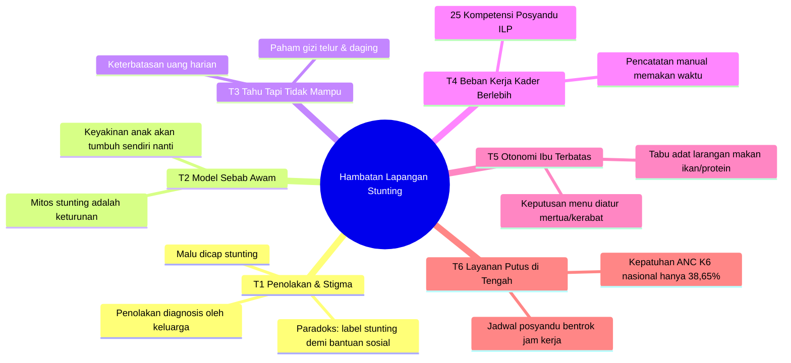
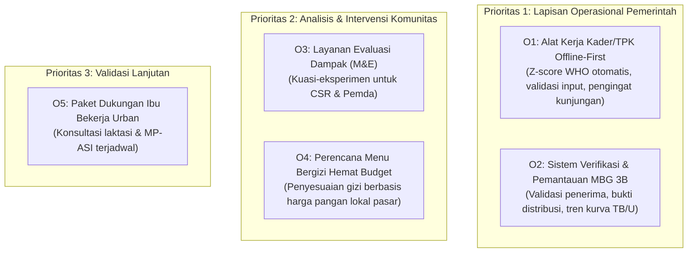

# 📑 Sintesis Komprehensif Laporan Final: Determinan Stunting Indonesia, Pengaruh Finansial & Pendidikan Ibu, Audit Bukti, dan Peluang Pasar

> **Dekonstruksi Ilmiah 27 Halaman Naskah Laporan Final, Sintesis Bukti Kuantitatif-Kualitatif, Eliminasi 13 Klaim Usang, dan Audit Data Mikro SKI 2023**  
> Bagian dari Modul: **[05-laporan-data-crawling](file:///Users/sinitygs/Projects21/05-laporan-data-crawling/README.md)**  
> Berkas Sumber Asli: [references/Laporan_Final_Determinan_Stunting_Indonesia_UPDATE2_26Sep2026.pdf](file:///Users/sinitygs/Projects21/05-laporan-data-crawling/references/Laporan_Final_Determinan_Stunting_Indonesia_UPDATE2_26Sep2026.pdf) *(27 Halaman, 1.363 KB)*  
> Disusun untuk: **GENY / Tim Inkubasi BTP Batch 24** | Penulis: **Gerrard Sebastian** | Pembaruan: **26 September 2026**

---

## 1. Ringkasan Eksekutif & Jawaban 5 Pertanyaan Kunci

Laporan Final ini menyajikan sintesis bukti sekunder yang ketat mengenai determinan stunting di Indonesia. Status seluruh bukti adalah **asosiasional (bukan kausal)** karena bersumber dari studi potong-lintang (*cross-sectional*) dan survei nasional.

### Jawaban terhadap Lima Pertanyaan Sentral:
1. **Faktor Apa Saja yang Paling Berpengaruh?**  
   Faktor terkuat dan paling konsisten berada di jalur **prenatal dan kelahiran proksimal**:
   - **Berat Badan Lahir Rendah (BBLR < 2.500 g)**: adjusted Odds Ratio (**aOR 2,55**, 95% CI 2,05–3,15; Titaley 2019).
   - Kelahiran prematur (< 37 minggu), perawakan ibu pendek (< 150 cm), ketidaklengkapan kunjungan Antenatal Care (ANC < 4 kali, aOR 1,22), serta kerawanan sanitasi dan air bersih.
   - Di lapisan bawahnya bekerja faktor determinan dasar: kemiskinan ekstrem, pendidikan rendah ibu, dan disparitas geografis Indonesia Timur.
2. **Apakah Kondisi Finansial Berpengaruh?**  
   **Ya, tetapi efeknya paling terlihat di ujung distribusi kekayaan**. Pada data SKI 2023 (n=78.049), kuintil 5 (terkaya) memiliki aOR 0,47 (95% CI 0,42–0,52) dibanding kuintil 1 (termiskin), yang setara dengan peningkatan risiko stunting **~2,1 kali lipat** di kelompok termiskin (Arief dkk., 2025). Namun, di antara strata ekonomi yang berdekatan (misal kelompok rentan vs miskin ekstrem di wilayah *urban-poor*), perbedaannya sangat tipis (OR 1,235; Laksono 2024) atau bahkan tidak signifikan secara statistik di beberapa studi daerah (Rahayuwati 2023).
3. **Apakah Pendidikan Ibu Berpengaruh?**  
   **Ya, gradien pendidikan ibu adalah salah satu yang paling konsisten** (OR berkisar 1,2 hingga 1,9; Laksono 2022). Setiap tambahan satu tahun sekolah formal ibu menurunkan odds stunting sebesar ~5% (OR 0,95; Semba 2008). Data SSGI 2024 (n=294.538) membuktikan bahwa pendidikan ibu bekerja **melalui mediator pengetahuan terapan**: pendidikan rendah memicu skor pengetahuan stunting rendah, dan pengetahuan rendah itulah yang berasosiasi langsung dengan kejadian stunting (aOR 1,617 di perkotaan; 1,576 di perdesaan; Rachmawati dkk., 2026).
4. **Apakah Ada Bukti/Jurnal yang Kontra?**  
   **Ada, dan memiliki bobot desain metodologis yang sangat kuat**:
   - **Roth dkk. (Lancet Glob Health 2017)**: Analisis 179 survei DHS dari 64 negara membuktikan bahwa *linear growth faltering* adalah **pergeseran seluruh distribusi populasi** (termasuk anak pada kuintil terkaya dan berpendidikan tinggi). Faktor risiko individual tidak memadai untuk memilah anak stunting satu per satu.
   - **Patriota dkk. (2024)**: Meta-analisis studi kohort prospektif global menemukan efek kerawanan pangan (*food insecurity*) terhadap stunting balita ternyata netral (**pooled OR 1,00**, 95% CI 0,87–1,14).
   - **Rahayuwati dkk. (2023)**: Di Jawa Barat (n=731), pendapatan (p=0,580) dan pengeluaran (p=0,398) tidak signifikan terhadap stunting.
   - **Kusumawardani dkk. (2023)**: Di Maluku, ibu di seluruh jenjang pendidikan justru berisiko lebih tinggi dibanding kelompok referensi tanpa pendidikan formal.
   - **Mustofa dkk. (2026)**: Program Pemberian Makanan Tambahan (PMT) tinggi protein untuk 4,9 juta balita pada 2023 gagal menurunkan stunting di sejumlah wilayah pedesaan (misal Kecamatan Sukodono) akibat masalah substitusi pangan keluarga.
5. **Insight & Peluang Pasar Startup?**  
   Masalah di lapangan telah bergeser dari *"ibu tidak tahu informasi"* menjadi **"keluarga tidak mampu beli protein hewani, menolak diagnosis stigma stunting, dan kader terbebani administrasi manual"**. Peluang paling *defensible* bagi Geny StuntCare berada di **lapisan operasional program pemerintah yang sedang berekspansi (Posyandu ILP Kemenkes & SPPG MBG 3B)**: alat triase kader *offline-first*, verifikasi akurasi data antropometri, dan perencanaan menu bergizi hemat berbasis harga pangan lokal.

---

## 2. Konteks Makro Global dan Nasional

Berdasarkan data resmi Kementerian Kesehatan RI:
- **SSGI 2024**: Prevalensi stunting nasional berada di angka **19,8%**, turun 1,7 poin persentase dari **21,5% pada SKI 2023**.
- **Ambang Batas WHO/UNICEF**: Angka 19,8% baru saja melewati ambang batas kategori "tinggi" (20% – <30%) masuk ke kategori "sedang" (10% – <20%) (de Onis dkk., 2019). Posisinya masih sangat rentan terhadap *rebound*.
- **Target RPJMN 2029**: Ditargetkan mencapai **14,2%** pada 2029. Penurunan rata-rata yang dibutuhkan adalah **1,1 poin persentase per tahun** selama periode 2024–2029.
- **Kesenjangan Wilayah Ekstrem**: Kesenjangan geografis jauh lebih masif dibanding kesenjangan finansial. Analisis SSGI 2024 terhadap 298.970 balita menemukan bahwa balita di **Papua Pegunungan memiliki odds stunting 5,82 kali lipat** dan **NTT 4,69 kali lipat** dibandingkan balita di Provinsi Bali (Lutpiatina & Rizal 2026).

```
   Prevalensi Stunting Nasional Indonesia (2021 - 2029 Target)
   27.5% ┤
   25.0% ┼─ 24,4% (SSGI 2021)
   22.5% ┼─────── 21,6% (SSGI 2022) ── 21,5% (SKI 2023)
   20.0% ┼──────────────────────────────────── 19,8% (SSGI 2024) [Batas WHO "Sedang" <20%]
   17.5% ┼ - - - - - - - - - - - - - - - - - - - - - - - - 
   15.0% ┼ - - - - - - - - - - - - - - - - - - - - - - - - 14,2% (Target RPJMN 2029)
         └───────┬────────────┬───────────┬───────────┬──────────────┬──────────────►
               2021         2022        2023        2024           2029
```

---

## 3. Metodologi Riset & Kerangka Triangulasi

### Kerangka PECO & PICO
- **Q1 Determinan (PECO)**:
  - **P (Population)**: Balita usia 0 sampai 59 bulan di Indonesia.
  - **E (Exposure)**: Status sosioekonomi rendah, pendidikan formal ibu rendah, status kerja ibu, sanitasi buruk.
  - **C (Comparison)**: Status ekonomi lebih tinggi, pendidikan ibu lebih tinggi, sanitasi layak.
  - **O (Outcome)**: Kejadian stunting ($HAZ < -2\text{ SD}$ standar baku WHO).
- **Q2 Solusi Pasar (PICO)**:
  - **P (Population)**: Pengasuh/ibu balita, kader posyandu, dan Tim Pendamping Keluarga (TPK).
  - **I (Intervention)**: Aplikasi mHealth atau layanan berbasis *User-Centered Design* (UCD) dan sistem pendukung keputusan.
  - **C (Comparison)**: Layanan posyandu konvensional atau aplikasi non-UCD.
  - **O (Outcome)**: *Uptake*, retensi pengguna, kepatuhan gizi, galat pencatatan, dan pemantauan tren TB/U.

### Protokol Triangulasi 3 Sumber (Revisi):
Penelitian lapangan tidak boleh menarik kesimpulan kausal hanya dari wawancara kualitatif. Alur triangulasi mewajibkan pengujian silang antara **Literatur Ilmiah**, **Wawancara Kualitatif Kasus Negatif (Positive Deviance)**, dan **Data Kuantitatif Lapangan**:



---

## 4. Rangkuman Bukti Kuantitatif Terverifikasi

Ukuran efek Odds Ratio (OR) terverifikasi dari studi bereputasi:

| Jalur Determinan | Indikator / Variabel | Ukuran Efek (OR / aOR) | Sumber & Sampel | Interpretasi Klinis |
| :--- | :--- | :--- | :--- | :--- |
| **Prenatal & Kelahiran** | **BBLR (< 2.500 gram)** | **aOR 2,55** (2,05–3,15) | Titaley 2019 (n=24.657) | Anak BBLR berisiko gagal tumbuh linier paling tinggi secara biologis. |
| **Prenatal & Kelahiran** | Kunjungan ANC < 4 kali | **aOR 1,22** (1,08–1,39) | Titaley 2019 | Kurangnya skrining kehamilan menghambat koreksi mikronutrien ibu. |
| **Finansial Ekstrem** | Termiskin vs Terkaya (SKI 2023) | **aOR 0,47** (0,42–0,52) | Arief 2025 (n=78.049) | Kuintil terkaya memiliki risiko stunting ~2,13 kali lebih rendah (1/0,47). |
| **Finansial Rentan** | Termiskin vs Miskin (Urban Poor) | **OR 1,235** (1,227–1,242) | Laksono 2024 | Efek ekonomi sangat moderat pada kelompok yang bertetangga kelas. |
| **Bantuan Sosial** | Pemilik Kartu Perlindungan Sosial (KPS) | **aOR 1,13** | Arief 2025 | Penerima bansos justru berisiko stunting lebih tinggi (bansos menjangkau sasaran, tapi belum mencukupi gizi anak). |
| **Pendidikan Ibu** | Ibu SD kebawah vs Perguruan Tinggi | **OR 1,587** (1,576–1,598) | Laksono 2022 | Ibu berpendidikan rendah berisiko 58% lebih tinggi. |
| **Pendidikan Ibu** | Pendidikan rendah (Bali Perkotaan) | **aOR 1,92** (1,24–2,97) | Kusumajaya 2023 | Efek pendidikan konsisten di berbagai daerah. |
| **Pengetahuan Ibu** | Pengetahuan stunting rendah (Perkotaan) | **aOR 1,617** | Rachmawati 2026 (SSGI 2024) | Pengetahuan adalah mediator langsung antara pendidikan dan status anak. |
| **Pangan & Konsumsi** | Rawan pangan (Meta-analisis lokal) | **OR 4,61** (4,17–5,11) | Sutrisno 2026 | Membesar pada studi lokal kecil karena pembagian sel jarang. |
| **Pangan & Konsumsi** | Rawan pangan (SSGI 2021) | **PR 1,15** (1,03–1,28) | Masitoh 2023 | Pada skala nasional, ukuran efek kerawanan pangan hanya 15%. |

### Plausibilitas Statistik & Efek Konversi Zhang-Yu:
1. **Confidence Interval Sempit**: Beberapa studi dengan n besar (misal Laksono 2024, n~43.000) melaporkan CI 1,145–1,160 yang sangat sempit karena memperlakukan bobot survei sebagai *frequency weight*. Laporan Final menegaskan penggunaan besaran efek (*effect size*), bukan sekadar nilai p.
2. **Koreksi Zhang-Yu**: Untuk luaran umum (*common outcome*) dengan prevalensi dasar $P_0 = 15\%\text{--}20\%$, nilai Odds Ratio membesar-besarkan risiko relatif (RR). Rumus Zhang-Yu:
   $$RR = \frac{OR}{(1 - P_0) + (P_0 \times OR)}$$
   Nilai OR 4,61 setara dengan RR riil sekitar **2,68 hingga 2,99**.

---

## 5. Bukti Kontra dan Perdebatan Metodologis

Tabel berikut mengurutkan bukti kontra dari yang paling kuat secara desain penelitian:

```
  Kekuatan Bukti Kontra:
  [Kuat] Longitudinal / Multi-negara ──► [Sedang] Panel Provinsi ──► [Lokal] Studi Cross-sectional
```

1. **Stunting sebagai Pergeseran Seluruh Populasi (Roth dkk., Lancet Glob Health 2017)**:
   - Data 179 survei DHS di 64 negara membuktikan penurunan rata-rata tinggi badan anak terjadi di seluruh kurva populasi (bukan hanya anak miskin). Hal ini membuktikan stunting adalah kondisi patologis populasi akibat lingkungan makro, sehingga model klasifikasi individual berbasis faktor sosial selalu memiliki akurasi pembeda yang rendah.
2. **Meta-Analisis Kerawanan Pangan (Patriota dkk., 2024)**:
   - Menggabungkan studi kohort prospektif global longitudinal: *pooled OR* adalah **1,00 (95% CI 0,87–1,14)**. Kerawanan pangan rumah tangga tidak serta merta menyebabkan stunting jika alokasi makanan anak diprioritaskan oleh ibu.
3. **Ketiadaan Hubungan Finansial di Jawa Barat (Rahayuwati dkk., 2023)**:
   - Sampel 731 keluarga di Jabar menunjukkan pendapatan ($p=0,580$) dan pengeluaran ($p=0,398$) tidak berhubungan secara signifikan dengan stunting.
4. **Anomali Pendidikan di Maluku (Kusumawardani dkk., 2023)**:
   - Ibu berpendidikan formal justru berisiko lebih tinggi dibanding ibu tanpa pendidikan formal, disebabkan oleh pergeseran pola asuh ke pengasuh pengganti berkualitas rendah saat ibu bekerja.
5. **Jajanan Tidak Sehat pada Keluarga Mampu (Widyaningsih dkk., 2022)**:
   - Konsumsi jajanan padat energi rendah gizi justru signifikan meningkatkan stunting pada keluarga non-miskin (aOR 1,23). Uang yang cukup tidak menjamin gizi anak jika dialokasikan ke makanan ultra-proses.

---

## 6. Sintesis Kualitatif: 6 Tema Penghambat di Lapangan

Dari sintesis berbagai studi wawancara mendalam di Indonesia (sampel 4–108 informan):



- **T1: Penolakan dan Stigma Sosial**: Diagnosis stunting memicu rasa malu orang tua, sehingga mereka berhenti datang ke posyandu. Namun di Jeneponto (Nurlela 2025), label stunting justru diburu demi mendapatkan bansos tunai. Kedua distorsi ini merusak validitas data antropometri nasional.
- **T2: Model Sebab Awam**: Orang tua meyakini anak pendek adalah faktor keturunan ("bapaknya juga pendek") atau kelak akan bertambah tinggi dengan sendirinya saat remaja.
- **T3: Tahu Tetapi Tidak Mampu**: Ibu memahami pentingnya daging dan telur, tetapi 7,4% keluarga informan berpendapatan di bawah Rp1 juta/bulan sehingga terpaksa memprioritaskan makanan pokok berkarbohidrat tinggi.
- **T4: Kader Kelebihan Beban**: Transformasi Posyandu ILP mewajibkan kader menguasai 25 kompetensi layanan siklus hidup. Pencatatan manual buku register menyita 70% waktu posyandu.
- **T5: Otonomi Domestik Ibu Terbatas**: Ibu muda sering kali tidak memiliki kuasa menentukan menu balita karena keputusan belanja dan pantangan adat dipegang oleh nenek atau mertua.
- **T6: Kontinuitas Layanan Putus (*Broken Continuum of Care*)**: Hanya 1 dari 2 balita di Indonesia yang menerima 4 paket layanan lengkap (ANC, persalinan faskes, imunisasi, dan pemantauan posyandu berkala). Angka nasional kepatuhan ANC K6 hanya 38,65%.

---

## 7. Audit Bukti Digital & mHealth

1. **Benchmark MARS Aplikasi Pediatrik (Irawan dkk., 2025, Front Digit Health)**:
   - Evaluasi terhadap 9 aplikasi terkemuka di Indonesia: Fungsionalitas rata-rata 4,61; Estetika 4,07; Kualitas Informasi 3,99; Engagement 3,80; Kualitas Subjektif 3,33.
   - Aplikasi komersial mencatat skor rata-rata 4,34, jauh mengungguli aplikasi pemerintah/non-komersial (3,34).
   - **Kelemahan Kritis**: Hanya 3 dari 9 aplikasi yang menyediakan fitur umpan balik personal (*personalized feedback*).
2. **Efisiensi Pencatatan Kader yang Tervalidasi**:
   - **SI-MASTING (Amalina dkk., 2025)**: Uji coba pada 11 balita memangkas durasi pengisian data antropometri dari **7,1 menit menjadi 2,4 menit (−66,2%)** dan menurunkan tingkat galat input dari **15,4% menjadi 2,1%**.
   - **Digital Posyandu (Ikhsan dkk., 2026)**: Uji coba offline di 12 posyandu meningkatkan kecepatan input +63%, memangkas galat −45%, dan mempercepat pelaporan bulanan puskesmas dari 3–5 hari menjadi kurang dari 24 jam.
3. **Kesenjangan Penetrasi Digital Terbalik**:
   - Penetrasi internet nasional 80,66% (APJII 2025), namun di wilayah beban stunting terparah (Papua 69,26%, NTT pedalaman) akses internet sangat terbatas. **Fitur *Offline-First* adalah syarat mutlak operasional, bukan sekadar fitur tambahan**.

---

## 8. Audit Silang File Project: Eliminasi 13 Klaim Usang & Distorsi

Bagian 7 Laporan Final melakukan audit forensik terhadap draf laporan lama (v1–v3), 5 file presentasi (*pitch decks*), dan 13 aset visual (*chart1–chart7*). Ditemukan **13 klaim palsu, salah atribusi, atau salah tafsir** yang dilarang keras untuk digunakan lagi:

| # | Klaim di File Lama Proyek | Hasil Verifikasi Dokumen Sumber Asli | Keputusan Audit Laporan Final |
| :-: | :--- | :--- | :--- |
| **1** | MARS: Engagement 2,85; Fungsionalitas 4,15; Customized feedback 2,40; Aksesibilitas 3,20 | Studi asli Irawan 2025: Engagement 3,80; Fungsionalitas 4,61; Estetika 4,07; Info 3,99; Subjektif 3,33. Dua dimensi terakhir di file lama bukan subskala MARS. | **SALAH**: Ganti total dengan Gambar 4 resmi. |
| **2** | 77,7% aplikasi skor tinggi estetika | 77,78% di studi asli adalah proporsi aplikasi yang berfokus pada pelacakan tumbuh kembang anak. | **SALAH TAFSIR**: Dieliminasi. |
| **3** | Input kader "45 detik menjadi 12 detik; efisiensi 73%; error 15% menjadi 1,8%" | Studi asli SI-MASTING (Amalina 2025): 7,1 mnt menjadi 2,4 mnt (−66,2%); galat 15,4% menjadi 2,1% pada pilot 11 balita. | **SALAH ANGKA & ATRIBUSI**: Ganti chart5. |
| **4** | Error 15% menjadi 2% berkat aplikasi SiKurang | Paper SiKurang (Istambul 2026) tidak pernah mengukur angka galat input (mengukur AUROC & SUS). | **SALAH ATRIBUSI**: Ditolak. |
| **5** | Waktu rujukan balita dipangkas dari 30 hari menjadi 5 hari | Tidak ditemukan sumber ilmiah atau data lapangan dalam penelusuran literatur manapun. | **HALUSINASI**: Ditolak dan dihapus total. |
| **6** | Net economic return Rp275 juta per 1.000 anak (DALY/ICER) | Tidak ada sumber. ICER adalah rasio biaya per DALY terselamatkan, bukan nilai keuntungan rupiah. | **HALUSINASI**: Ditolak; hapus chart6. |
| **7** | Prevalensi kuintil termiskin 19,0% (aOR 1,24) | Menggabungkan data tak sepadan. Prevalensi Q1 resmi SSGI 2024 adalah 29,8%. | **SALAH**: Ganti chart4 dengan data resmi. |
| **8** | Rawan pangan OR 3,77 (cross-sectional) | Nilai pada abstrak asli Sutrisno dkk. (2026) adalah OR 4,61 (95% CI 4,17–5,11). | **SALAH KUTIP**: Koreksi ke 4,61. |
| **9** | Pendidikan ibu tingkatkan risiko 3,20 kali (Titaley 2025) | Paper Titaley 2025 meneliti faktor ketidakhadiran ANC, bukan stunting balita. | **SALAH ATRIBUSI**: Ditolak. |
| **10** | Pendidikan formal p=0,458; Pengetahuan POR 4,013 | Sumber tidak ditemukan dalam penelusuran kueri akademik. | **TIDAK DAPAT DITELUSURI**: Dihapus. |
| **11** | "22,6% keluarga kaya stunting; 77,4% keluarga miskin berhasil mencegah" | Kedua angka tersebut hanya komplemen matematika (100 − 22,6 = 77,4) pada populasi yang sama, bukan dua populasi terpisah. | **SALAH LOGIKA**: Ditolak total. |
| **12** | Retensi kader posyandu OR 192 | Tidak plausibel secara epidemiologis; ciri artifak sel kosong (*sparse cell*). | **TIDAK PLAUSIBEL**: Dihapus. |
| **13** | Stres ibu bekerja OR 3,30 memicu stunting | Studi asli Juniarti 2025: OR 3,30 adalah untuk *perilaku pencegahan buruk*, bukan stunting. | **SALAH TAFSIR**: Dieliminasi. |

> ⚠️ **Catatan Tambahan**: Label *"N=47.021 sampel proyek"* dihapus dari seluruh materi pitch deck dan laporan, karena angka 47.021 tersebut adalah sampel data sekunder baduta keluarga miskin dari studi Wulandari dkk. (2025), bukan data milik proyek Geny StuntCare.

---

## 9. Peta Peluang Pasar Startup & Rekomendasi Solusi

Startup Geny StuntCare menetapkan prioritas produk pada integrasi program nasional:



### Ekosistem Pasar Terbuka 2026:
- **Program Makan Bergizi Gratis (MBG 3B)**: Per 18 Agustus 2026 telah menjangkau **10,8 juta penerima** (964 ribu bumil, 2,4 juta busui, 7,4 juta balita) dilayani oleh 24.606 Satuan Pelayanan Pangan Gizi (SPPG) dan 139.000 TPK (SE Kemendukbangga No. 5/2026).
- **Posyandu**: Berjumlah lebih dari 300.000 unit dengan hampir 1,3 juta kader aktif di seluruh Indonesia.

---

## 10. Matriks Sampling & Roadmap Riset Operasional 16 Minggu

### Matriks Sampling Purposif (Wawancara Mendalam):
- **Sel A**: Keluarga miskin dengan anak tidak stunting (*Positive Deviance*, target 8–12 keluarga).
- **Sel B**: Keluarga miskin dengan anak stunting (target 8–12 keluarga).
- **Sel C**: Keluarga mampu dengan anak stunting (target 6–10 keluarga).
- **Sel D**: Kader Posyandu senior & muda, TPK, bidan desa (target 8–12 nakes/kader).
- **Sel E**: Pengelola SPPG MBG dan perangkat desa/pembayar (target 4–6 informan).

*Aturan Pelaksanaan*: Jangan pernah menyebut kata "stunting" di awal wawancara untuk menghindari jawaban defensif atau manipulatif; gunakan istilah "pertumbuhan anak" dan "panjang/tinggi badan".

### Roadmap Riset 16 Minggu (5 Fase & Gerbang Keputusan):
1. **Fase 1: Persiapan (Minggu 1–3)**: Protokol, izin etik, panduan instrumen (Gerbang: lolos uji validitas isi $\ge 2$ ahli).
2. **Fase 2: Pilot Lapangan (Minggu 4)**: Uji coba 5 keluarga (Gerbang: durasi $\le 60$ menit, tidak memicu resistensi).
3. **Fase 3: Lapangan Penuh (Minggu 5–9)**: 34–52 wawancara, pengukuran antropometri standar WHO, HFIAS 9 pertanyaan, MDD 8 kelompok pangan (Gerbang: kelengkapan data $\ge 95\%$, saturasi tercapai).
4. **Fase 4: Analisis & Triangulasi (Minggu 10–12)**: Koding tematik, z-score Anthro, uji kriteria gugur H1–H6 (Gerbang: keputusan kuat/gugur per hipotesis).
5. **Fase 5: Keluaran & Diseminasi (Minggu 13–16)**: Laporan akhir, validasi bersama mitra puskesmas/pemda, dan rekomendasi produk Geny StuntCare.

---

## 11. Addendum 12: Audit Silang Data SKI 2023 Project GENY (Temuan D1–D9)

Tim memegang data mikro resmi SKI 2023 tingkat nasional:
- `balita.csv`: 306.281 baris × 33 kolom (memuat HAZ resmi, W_balita, PSU, STRATA).
- `individu.csv`: 877.531 baris × 413 kolom.
- `rumahtangga.csv`: 315.646 baris × 16 kolom.
- `dataset_final V6`: 304.193 baris (setelah deduplikasi 2.088 baris).

### 9 Temuan Audit Data & Program GENY:
- **D1 (Cakupan Wilayah)**: Draf awal menyebut data Pulau Kalimantan; audit membuktikan dataset mencakup **38 provinsi dan 514 kab/kota secara nasional**. Keputusan: Paper diframing ulang sebagai data mikro nasional SKI 2023 tanpa perlu melatih ulang model V6.
- **D2 (Label Fitur A12)**: Fitur yang dinamai `status_gizi_ibu` sebenarnya berasal dari variabel A12 buku kode (riwayat diagnosis TBC paru dalam 1 tahun terakhir). Keputusan: Koreksi label menjadi `maternal_pulmonary_TB`.
- **D3 (Tautan Ibu)**: Skrip lama menautkan ibu dengan `B4K3 = 2` (pasangan kepala rumah tangga), sehingga 8,2% balita cucu tertaut ke neneknya. Keputusan: Tautkan menggunakan kunci eksplisit `NO_IBU`.
- **D4 (Desain Survei)**: Program Decision Tree dilatih tanpa penimbang survei kompleks (`W_balita`), sehingga angka metrik model mencerminkan kinerja sampel uji, bukan prevalensi terbobot populasi.
- **D5 (Dominasi Tinggi & Usia)**: Fitur tinggi badan (0,5243) dan usia bulan (0,4580) menyumbang **0,9823 (98,23%)** dari total *feature importance*, merekonstruksi batas WHO. Fitur non-antropometri hanya menyumbang < 0,0002.
- **D6 (Versi Usang)**: genytrain.py lama masih memakai batas kedalaman 5 dan rumus BB8R3 yang salah; hanya keluaran V6 yang sah.
- **D7 (Atribusi Penulis)**: Samakan sitasi artikel JMIR Pediatr Parent menjadi Yuni Sufyanti Arief dkk. (2025).
- **D8 (Mutu Data Berat Lahir)**: 39,8% berat lahir berasal dari ingatan ibu (*recall bias*) dan 12,3% menumpuk tepat di angka 3.000 gram.
- **D9 (Deduplikasi 2.088 Baris)**: 2.088 baris (0,68%) dikeluarkan karena duplikasi vektor prediktor identik (841 rendah, 927 sedang, 320 tinggi).

---

## 12. Addendum 13: Audit Silang Project STUNTING (Temuan E1–E7)

Pemeriksaan terhadap file subsampel Kalimantan Tengah (`Individu_balita_2023_merged.csv`, 1.679 baris) dan subset STUNTOR (`dataset_final.csv`, 389 baris):
- **E1 (Tautan Ibu Kalteng Tidak Valid)**: Dari 1.373 perempuan tertaut yang menjawab H03, **95,8% (1.316 orang) menyatakan tidak pernah melahirkan atau keguguran sejak 1 Januari 2018**, padahal semua anak berumur < 5 tahun pada saat survei 2023. Median umur "ibu" adalah 43 tahun dan 29,5% berumur $\ge 50$ tahun. *Variabel ibu pada dataset Kalteng ini tidak boleh digunakan!*
- **E2 (Prevalensi Kalteng di Bawah Angka Resmi)**: File tim menghasilkan prevalensi berbobot 18,6% (95% CI 16,3–20,8%), jauh di bawah angka resmi SKI 2023 Provinsi Kalteng sebesar **23,5%**.
- **E3 (Bias Umur Bulan Penuh)**: Menghitung HAZ dari umur bulan penuh (integer) menggeser nilai z-score ke atas. Jika dihitung dengan titik tengah bulan (umur + 0,5 bulan), prevalensi stunting pada 389 balita STUNTOR naik dari **16,45% menjadi 21,34%** (19 anak berpindah status menjadi stunting).
- **E4 (Bobot Individu vs Balita)**: File Kalteng menggunakan bobot individu (`w_final_i`), padahal analisis balita wajib menggunakan `W_BALITA`.
- **E5 (Asal Angka LILA 186.921)**: Angka LILA 186.921 di paper GENY berasal dari perempuan dengan `B4K3 = 2` (pasangan KRT), bukan ibu kandung terverifikasi.
- **E6 & E7 (Kebersihan File)**: Kode duplikat `ID_balita` dan pembulatan tinggi badan 88,0 cm wajib ditangani secara hati-hati.

---
*Langkah selanjutnya: Mempelajari 2 Referensi Pendukung Utama:*  
👉 **[Lanjut ke 03. Referensi Utama 1: Paper GENY (Decision Tree SKI 2023) ➔](file:///Users/sinitygs/Projects21/05-laporan-data-crawling/03_referensi_utama_1_paper_geny.md)**  
👉 **[Lanjut ke 04. Referensi Utama 2: Buku Tugas Akhir Stunting (Fuzzy Logic & GA) ➔](file:///Users/sinitygs/Projects21/05-laporan-data-crawling/04_referensi_utama_2_buku_ta_stunting.md)**
