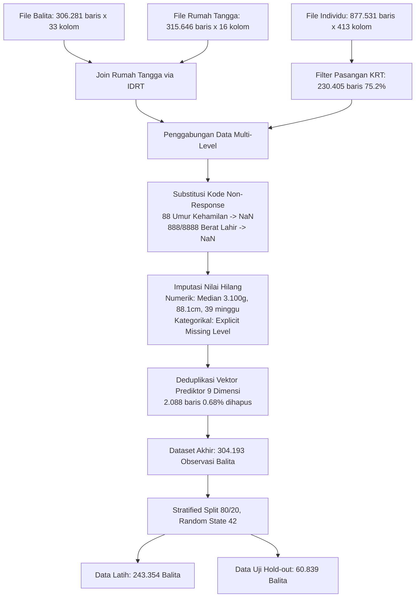

# 📄 Referensi Utama 1: Paper GENY (Decision Tree Pembelajaran Mesin Berbasis SKI 2023)

> **Dokumentasi Ilmiah & Bedah Lengkap Paper Publikasi Internasional IEEE IBITeC 2026**  
> **Judul Naskah**: *Predicting Childhood Stunting Risk from Field-Recordable Survey Variables Using Decision Tree Learning*  
> Bagian dari Modul: **[05-laporan-data-crawling](file:///Users/sinitygs/Projects21/05-laporan-data-crawling/README.md)**  
> Berkas Naskah Asli: [references/PaperGeny.pdf](file:///Users/sinitygs/Projects21/05-laporan-data-crawling/references/PaperGeny.pdf) *(6 Halaman, 275 KB)*  
> Berkas Audit Naskah: [references/Audit_Paper_GENY_draf_19Agu2026.docx](file:///Users/sinitygs/Projects21/05-laporan-data-crawling/references/Audit_Paper_GENY_draf_19Agu2026.docx) *(24 KB)*  

---

## 1. Metadata Naskah & Profil Peneliti

- **Judul**: *Predicting Childhood Stunting Risk from Field-Recordable Survey Variables Using Decision Tree Learning*
- **Penulis**:
  1. **Gerrard Sebastian** *(Program Studi S1 Informatika, Telkom University Kampus Surabaya)* — `sinitygsxy@student.telkomuniversity.ac.id` (First Author)
  2. **Pima Hani Safitri** *(Program Studi S1 Informatika, Telkom University Kampus Surabaya)*
  3. **Grace Roswita Sallu** *(Program Studi S1 Informatika, Telkom University Kampus Surabaya)*
  4. **Mohammad Gibran Khalilullah** *(Program Studi S1 Informatika, Telkom University Kampus Surabaya)*
  5. **Nevia Duli Rahma** *(Program Studi S1 Bisnis Digital, Telkom University Kampus Surabaya)*
  6. **Dimas Adiputra** *(Center of Excellence for Motion Technology for Safety, Health and Wellness / MOSHEE, Telkom University Surabaya)*
- **Target Konferensi**: *2026 8th International Conference on Biomedical Engineering and Technology (IBITeC)*
- **Status Sertifikasi**: *Certified by IEEE PDF eXpress at August 19, 2026* (File ID: `2026288710.pdf`)
- **Dukungan Pendanaan**: *Program Innovillage 2025, Komunitas Desa Siwalanpanji Sidoarjo, MOSHEE, dan Telkom University*.

---

## 2. Intisari Masalah & Motivasi Riset

Meskipun algoritma *ensemble* (Random Forest, XGBoost, Stacking) dapat mencapai akurasi tinggi (>94%), model tersebut bersifat **kotak hitam (*black box*)** yang mustahil diperiksa alasannya secara manual oleh kader posyandu di pelosok desa. Kader di lapangan memerlukan alat bantu skrining yang:
1. **Dapat Diaudit (*Auditable*)**: Kader dan bidan dapat menjelaskan secara logis kepada orang tua mengapa seorang anak dikategorikan "berisiko tinggi".
2. **Dapat Dijalankan Secara Manual (*Hand-Executable*)**: Struktur keputusan cukup ringkas sehingga dapat dicetak dalam satu lembar bagan alir dan digunakan saat gawai mati atau ketiadaan listrik.
3. **Menggunakan Variabel yang Benar-benar Dicatat di Posyandu**: Menghubungkan variabel antropometri, status gizi/kesehatan ibu, dan sanitasi rumah tangga tanpa memerlukan uji laboratorium darah.

---

## 3. Pipeline Preprocessing Data Mikro SKI 2023

Penelitian ini memproses data mikro nasional **Survei Kesehatan Indonesia (SKI) 2023** yang dirilis Kementerian Kesehatan RI:



### Tabel Komposisi Data & 9 Prediktor:

| Variabel Prediktor | Kode Kolom SKI | Tipe Data | Persentase Hilang | Nilai Imputasi Median |
| :--- | :--- | :---: | :---: | :--- |
| `jenis_kelamin` | B4K4 (Balita) | Kategorikal (2) | 0,0% | Laki-laki (51,6%), Perempuan (48,4%) |
| `usia_bulan` | B4K7BLN (Balita) | Numerik | 0,0% | Rentang 0–59 bulan |
| `berat_badan_lahir` | I05A (Balita) | Numerik | 5,3% | 3.100 gram |
| `tinggi_badan` | J02B (Balita) | Numerik | 0,5% | 88,10 cm |
| `usia_kehamilan` | I04 (Balita) | Numerik | 3,8% | 39,0 minggu |
| `klasifikasi_wilayah` | B1R5 (Balita) | Kategorikal (2) | 0,0% | Perkotaan (52,5%), Perdesaan (47,5%) |
| `maternal_pulmonary_TB` | A12 (Individu) | Kategorikal (3) | 24,8% | Riwayat diagnosis TBC ibu 1 tahun terakhir |
| `sumber_air` | B6R1 (Rumah Tangga) | Kategorikal (13) | 0,0% | 13 kategori sarana air minum |
| `sanitasi` | B6R11 (Rumah Tangga) | Kategorikal (5) | 0,0% | 5 jenis fasilitas BAB |

### Ground Truth Labeling Berdasarkan Standar WHO:
Label risiko diturunkan dari *Height-for-Age Z-score* (HAZ):
- **Low (Normal)**: $HAZ \ge -1,0\text{ SD}$ (133.269 balita / 43,8%)
- **Moderate (At Risk / Mild Stunting)**: $-2,0\text{ SD} \le HAZ < -1,0\text{ SD}$ (102.743 balita / 33,8%)
- **High (Stunted / Severely Stunted)**: $HAZ < -2,0\text{ SD}$ (68.181 balita / 22,4%)

---

## 4. Parameter & Arsitektur Decision Tree

Model menggunakan algoritma **CART (Classification and Regression Trees)** dengan kriteria *entropy* (Information Gain):
- **Kriteria Split**: Entropy (Information Gain)
- **Kedalaman Maksimum (*Max Depth*)**: 8 (menghasilkan kedalaman riil 8 dengan **179 daun / leaves**)
- **Sampel Minimum untuk Split (*Min Samples Split*)**: 50 sampel
- **Sampel Minimum per Daun (*Min Samples Leaf*)**: 20 sampel
- **Pembobotan Kelas (*Class Weight*)**: Balanced
- **Struktur Daun**: 65 daun kelas Rendah, 70 daun kelas Sedang, dan 44 daun kelas Tinggi.

---

## 5. Hasil Kuantitatif & Evaluasi Performa Model

Pengujian pada data uji independen (*stratified hold-out set*, $n=60.839$ balita):

### Tabel Performa Multi-Kelas (3 Kelas Risiko):

| Kelas Risiko | Precision | Recall | F1-Score | Jumlah Sampel Uji (*Support*) |
| :--- | :---: | :---: | :---: | :---: |
| **Low (Normal)** | 0,7350 | **0,9259** | **0,8195** | 26.654 |
| **Moderate (Sedang)** | **0,8528** | 0,5457 | 0,6656 | 20.549 |
| **High (Tinggi)** | 0,7145 | **0,7394** | **0,7268** | 13.636 |
| **Akurasi Keseluruhan** | — | — | **0,7557 (75,57%)** | 60.839 |
| **Macro Average** | 0,7674 | 0,7370 | **0,7373** | 60.839 |
| **Weighted Average** | 0,7702 | 0,7557 | **0,7468** | 60.839 |

### Confusion Matrix Evaluasi (Data Uji 60.839 Balita):

```
                       PREDIKSI MODEL
                Low        Moderate      High       Total Aktual
ACTUAL Low     24.680       1.354         620          26.654
       Mod      5.927      11.214       3.408          20.549
       High     2,972         581      10.083          13.636
       Total   33.579      13.149      14.111          60.839
```

### Evaluasi sebagai Alat Skrining Biner (At-Risk = Moderate + High):
Ketika sistem digunakan untuk memilah balita yang membutuhkan intervensi gizi (kelas Moderate dan High digabung):
- **Sensitivitas Skrining**: **73,97%** (25.286 balita terjaring dari 34.185 kasus riil).
- **Spesifisitas**: **92,59%** (24.680 balita normal lolos dari 26.654).
- **Positive Predictive Value (PPV)**: **92,76%** (25.286 dari 27.260 anak yang diflag benar-benar berisiko stunting).
- **Negative Predictive Value (NPV)**: **73,50%** (24.680 dari 33.579 anak yang dinyatakan aman memang normal).
- **High-Risk False Negatives**: 21,80% (2.972 balita stunting parah tergeser ke kategori low akibat batas kedalaman 8).

> **Makna Operasional Lapangan**: Nilai PPV 92,76% membuktikan bahwa **setiap alokasi bantuan makanan tambahan dan waktu kunjungan rumah oleh kader tidak akan salah sasaran**. Namun sensitivitas 73,97% menunjukkan perlunya penyesuaian *threshold* lanjutan pada balita usia rawan 0–24 bulan.

---

## 6. Temuan Saintifik Sentral: Dominasi Fitur Antropometri

Pemeriksaan nilai *feature importance* (Gini/Entropy Impurity Reduction) dan sebaran node *split* pada pohon menghasilkan temuan kunci:

| Variabel Prediktor | Impurity-based Importance | Jumlah Node Split | Persentase Share Split |
| :--- | :---: | :---: | :---: |
| **`tinggi_badan`** | **0,5243** | 73 | 41,01% |
| **`usia_bulan`** | **0,4580** | 63 | 35,39% |
| **`jenis_kelamin`** | 0,0175 | 26 | 14,61% |
| `berat_badan_lahir` | < 0,00005 | 5 | 2,81% |
| `usia_kehamilan` | 0,0001 | 3 | 1,69% |
| `klasifikasi_wilayah` | < 0,00005 | 3 | 1,69% |
| `maternal_pulmonary_TB` | < 0,00005 | 2 | 1,12% |
| `sumber_air` | < 0,00005 | 2 | 1,12% |
| `sanitasi` | < 0,00005 | 1 | 0,56% |
| **Total** | **1,0000** | **178 Split** | **100,00%** |

### 🔍 Interpretasi Ilmiah & Batasan Model:
1. **Dominasi 98,23% oleh Tinggi Badan & Usia**: Gabungan nilai penting tinggi badan (0,5243) dan usia bulan (0,4580) mencapai **0,9823 (98,23%)**. Hal ini terjadi karena label HAZ secara deterministik diturunkan dari relasi non-linier antara tinggi badan dan usia menurut tabel standar WHO.
2. **Bukan Model Etiologis Akar Masalah**: Model pohon keputusan ini **bukan model kausal untuk membuktikan penyebab stunting**, melainkan **aproksimasi cerdas batas keputusan (*decision boundary*) kurva WHO HAZ yang dapat dijalankan secara langsung di Posyandu tanpa perlu membuka tabel LMS manual**.
3. **Peran Faktor Non-Antropometri**: Enam prediktor sosial, maternal, dan lingkungan hanya menyumbang < 0,0002 bobot kepentingan dan hanya muncul di percabangan paling dalam (*deep leaves*) dengan dukungan sampel rendah.

---

## 7. Model Uji Tanpa Variabel Antropometri & Benchmark Ensemble

Untuk membuktikan secara terpisah seberapa besar sinyal risiko yang dibawa oleh faktor sosial-ekonomi murni, paper GENY melatih model pembanding tanpa memasukkan tinggi badan dan usia anak:

### Tabel Perbandingan Benchmark Model (Protokol Identik):

| Model Algoritma | Akurasi | Macro F1 | Recall High-Risk | Dapat Dieksekusi Manual di Posyandu? |
| :--- | :---: | :---: | :---: | :---: |
| **Majority Baseline** | 0,4381 | 0,2031 | 0,0000 | Ya |
| **Model Tanpa TB & Usia** | **0,3938** | **0,3565** | **0,5133** | **Ya** |
| **Regresi Logistik** | 0,6859 | 0,6742 | 0,7056 | Sebagian |
| **Decision Tree GENY (Diusulkan)** | **0,7557** | **0,7373** | **0,7394** | **Ya (1 Lembar Kertas)** |
| **Random Forest (200 Trees)** | 0,9413 | 0,9394 | 0,9306 | Tidak (*Black Box*) |
| **Gradient Boosting** | **0,9461** | **0,9444** | **0,9592** | Tidak (*Black Box*) |

### Kesimpulan Eksperimen:
- Ketika variabel tinggi badan dan usia dihilangkan, model hanya mencapai **Macro F1 0,3565**. Angka ini membuktikan bahwa faktor sosial, maternal (LILA/TB), dan sanitasi membawa sinyal nyata tetapi **sangat lemah untuk mendiskriminasi risiko anak secara individual**.
- Perbedaan antara Decision Tree (75,57%) dan Gradient Boosting (94,61%) merupakan harga yang dibayar untuk **kemampuan audit (*auditability*) dan transparansi penalaran medis**. Di posyandu pelosok, kemampuan kader untuk menjelaskan alur keputusan kepada keluarga jauh lebih berharga daripada selisih akurasi model kompleks yang tidak dapat dijelaskan.

---

## 8. Implementasi pada Aplikasi Mobile GENY-StuntCare

Model Decision Tree ini diekspor ke dalam format metadata serial (`feature_columns.json`, `feature_types.json`, model `.joblib`) dan diintegrasikan ke dalam arsitektur aplikasi mobile **GENY-StuntCare**:
- **Lokasi Uji Coba Lapangan**: Desa Siwalanpanji, Kabupaten Sidoarjo, Jawa Timur (Kemitraan Komunitas & Innovillage 2025).
- **Antarmuka Input**: 9 form sederhana yang dipandu validasi otomatis.
- **Rekomendasi Berbasis Daun Pohon**: Tiap daun klasifikasi menghasilkan intervensi yang berbeda (misal: Daun Kelas High mengarahkan rujukan cepat ke Puskesmas, Daun Kelas Moderate memicu protokol modifikasi pangan lokal tinggi protein hewani).

---
*Lanjut membaca dokumen referensi pendukung kedua:*  
👉 **[Lanjut ke 04. Referensi Utama 2: Buku Tugas Akhir Stunting (Fuzzy Logic & GA) ➔](file:///Users/sinitygs/Projects21/05-laporan-data-crawling/04_referensi_utama_2_buku_ta_stunting.md)**
