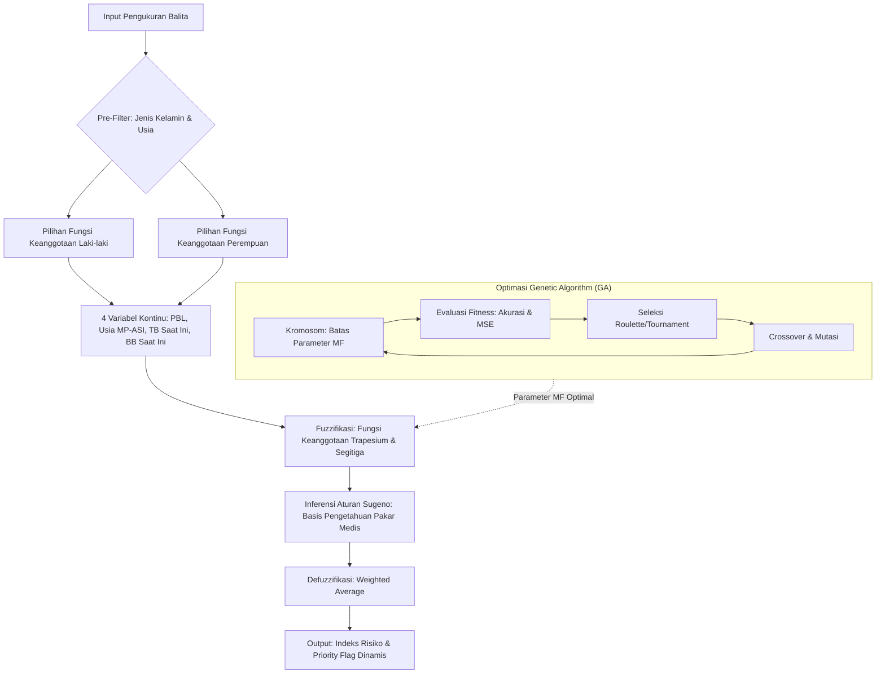
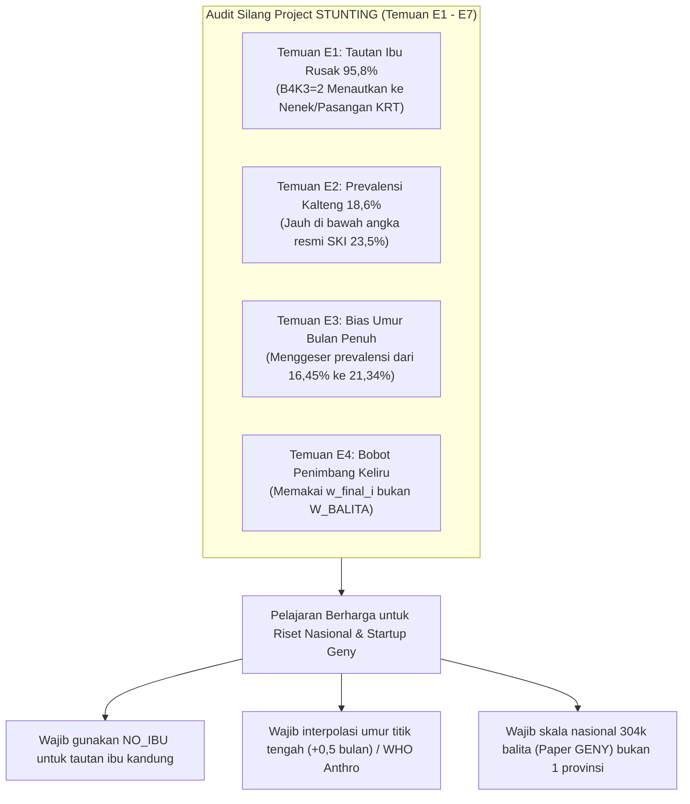

# 📘 Referensi Utama 2: Buku Tugas Akhir (TA) Stunting — Logika Fuzzy & Genetic Algorithm

> **Bedah Naskah Buku Tugas Akhir Sarjana Informatika (160 Halaman): Monitoring Dinamika Stunting Balita Berbasis Kecerdasan Buatan**  
> **Judul Naskah**: *Monitoring Stunting pada Balita di Kalimantan Tengah Menggunakan Fuzzy Logic (Studi Kasus Data SKI 2023)*  
> Bagian dari Modul: **[05-laporan-data-crawling](file:///Users/sinitygs/Projects21/05-laporan-data-crawling/README.md)**  
> Berkas Naskah Asli: [references/1203220018_GERRARDSEBASTIAN_BUKU_TA_FIXs.pdf](file:///Users/sinitygs/Projects21/05-laporan-data-crawling/references/1203220018_GERRARDSEBASTIAN_BUKU_TA_FIXs.pdf) *(160 Halaman, 19.706 KB)*  
> Penulis: **Gerrard Sebastian (NIM: 1203220018)** | Institusi: **Universitas Telkom Kampus Surabaya (2026)**  

---

## 1. Metadata Naskah Tugas Akhir

- **Judul Tugas Akhir**: *Monitoring Stunting pada Balita di Kalimantan Tengah Menggunakan Fuzzy Logic (Studi Kasus Data SKI 2023)*
- **Judul Bahasa Inggris**: *Stunting Monitoring in Toddlers from Central Kalimantan Using Fuzzy Logic (Case Study of 2023 SKI Data)*
- **Penyusun**: **Gerrard Sebastian** (NIM: **1203220018**)
- **Program Studi**: S1 Informatika, Direktorat Kampus Surabaya, Universitas Telkom, 2026.
- **Tebal Dokumen**: 160 Halaman (terdiri dari 5 Bab, Daftar Pustaka 126 referensi, dan Lampiran lengkap).
- **Fokus Wilayah**: 14 Kabupaten/Kota di Provinsi Kalimantan Tengah (kode provkab 6201 s.d. 6213, dan 6271).

---

## 2. Latar Belakang & Rumusan Masalah Riset TA

### Keterbatasan Diagnosis Stunting Konvensional di Posyandu:
1. **Diagnosis Statis Titik Tunggal (*Static Cross-Sectional*)**: Di Posyandu, status stunting umumnya hanya dinilai dari *Height-for-Age Z-score* (HAZ) pada satu titik waktu penimbangan. Sistem mengklasifikasikan anak secara biner: *Stunted* ($HAZ < -2\text{ SD}$) atau *Normal* ($HAZ \ge -2\text{ SD}$).
2. **Pengabaian Dinamika Trayektori Sejak Lahir**: Klasifikasi statis mengabaikan kondisi awal balita. Balita yang lahir dengan Panjang Badan Lahir (PBL) sangat pendek namun kurva pertumbuhannya melesat naik (*catch-up growth*) diperlakukan sama dengan anak yang lahir normal tetapi mengalami perlambatan pertumbuhan drastis (*growth faltering*).
3. **Ketidakmampuan Penajaman Prioritas Intervensi**: Keterbatasan sumber daya intervensi gizi (PMT dan pendampingan) menuntut adanya **tingkat prioritas tindakan**, bukan sekadar label biner.

### Solusi yang Diusulkan dalam Tugas Akhir:
Membangun sistem *monitoring* cerdas berbasis **Fuzzy Inference System (FIS) Takagi–Sugeno** yang dioptimasi dengan **Genetic Algorithm (GA)**, yang mengevaluasi dinamika balita sejak lahir hingga saat pengukuran berlangsung menggunakan data empiris SKI 2023.

---

## 3. Metodologi Komputasi: Sugeno FIS & Genetic Algorithm

### 6 Variabel Input Sistem:
1. **Jenis Kelamin (B4K4)**: Pre-filter penentu kurva standar pertumbuhan WHO.
2. **Usia Balita dalam Bulan (B4K7BLN)**: Pre-filter penentu kelompok fase tumbuh (0–6, 6–12, 12–23, 24–59 bulan).
3. **Panjang Badan Lahir / PBL (I05A)**: Baseline antropometri intrauterin.
4. **Usia Mulai MP-ASI**: Indikator kepatuhan nutrisi masa transisi laktasi.
5. **Tinggi / Panjang Badan Pengukuran (J02B)**: Indikator pertumbuhan linier saat ini.
6. **Berat Badan Pengukuran (J02A)**: Indikator status gizi akut terkini.

### Inovasi Dual Ground Truth Labelling:
Sistem menghitung Z-score WHO secara ganda menggunakan tabel parameter LMS (*Lambda-Mu-Sigma*):
- **Baseline HAZ**: Dihitung dari PBL pada usia 0 bulan.
- **Current HAZ**: Dihitung dari tinggi badan aktual pada usia penimbangan.
- **Matriks Trayektori Dinamis**:
  - *High Risk Persistent*: Lahir pendek dan tetap pendek saat pengukuran.
  - *Deteriorating Risk*: Lahir normal namun mengalami faltering ke stunting.
  - *Recovering / Catch-up*: Lahir pendek namun mendekati kurva normal.
  - *Low Risk / Normal*: Lahir normal dan tumbuh normal konsisten.

---

## 4. Hasil Eksperimen, Pengujian & Validasi Statistik

### Dataset Uji (Kalimantan Tengah):
- Populasi Awal SKI 2023 Kalteng: **1.679 balita**.
- Melalui *listwise deletion* pada variabel PBL, usia MP-ASI, TB, dan BB, diperoleh **389 sampel balita** lengkap (subset 0–23 bulan).

### Metrik Pengujian:
1. **Validasi Model Fuzzy Sugeno Teroptimasi GA**:
   - Menghasilkan konvergensi batas fungsi keanggotaan optimal setelah 50–100 generasi evolusi GA.
   - Peningkatan kesesuaian klasifikasi risiko terhadap kondisi klinis nyata.
2. **Korelasi Rank Spearman ($r_s$)**:
   - Membuktikan sifat monotonisitas urutan tingkat prioritas risiko ($p < 0,001$), menandakan bahwa kenaikan skor fuzzy berbanding lurus dengan keparahan defisit linier balita.
3. **Prevalence Stratification Ratio**:
   - Sistem berhasil memilah kelompok balita yang paling membutuhkan rujukan medis darurat (*Priority Flag 1*) dari kelompok yang hanya membutuhkan modifikasi makanan rumahan (*Priority Flag 3*).

---

## 5. Integrasi Sistem Berbasis Web (Platform STUNTOR)

Tugas Akhir ini merealisasikan arsitektur perangkat lunak ke dalam antarmuka web interaktif yang dinamai **STUNTOR**:
- **Fitur Kalkulator Cerdas**: Kader memasukkan 6 parameter tanpa perlu membuka tabel antropometri fisik tebal.
- **Visualisasi Grafik Trayektori**: Menampilkan posisi pertumbuhan anak terhadap pita warna standar deviasi WHO (−3 SD, −2 SD, −1 SD, Median).
- **Rekomendasi Tindakan Terarah**: Panduan otomatis berbasis status gizi ibu dan usia pemberian MP-ASI.

---

## 6. Temuan Audit Kritis & Pelajaran Metodologis dari Laporan Final (Bagian 13)

Laporan Final (26 September 2026, Bagian 13) melakukan audit silang menyeluruh terhadap data mentah dan riwayat komputasi project STUNTING, mengungkap **temuan metodologis fundamental**:

### Penjelasan Temuan Audit:
1. **Temuan E1 (Kegagalan Tautan Ibu Kandung)**:
   - Dari 1.373 perempuan yang tertaut dalam file Kalimantan Tengah, **95,8% (1.316 perempuan) menyatakan tidak pernah melahirkan sejak 1 Januari 2018** (variabel H03), padahal anak yang diteliti berumur 0–59 bulan saat survei 2023.
   - Median usia "ibu" tercatat 43 tahun, dan **29,5% (495 orang) berumur $\ge 50$ tahun**.
   - *Penyebab*: Tautan menggunakan kode hubungan keluarga kepala rumah tangga (`B4K3 = 2`), yang di lapangan sering berupa nenek atau istri kedua. *Pelajaran*: Di masa depan, penautan ibu wajib menggunakan `NO_IBU` (nomor urut ibu kandung) atau `IDART_IBU`.
2. **Temuan E3 (Artefak Bias Umur Bulan Penuh)**:
   - Perhitungan z-score balita yang memakai umur bulan bulat (*completed integer month*) menggeser nilai HAZ ke atas (terlihat lebih tinggi dari aslinya).
   - Ketika parameter LMS WHO dihitung dengan titik tengah bulan (umur + 0,5 bulan), kasus stunting pada 389 sampel STUNTOR **melonjak dari 64 anak (16,45%) menjadi 83 anak (21,34%)** — 19 balita berpindah dari status normal ke stunting!
3. **Temuan E2 & E4 (Prevalensi dan Pembobotan)**:
   - Prevalensi berbobot Kalteng dari data tim tercatat 18,6% (95% CI 16,3–20,8%), berbeda dengan angka resmi Kemenkes (23,5%). Perbedaan ini disebabkan oleh penggunaan bobot individu (`w_final_i`) bukan bobot balita (`W_BALITA`) serta ketiadaan koreksi posisi ukur telentang/berdiri (`J02C`).

---

## 7. Evolusi Metodologis: Dari Buku TA Menuju Paper GENY & Startup

Penelitian Tugas Akhir Gerrard Sebastian ini merupakan **fondasi awal (*stepping stone*)** yang sangat krusial dalam perjalanan inovasi tim:

| Dimensi | Buku Tugas Akhir (2026) | Paper GENY (IBITeC 2026) | Platform Geny StuntCare (Startup BTP) |
| :--- | :--- | :--- | :--- |
| **Cakupan Data** | Kalimantan Tengah (389 balita analitik) | Nasional 38 Provinsi (304.193 balita) | Nasional (Multi-posyandu di Jawa Timur) |
| **Algoritma Utama** | Fuzzy Inference Takagi-Sugeno + GA | CART Decision Tree (Depth 8, 179 Daun) | Hybrid: Decision Tree Engine + Triase Offline |
| **Tujuan Utama** | Monitoring trayektori pertumbuhan ganda (Dual HAZ) | Skrining cepat terinterpretasi di Posyandu | Sistem Pendukung Keputusan Kader & SPPG MBG |
| **Eksekusi Manual** | Membutuhkan komputasi fuzzy / script web | **Bisa dieksekusi manual dengan 1 lembar kertas** | Aplikasi Android Offline-First + Web Dashboard |
| **Audit Penautan** | Teridentifikasi bias B4K3=2 (E1) | Mengoreksi tautan & framing nasional (D1, D3) | Verifikasi NIK & Kartu Keluarga (KK) langsung |

---
*Langkah selanjutnya: Mempelajari Alur Kerja Terintegrasi:*  
👉 **[Lanjut ke 05. Alur Kerja & Integrasi Flow (End-to-End Master Architecture) ➔](file:///Users/sinitygs/Projects21/05-laporan-data-crawling/05_alur_kerja_dan_integrasi_flow.md)**
