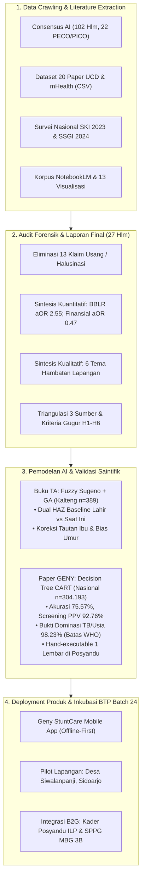
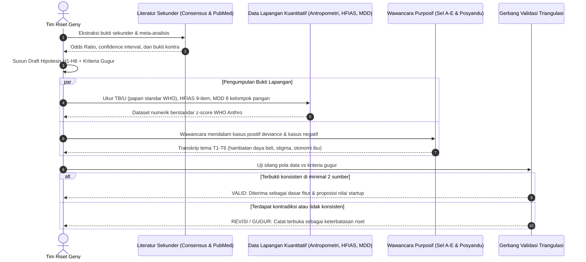
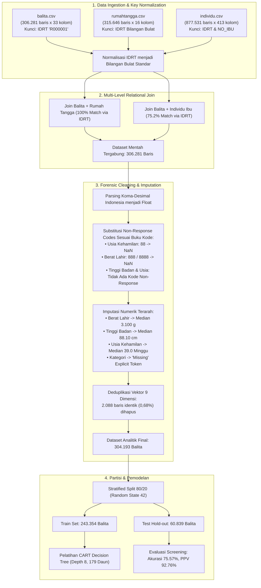
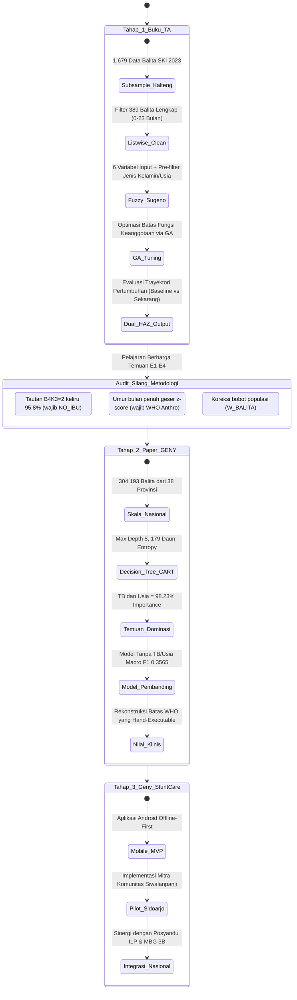
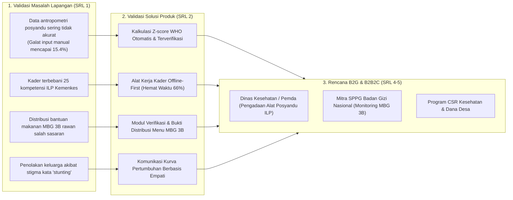

# 🔄 Alur Kerja Terintegrasi & Master Architecture Flow

> **Arsitektur Alur Kerja Menyeluruh: Dari Data Crawling Multi-Sumber, Triangulasi Bukti Ilmiah, Rekayasa Data Mikro SKI 2023, Pemodelan AI (Fuzzy & Decision Tree), hingga Eksekusi Lapangan Startup Geny StuntCare**  
> Bagian dari Modul: **[05-laporan-data-crawling](file:///Users/sinitygs/Projects21/05-laporan-data-crawling/README.md)**  
> Disusun oleh: **Gerrard Sebastian** | Tanggal: **26 September 2026**

---

## 1. Master Architecture Overview

Alur kerja riset dan pengembangan teknologi dalam proyek **Geny StuntCare** menggabungkan empat subsistem yang saling mengunci (*interlocking pipelines*):
1. **Pipeline Triangulasi Ilmiah**: Memvalidasi hipotesis determinan melalui konvergensi literatur, data kuantitatif lapangan, dan wawancara kasus negatif.
2. **Pipeline Rekayasa Data Mikro Survei Nasional**: Membersihkan dan memvalidasi data mikro SKI 2023 berskala 304.193 balita.
3. **Pipeline Evolusi Algoritma Kecerdasan Buatan**: Mengembangkan pemodelan dari *Fuzzy Inference System* + *Genetic Algorithm* (Buku TA) menjadi *CART Decision Tree* (Paper GENY).
4. **Pipeline Validasi Pasar & Inkubasi Startup BTP**: Menerapkan model ke dalam produk kerja kader *offline-first* yang terintegrasi dengan Posyandu ILP dan Program Makan Bergizi Gratis (MBG 3B).

---

## 2. Flow 1: Triangulasi Bukti Ilmiah (Revisi Laporan Final)

Salah satu kelemahan umum riset stunting adalah menarik kesimpulan kausal hanya dari wawancara kualitatif beberapa informan atau studi *cross-sectional* kecil dengan nilai OR ekstrem. Flow triangulasi Laporan Final memastikan bahwa klaim hanya dibuat setelah terkonfirmasi oleh minimal 2 dari 3 sumber independen:

### 6 Hipotesis Riset & Kriteria Gugur (Laporan Final Bagian 9):
- **H1 (Finansial Lewat Pangan)**: Efek finansial disalurkan lewat ketahanan pangan dan kualitas MP-ASI. *(Kriteria Gugur: Asosiasi pendapatan dan stunting tidak melemah setelah ketahanan pangan dikontrol)*.
- **H2 (Pendidikan Lewat Pengetahuan)**: Efek pendidikan ibu dimediasi oleh pengetahuan terapan dan pemanfaatan ANC. *(Kriteria Gugur: Mediator pengetahuan tidak berbeda antarjenjang pendidikan)*.
- **H3 (Pengetahuan Tanpa Daya Beli)**: Pengetahuan tanpa daya beli tidak menurunkan risiko stunting. *(Kriteria Gugur: Pengetahuan terbukti protektif setara di semua strata pendapatan)*.
- **H4 (Jajanan Keluarga Mampu)**: Pada keluarga mampu, pola konsumsi jajanan ultra-proses menjadi pendorong stunting. *(Kriteria Gugur: Pola jajan sama antara balita stunting dan normal di kelompok mampu)*.
- **H5 (Status Kerja Ibu)**: Dampak kerja ibu bergantung pada jenis kerja dan kualitas pengasuh pengganti. *(Kriteria Gugur: Tidak ada perbedaan menurut jenis pekerjaan)*.
- **H6 (Positive Deviance)**: Keluarga miskin dengan anak sehat memiliki praktik belanja dan jejaring yang dapat direplikasi. *(Kriteria Gugur: Tidak ditemukan praktik pembeda)*.

---

## 3. Flow 2: Pipeline Rekayasa Data Mikro Survei Nasional SKI 2023

Pipeline data mikro yang digunakan pada Paper GENY dan Laporan Final Addendum 12 menangani 304.193 balita melalui protokol pembersihan ketat:

---

## 4. Flow 3: Evolusi Pemodelan AI (Dari Buku TA ke Paper GENY & Startup)

Perjalanan pemodelan kecerdasan buatan tim berkembang secara terukur dari studi kasus regional menuju standarisasi skrining nasional:

### Komparasi Metodologis Antar-Tahap:

| Fitur / Parameter | Tahap 1: Buku Tugas Akhir | Tahap 2: Paper GENY (IBITeC) | Tahap 3: Platform Geny StuntCare |
| :--- | :--- | :--- | :--- |
| **Penyusun Utama** | Gerrard Sebastian (1203220018) | Gerrard Sebastian dkk. | Tim Startup Geny StuntCare |
| **Metode AI** | Takagi-Sugeno Fuzzy Logic + GA | CART Decision Tree (Depth 8) | Decision Engine Teroptimasi + Rule Base |
| **Cakupan Wilayah** | 1 Provinsi (Kalimantan Tengah) | 38 Provinsi (Nasional Indonesia) | Komunitas Jawa Timur (Pilot) ➔ Nasional |
| **Ukuran Sampel** | 389 Balita (0–23 bulan) | 304.193 Balita (0–59 bulan) | Seluruh balita terdata di Posyandu sasaran |
| **Daya Eksekusi** | Komputasi fuzzy berbasis skrip web | **Dapat dieksekusi manual (1 lembar)** | Mobile App Offline-First & Cloud Sync |
| **Evaluasi Kritis** | Analisis trayektori dinamik lahir-kini | Skrining sensitivitas biner (PPV 92,76%) | Efisiensi kader (-66% waktu) & pemantauan MBG |

---

## 5. Flow 4: Implementasi Validasi Lapangan & Inkubasi BTP Batch 24

Dalam konteks program inkubasi di Bandung Techno Park (Telkom University), seluruh aset riset ini dialirkan ke dalam rencana operasional tahap **SRL 1 (Problem Validation)** dan **SRL 2 (Solution Validation)**:

---

## 6. Matriks Akses Cepat Berkas Penunjang (*Direct File Cross-Reference*)

Semua komponen dokumen dan aset dalam workflow ini dapat diakses secara langsung melalui tabel direktori berikut:

| Tahapan Workflow | Berkas Dokumen Terkait | Tautan Langsung Workspace | Path Sistem Operasi Lokal |
| :--- | :--- | :--- | :--- |
| **Kompilasi Crawling** | Ekspor Sesi Consensus (102 Halaman) | [Consensus PDF](file:///Users/sinitygs/Projects21/05-laporan-data-crawling/references/Faktor%20Faktor%20Stunting%20Indonesia%20-%20Consensus.pdf) | `/Users/sinitygs/Downloads/GENY/Faktor Faktor Stunting Indonesia - Consensus.pdf` |
| **Kompilasi Crawling** | Dataset 20 Paper UCD Stunting | [20 UCD Papers CSV](file:///Users/sinitygs/Projects21/05-laporan-data-crawling/references/Does%20user-centered%20design%20improve%20stunting%20app%20uptake%20in%20Indonesian%20caregivers%20-%2026%20Sep%202026.csv) | `/Users/sinitygs/Downloads/GENY/Does user-centered design improve stunting app uptake in Indonesian caregivers - 26 Sep 2026.csv` |
| **Sintesis Bukti** | Laporan Final Determinan (27 Halaman) | [Laporan Final PDF](file:///Users/sinitygs/Projects21/05-laporan-data-crawling/references/Laporan_Final_Determinan_Stunting_Indonesia_UPDATE2_26Sep2026.pdf) | `/Users/sinitygs/Downloads/Laporan_Final_Determinan_Stunting_Indonesia_UPDATE2_26Sep2026.pdf` |
| **Referensi Utama 1** | Paper GENY (IEEE IBITeC 2026) | [Paper GENY PDF](file:///Users/sinitygs/Projects21/05-laporan-data-crawling/references/PaperGeny.pdf) | `/Users/sinitygs/Downloads/PaperGeny.pdf` |
| **Referensi Utama 1** | Audit Forensik Naskah Paper GENY | [Audit Paper DOCX](file:///Users/sinitygs/Projects21/05-laporan-data-crawling/references/Audit_Paper_GENY_draf_19Agu2026.docx) | `/Users/sinitygs/Downloads/Audit_Paper_GENY_draf_19Agu2026.docx` |
| **Referensi Utama 2** | Buku Tugas Akhir Stunting (160 Hlm) | [Buku TA PDF](file:///Users/sinitygs/Projects21/05-laporan-data-crawling/references/1203220018_GERRARDSEBASTIAN_BUKU_TA_FIXs.pdf) | `/Users/sinitygs/Downloads/1203220018_GERRARDSEBASTIAN_BUKU_TA_FIXs.pdf` |
| **Visualisasi Aset** | Benchmark MARS Terverifikasi | [MARS Chart](file:///Users/sinitygs/Projects21/05-laporan-data-crawling/assets/chart3_mars_benchmarking_v3.png) | `/Users/sinitygs/Projects21/05-laporan-data-crawling/assets/chart3_mars_benchmarking_v3.png` |
| **Visualisasi Aset** | Efisiensi Kader Posyandu | [Efisiensi Chart](file:///Users/sinitygs/Projects21/05-laporan-data-crawling/assets/chart5_efisiensi_operasional_kader_v3.png) | `/Users/sinitygs/Projects21/05-laporan-data-crawling/assets/chart5_efisiensi_operasional_kader_v3.png` |
| **Visualisasi Aset** | Forest Plot Odds Ratio Terverifikasi | [Odds Ratio Chart](file:///Users/sinitygs/Projects21/05-laporan-data-crawling/assets/chart4_odds_ratio_stunting_v3.png) | `/Users/sinitygs/Projects21/05-laporan-data-crawling/assets/chart4_odds_ratio_stunting_v3.png` |

---
*Kembali ke indeks utama:*  
👉 **[Kembali ke 📁 README.md Indeks Folder 05 ➔](file:///Users/sinitygs/Projects21/05-laporan-data-crawling/README.md)**
